<div align="center">

# 🛡️ CyberSaarthi

### Investigation Intelligence Platform

**Deterministic criminal-network analysis for investigators** — evidence ingestion, entity
resolution, a knowledge graph, and an explainable analytics engine (patterns, hypotheses,
findings, Network DNA, priorities, paths).

PostgreSQL is the source of truth; Neo4j is an idempotent graph projection used only for
bounded path traversal. Every analytical score is a **deterministic function of real ingested
evidence** — there is no fake AI, no random scoring, and no fabricated confidence.

```
 Evidence → Intelligence → Connections → Insights → Investigator
```

</div>

<div align="center">


</div>

---

## 📑 Table of Contents

- [What is CyberSaarthi?](#what-is-cybersaarthi)
- [Why CyberSaarthi?](#why-cybersaarthi)
- [Feature Showcase](#feature-showcase)
- [End-to-End Architecture](#end-to-end-architecture)
- [The Investigation Pipeline](#the-investigation-pipeline)
- [Phase History](#phase-history)
- [Data Intelligence](#data-intelligence)
- [Entity Resolution](#entity-resolution)
- [The Knowledge Graph](#the-knowledge-graph)
- [Investigation Analytics](#investigation-analytics)
- [Explainability](#explainability)
- [Security](#security)
- [Frontend](#frontend)
- [API Overview](#api-overview)
- [Investigation Demo](#investigation-demo)
- [UI Preview](#ui-preview)
- [Performance](#performance)
- [Testing](#testing)
- [Project Structure](#project-structure)
- [Installation — Linux](#installation--linux)
- [Installation — Windows + Docker Desktop](#installation--windows--docker-desktop)
- [Docker Architecture](#docker-architecture)
- [Configuration](#configuration)
- [Troubleshooting](#troubleshooting)
- [Contributing](#contributing)
- [Roadmap](#roadmap)
- [Engineering Principles](#engineering-principles)
- [License](#license)
- [Acknowledgements](#acknowledgements)

---

## What is CyberSaarthi?

CyberSaarthi turns **raw evidence** into an **investigative picture** a human analyst can act
on. It is not an autocomplete oracle — it is a deterministic, explainable pipeline that makes
the connections between facts explicit and auditable.

```
 Raw evidence
   │  (files: CSV / JSON / TXT)
   ▼
 Structured information          parsed rows, fields, provenance
   │
   ▼
 Entities                        people, organizations, places, artifacts
   │
   ▼
 Relationships                   who is connected to whom, and how
   │
   ▼
 Knowledge graph                 Neo4j projection of the resolved network
   │
   ▼
 Analytics                       centrality, communities, patterns, paths
   │
   ▼
 Findings                        explainable, investigator-reviewed outputs
   │
   ▼
 Investigator                    a human decides what matters next
```

The platform solves a concrete investigation problem: **fragmented evidence hides structure.**
A phone number in one record, an alias in another, and a shared address in a third are only
meaningful once reconciled into a single entity and linked to the network around it.

---

## Why CyberSaarthi?

| Pain point | How CyberSaarthi helps |
| --- | --- |
| **Fragmented evidence** | Ingests files, fingerprints them by SHA-256, and stores them in object storage with full provenance. |
| **Duplicate identities** | Entity resolution blocks candidates and runs deterministic fuzzy matching to collapse aliases into canonical entities. |
| **Hidden relationships** | Relationship discovery infers connections from co-occurrence and documented fields, storing evidence for each link. |
| **Manual correlation** | The pipeline automates parsing → extraction → normalization → resolution → graph projection. |
| **Graph-based investigation** | Neo4j provides bounded path traversal over the projected network, isolated per case. |
| **Explainable findings** | Every finding carries its approach, signals, weights, affected entities/relationships, and evidence ids. |
| **Investigator-oriented prioritization** | Priority scoring, patterns, hypotheses and Network DNA surface what an analyst should look at next. |

> **Honesty note.** These are capabilities implemented in this codebase and verified by its test
> suite. They describe *engineering behavior*, not claims of real-world operational effectiveness
> against live criminal networks. The system's value is realized only when an investigator uses
> the explainable outputs as **signals**, not as proof.

<div align="center">━━━━━━━━━━━━━━━━━━━━━━━━━━━━━━━━━━━━━━━━</div>

## Feature Showcase

| Capability | Status | Notes |
| --- | --- | --- |
| Evidence ingestion (upload → validate → store) | ✅ Implemented | SHA-256 dedup, size caps, MinIO object storage |
| Parsing (CSV / JSON / TXT) | ✅ Implemented | format & encoding sniffing, schema mapping |
| Entity extraction (rules + spaCy NER) | ✅ Implemented | `spacy` `en_core_web_sm` + field/rule extraction |
| Normalization | ✅ Implemented | canonical string forms (phone, url, email, entity) |
| Entity resolution | ✅ Implemented | blocking + fuzzy matching + context → canonical entities |
| Relationship discovery | ✅ Implemented | typed relationships with source evidence |
| Provenance | ✅ Implemented | per-entity, per-relationship, per-evidence provenance |
| PostgreSQL source of truth | ✅ Implemented | canonical relational store |
| Neo4j graph projection | ✅ Implemented | idempotent `MERGE`-based sync, per-case isolation |
| Graph analytics — centrality | ✅ Implemented | Degree, Betweenness, Closeness, PageRank |
| Graph analytics — structure | ✅ Implemented | connected components, articulation points, communities |
| Network DNA | ✅ Implemented | deterministic network fingerprint |
| Relationship strength | ✅ Implemented | evidence-weighted edge scoring |
| Investigation priority | ✅ Implemented | ranked analyst priority from findings/signals |
| Patterns | ✅ Implemented | e.g. star patterns, repeated relationships |
| Hypotheses | ✅ Implemented | explainable candidate hypotheses |
| Findings | ✅ Implemented | persisted, reviewable, explainable |
| Authentication | ✅ Implemented | JWT + bcrypt + Redis-denylist token revocation |
| RBAC | ✅ Implemented | ADMIN / INVESTIGATOR / ANALYST / VIEWER |
| Audit logging | ✅ Implemented | append-only, permission-scoped |
| Security controls | ✅ Implemented | CSP/HSTS, throttling, case isolation, IDOR guards |
| Interactive frontend | ✅ Implemented | React 19 + Vite, mock & real API modes |
| ML / model training pipeline | 📋 Planned | `ml/` is a placeholder; no training pipeline ships yet |
| Background ingestion worker | 📋 Planned | ingest currently runs synchronously (single-worker local mode) |

<div align="center">━━━━━━━━━━━━━━━━━━━━━━━━━━━━━━━━━━━━━━━━</div>

## End-to-End Architecture

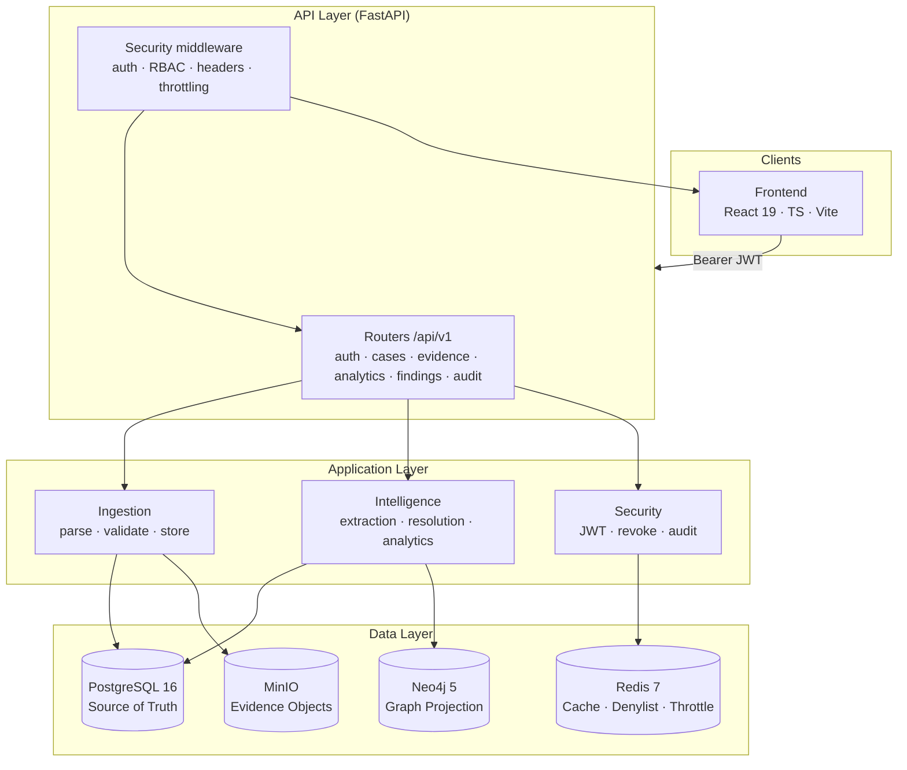

**Data flow note.** PostgreSQL is the source of truth for all relational state. Neo4j holds an
idempotent *projection* rebuilt from PostgreSQL (never an independent source). Redis is used for
token revocation (denylist) and login throttling. MinIO stores the raw evidence objects.

## The Investigation Pipeline

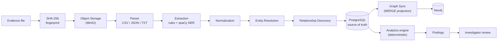

| Stage | What happens |
| --- | --- |
| **Evidence** | A file uploaded to a case (size-capped, format-sniffed). |
| **SHA-256** | Content is fingerprinted; exact duplicates return `409` and never re-ingest. |
| **Object Storage** | The file is stored server-side under a generated key (user-supplied filenames sanitized). |
| **Parser** | CSV / JSON / TXT parsed into rows with schema mapping. |
| **Extraction** | Field extraction plus spaCy NER (`PERSON`, `ORG`, `GPE`, …) pull candidate entities. |
| **Normalization** | n/a — values are canonicalized (phones, URLs, emails, entity strings). |
| **Entity Resolution** | Candidates are blocked, fuzzy-matched, and resolved to canonical entities with aliases and evidence. |
| **Relationship Discovery** | Typed relationships are inferred (co-occurrence + documented fields) and linked to evidence. |
| **PostgreSQL** | All entities, relationships, and provenance persist in the source of truth. |
| **Graph Sync** | An idempotent projection is pushed to Neo4j (canonical edge keys, per-case isolation). |
| **Analytics** | The deterministic analytics engine computes centrality, communities, patterns, hypotheses, priority, Network DNA, strength, paths. |
| **Findings** | Explainable findings are persisted per run, then reviewed by an analyst (NEW → REVIEWED / DISMISSED / CONFIRMED). |

---

## Phase History

| Phase | Focus | Outcome | Verification |
| --- | --- | --- | --- |
| **1 — Foundation** | API foundation + local Docker infrastructure | FastAPI modular monolith, PostgreSQL/Neo4j/Redis/MinIO compose stack, Alembic async migrations, health/readiness probes | seed data, health endpoints |
| **2 — Data Intelligence** | Evidence → entities → relationships → graph | Upload/ingest pipeline, SHA-256 dedup, parsing, extraction, normalization, resolution, Neo4j sync, graph query APIs | `phase-2-verified` tag |
| **3 — Investigation Intelligence** | Deterministic analytics engine | centrality, communities, patterns, hypotheses, findings, Network DNA, priority, strength, paths, explanations | `phase-3-verified` tag |
| **4 — Productization & Security** | Auth, RBAC, audit, hardening, premium frontend | JWT + revocation, RBAC, audit, security headers, secret validation, throttling, frontend | `phase-4-verified`, `project-audit-verified` tags |

Design decisions are captured in decision records (ADRs) at `docs/adr/001..007` and architecture
reports under `docs/architecture/`.

---

## Data Intelligence

1. **Ingestion** — synchronous pipeline per evidence file; jobs tracked end-to-end (`POST /cases/{id}/ingest`, `GET /cases/{id}/ingest-jobs`).
2. **SHA-256 deduplication** — content-addressed files; re-uploading identical content returns `409` and does not create duplicates.
3. **MinIO** — S3-compatible object storage; evidence binaries live here, referenced by the relational source of truth.
4. **CSV / JSON / TXT parsing** — format and encoding sniffing with schema mapping into source records.
5. **Field extraction** — structured fields mapped from parsed rows.
6. **Rule extraction** — deterministic rules pull known-shape entities from text.
7. **spaCy NER** — `en_core_web_sm` extracts named entities where meaningful.
8. **Normalization** — canonical string forms so `+1 (555) 010-9999` and `5550109999` resolve to one value.
9. **Entity resolution** — blocking + fuzzy matching + context combining into canonical entities with aliases and candidate-match evidence.
10. **Relationship discovery** — typed links inferred with provenance.
11. **Provenance** — every entity and relationship records the evidence that produced it, and every evidence file records the records/entities it produced.
12. **Persistence** — all resolved state persists to PostgreSQL.
13. **Neo4j projection** — an idempotent `MERGE`-based sync rebuilds the graph from the source of truth; bounded, case-isolated.

---

## Entity Resolution

```mermaid
flowchart TD
    A["Raw entities from<br/>extraction/NER"] --> B["Blocking<br/>group candidate pools"]
    B --> C["Fuzzy matching<br/>(RapidFuzz)"]
    C --> D["Context check<br/>fields + co-occurrence"]
    D --> E{["Resolved?"]}
    E -->|"merge"| F["Canonical entity<br/>+ aliases + evidence"]
    E -->|"keep separate"| G["Distinct entities"]
```

- **Blocking** limits fuzzy comparisons to plausible candidate pools (avoids an all-pairs blow-up).
- **Fuzzy matching** (RapidFuzz) measures string similarity on normalized values.
- **Context** — field type, surrounding entities, and co-occurrence inform the decision.
- **Canonical entities & aliases** — resolved identities carry a canonical form plus the spellings/representations that mapped to it.
- **Candidate matches & evidence** — the resolution review surface exposes candidate groups and the evidence behind each decision (`GET /cases/{id}/resolution/review`).

<div align="center">━━━━━━━━━━━━━━━━━━━━━━━━━━━━━━━━━━━━━━━━</div>

## The Knowledge Graph

**PostgreSQL is the source of truth** for all cases, evidence, entities, relationships, findings
and runs. **Neo4j is a graph projection** rebuilt idempotently for bounded traversal — it never
owns authoritative data.

- **Nodes** — `:Entity` with typed sub-labels mirroring entity type (e.g. `:PERSON`), plus
  uniqueness constraints on id and `(case_id, entity_type, canonical_value)`.
- **Edges** — `:Relationship` typed edges (`called`, `owns`, `works_for`, `associated_with`,
  `located_at`, `visited`, `transferred_to`).
- **Canonical edge keys** — graph identity is `(source, target, type)`; PostgreSQL constrains one
  canonical row per logical edge.
- **Deduplication** — `prune_duplicate_edges` collapses legacy duplicate edges, preferring
  canonical relationship ids.
- **Graph synchronization** — `sync_case` syncs nodes, edges, and prunes in an idempotent pass.
- **Case isolation** — every projection is scoped to `case_id`; deleting a case removes its graph.
- **Provenance** — elements link back to evidence records and PostgreSQL rows.

**Example (synthetic, non-sensitive):**

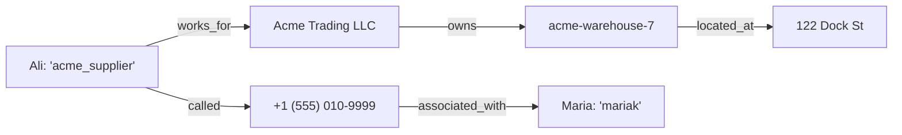

A relationship label is the only string ever interpolated into a Cypher statement; it is validated
against a strict allowlist before any query is built (see [Security](#security)).

---

## Investigation Analytics

Every analytic is a **deterministic function** of the evidence. It is recomputed on demand on the
live graph (below the `ANALYTICS_GRAPH_NODE_CAP`), or read from a persisted, auditable run.

### Centrality

| Measure | Purpose |
| --- | --- |
| **Degree** | how connected an entity is |
| **Betweenness** | how often an entity sits on shortest paths (potential connector) |
| **Closeness** | how quickly an entity can reach the rest of the network |
| **PageRank** | importance inherited through the link structure |

### Graph structure

| Analysis | Purpose |
| --- | --- |
| **Connected components** | the islands of the network |
| **Articulation points** | entities whose removal disconnects the graph |
| **Communities** | clusters that hang together more tightly |

### Investigation intelligence

| Feature | Purpose |
| --- | --- |
| **Patterns** | recognizable structures (e.g. star patterns, repeated relationship types) |
| **Network insights** | aggregate network properties per case |
| **Relationship insights** | evidence-weighted view of individual edges |
| **Hypotheses** | explainable candidate explanations of the observed structure |
| **Priority** | ranks entities/findings for an analyst's next step |
| **Network DNA** | a deterministic fingerprint of the case graph |
| **Relationship strength** | edge weighting derived from matching evidence |
| **Paths** | bounded Neo4j traversals between entities |

> **Bounded computation.** Exact graph algorithms run below `ANALYTICS_GRAPH_NODE_CAP` (default
> 2000 nodes). Larger cases fall back to sampled approximations, which the API reports explicitly
> in `approximation_notice` and per-row `exact` flags.

---

## Explainability

Findings are structured outputs designed to be inspected, not black boxes. Each finding exposes:

- **approach** — which analytic produced it;
- **signals** — the observable inputs that triggered it;
- **weights** — contribution of each signal;
- **affected entities & relationships** — the schema-level scope;
- **evidence ids** — the underlying records an analyst can pull up;
- **limitations** — what the finding does *not* assert.

> **Analytical findings are signals for investigation — they are not proof of guilt or
> wrongdoing.** CyberSaarthi does not make legal or moral determinations. Its value is in making
> candidate relationships and priorities explicit so an investigator can apply judgment.

Findings are persisted per analytics run (`run_id` snapshot), filterable by type/status/severity,
and reviewed via `PATCH /cases/{id}/findings/{id}/status` (`NEW` / `REVIEWED` / `DISMISSED` /
`CONFIRMED`; status is never auto-assigned).

---

## Security

CyberSaarthi applies defense-in-depth, but is **not for that reason "100% secure."** Security is
continuously reviewed; see `docs/audit/` for the latest independent audit.

- **Authentication** — JWT bearer tokens (short-lived, `expires_in`), bcrypt-hashed passwords.
- **Token revocation** — tokens carry a unique `jti`; logout (and, when enabled, revocation) adds
  the id to a Redis denylist so a revoked token is rejected (A07 fix).
- **RBAC** — `ADMIN` / `INVESTIGATOR` / `ANALYST` / `VIEWER` with per-endpoint permissions
  (`case.read`, `case.create`, `case.update`, `case.archive`, `evidence.upload`,
  `evidence.delete`, `ingestion.run`, `analytics.run`, `findings.review`, `findings.dismiss`,
  `findings.confirm`, `users.manage`, `audit.read`, …).
- **Owner/admin authorization & case isolation** — non-admins only see/act on cases they own;
  cross-case access is refused (IDOR guard).
- **Rate limiting / throttling** — Redis keyed login throttling (username + IP) with exponential
  lockout (A06 fix).
- **Correlation ids** — `x-request-id` is generated and echoed across request/error responses.
- **Audit logs** — append-only, permission-scoped (`audit.read`); no write/delete endpoint.
- **Security headers** — `X-Content-Type-Options`, `X-Frame-Options`, `Referrer-Policy`,
  `X-XSS-Protection`, `Cross-Origin-Opener-Policy`, `Permissions-Policy`; in `production` also HSTS
  and a restrictive CSP (`default-src 'none'`) (A12 fix).
- **Secret validation** — the production profile refuses to start with placeholder secrets in
  `POSTGRES_PASSWORD`, `NEO4J_PASSWORD`, `S3_SECRET_KEY`, `REDIS_URL`, `SECRET_KEY`, `CORS_ORIGINS`.
- **Cypher relationship allowlisting** — relationship labels are validated against a canonical list
  before interpolation (A11).
- **Input validation** — size caps streamed during upload, encoding/format sniffing, Pydantic
  validation, strict error envelope.
- **Non-root containers** — the API image runs as `USER appuser`.

---

## Frontend

A premium, template-oriented **Vite + React 19 UI** built to be extended by teammates.

- **Stack** — React 19, Vite 6, TypeScript, Tailwind CSS v4, TanStack Query, Zustand, React Router,
  Framer Motion, Lucide, Cypress-compatible **Cytoscape** for graph rendering, Radix UI primitives.
- **Component architecture** — a reusable design system (`frontend/src/components/ui`), layouts,
  layouts and page components under `frontend/src/app`.
- **API facade** — a single typed facade (`frontend/src/api`) with two interchangeable adapters:
  `mock` (deterministic in-browser demo) and `real` (against the FastAPI backend). Switch with
  `VITE_USE_MOCK_API` — the UI and query hooks do not change.
- **Route guards** — authentication guard + per-permission guards that show a `no-access` page.
- **TanStack Query** — server state caching and invalidation.
- **Code splitting & lazy loading** — pages load on demand.
- **Cytoscape** — interactive graph visualization on the graph page.

### Route tree

```
/login
└── /app                      (authenticated)
    ├── /dashboard            Dashboard
    ├── /cases                Cases list
    └── /cases/:caseId        Case workspace
        ├── /overview         Case overview
        ├── /entities         Entities list
        ├── /entities/:id     Entity detail + analytics profile
        ├── /evidence         Evidence & ingestion
        ├── /graph            Knowledge-graph visualization
        ├── /analytics        Analytics (centrality, communities, ...)
        ├── /hypotheses       Hypotheses
        ├── /findings         Findings list
        ├── /findings/:id     Finding detail (explainable)
        ├── /timeline         Event timeline
        └── /audit            Audit log (permission-guarded)
└── /settings                 Settings
```

The frontend is intentionally structured as a **reusable template**: teammates can add pages and
features while reusing the design system, API facade, permission guards, and query layer.

---

## API Overview

All routes are versioned under `/api/v1`. Authentication uses `Authorization: Bearer <token>`.
Errors use a single envelope `{"error": {"code": "...", "message": "..."}}`.

| Group | Representative endpoints |
| --- | --- |
| **Health** | `GET /health` (liveness) · `GET /ready` (PostgreSQL/Neo4j/Redis/MinIO readiness) |
| **Authentication** | `POST /auth/login` · `POST /auth/logout` (revokes token) · `POST /auth/register` (ADMIN) · `GET /auth/me` |
| **Cases** | `GET/POST /cases` · `GET/PATCH /cases/{id}` · `POST /cases/{id}/archive` |
| **Evidence** | `POST /cases/{id}/evidence` · `GET /cases/{id}/evidence` · `DELETE .../{eid}` · `GET .../{eid}/provenance` · `POST /cases/{id}/ingest` · `GET /cases/{id}/ingest-jobs` |
| **Entities** | `GET /cases/{id}/entities` · `GET /cases/{id}/entities/{eid}` · `GET /cases/{id}/resolution/review` |
| **Relationships** | `GET /cases/{id}/relationships` |
| **Graph** | `GET /cases/{id}/graph` · `/graph/stats` · `/graph/entity/{eid}` |
| **Analytics** | `GET .../analytics/summary|centrality|communities|network-dna|priorities|strength|patterns|hypotheses` · `.../analytics/paths` · `.../analytics/entity/{eid}/analytics` · `POST .../analytics/run` · `GET .../analytics/runs` |
| **Findings** | `GET /cases/{id}/findings` · `/findings/stats` · `GET/PATCH .../findings/{fid}` |
| **Audit** | `GET /audit-logs` (append-only) |

The complete, versioned contract is maintained at
[`backend/docs/frontend-contract.md`](backend/docs/frontend-contract.md), and interactive docs are
served by the API at `/docs` (Swagger UI).

---

## Investigation Demo

With the demo case seeded (`make seed`, case `DEMO-2026-001`), walk an end-to-end investigation:

1. **Login** — open the UI (or `POST /auth/login`); the seeded demo includes credentials & role.
2. **Select a case** — open `DEMO-2026-001` from the cases list.
3. **Inspect evidence** — list the ingested evidence files and their provenance.
4. **View entities** — resolved entities with aliases and confidence.
5. **Explore the graph** — the interactive Neo4j-backed graph page for the case.
6. **Run analytics** — `POST /cases/{id}/analytics/run` persists an auditable snapshot.
7. **Review priorities** — `GET /cases/{id}/analytics/priorities`.
8. **Inspect findings** — `GET /cases/{id}/findings` with explainable payloads.
9. **Inspect a hypothesis** — `GET /cases/{id}/analytics/hypotheses`.
10. **Trace evidence** — each entity/relationship/finding links back to its evidence ids.
11. **Review the audit trail** — `GET /audit-logs` shows every meaningful action.

```bash
# Seed the deterministic demo case (idempotent)
make seed
# Live, deterministic analytics over the demo case
curl 'http://localhost:8000/api/v1/cases/$(id)/analytics/summary'
# Persist an auditable analytics run
curl -X POST 'http://localhost:8000/api/v1/cases/$(id)/analytics/run'
# Inspect persisted findings
curl 'http://localhost:8000/api/v1/cases/$(id)/findings'
```

`make seed` prints the case id; `backend/scripts/preview_analytics.py` prints a headless pipeline
summary for the seeded case.

---

## UI Preview

Real screenshots of the running frontend are committed under [`screenshots/`](screenshots/):

| Screen | Screenshot |
| --- | --- |
| Login | 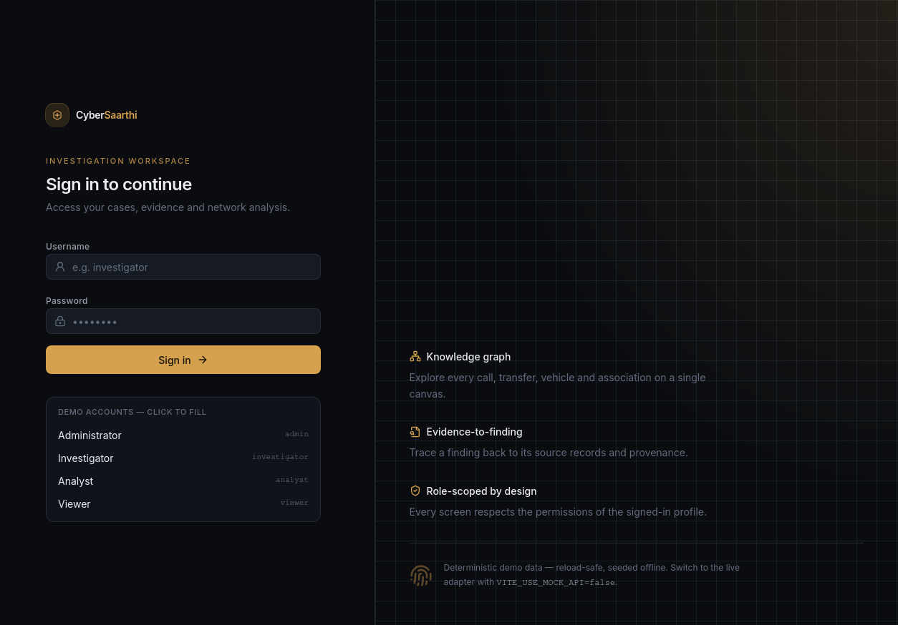 |
| Dashboard |  |
| Cases list | 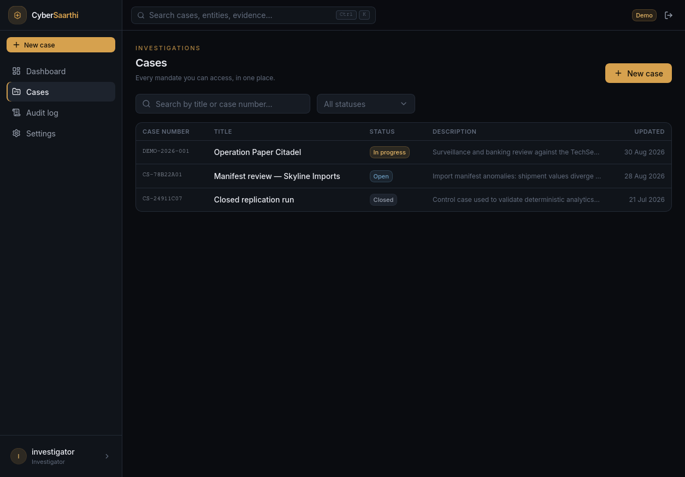 |
| Test case | 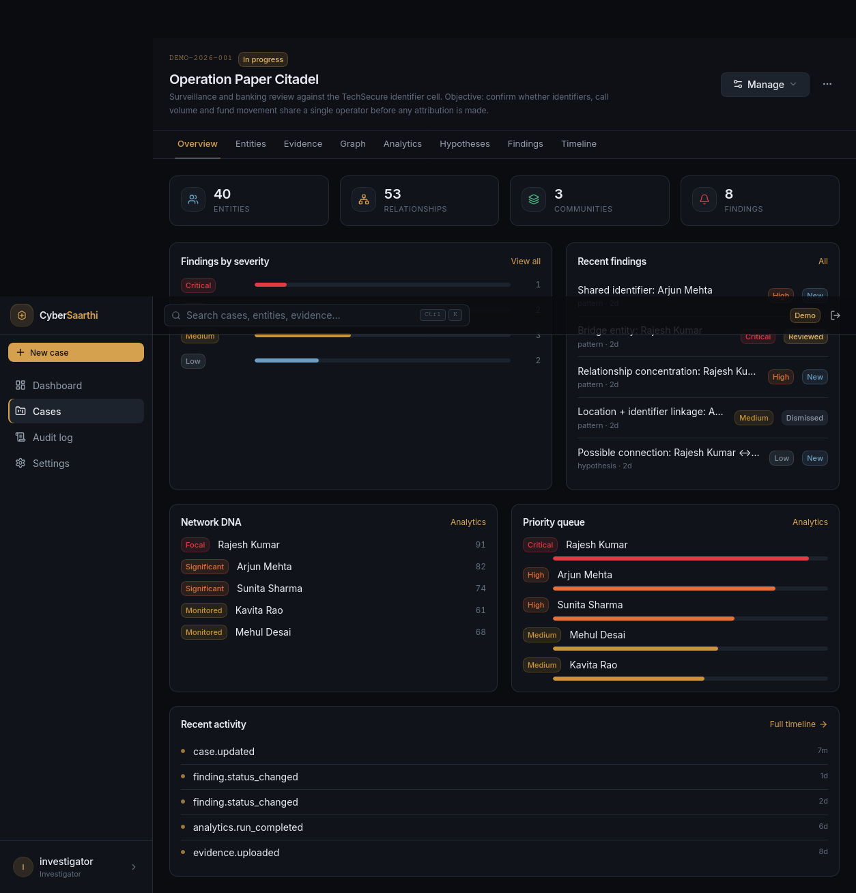 |
| Evidence & ingestion |  |
| Entities | 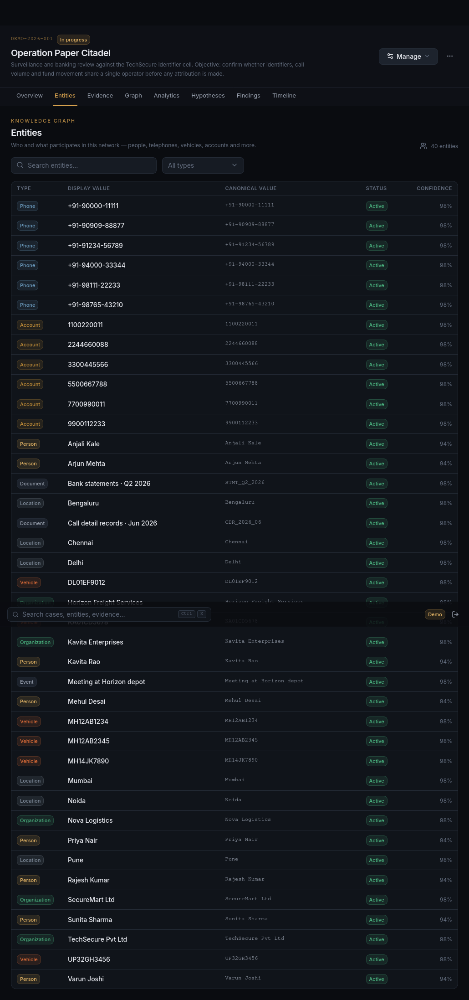 |
| Knowledge graph (Cytoscape) |  |
| Analysis / analytics |  |
| Findings |  |
| Hypotheses | 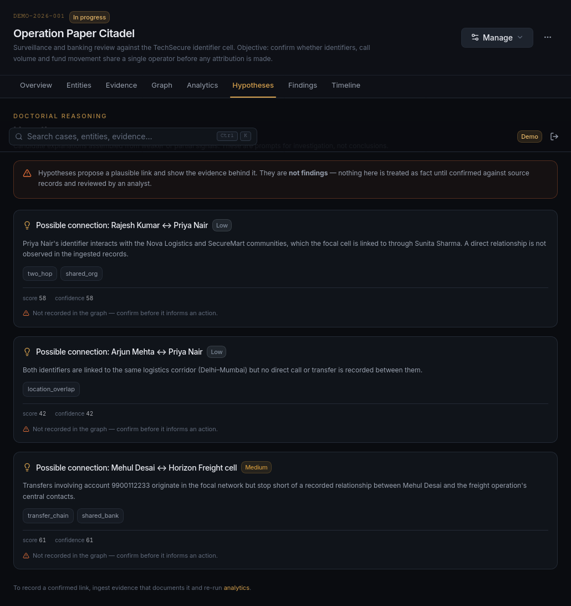 |
| Timeline | 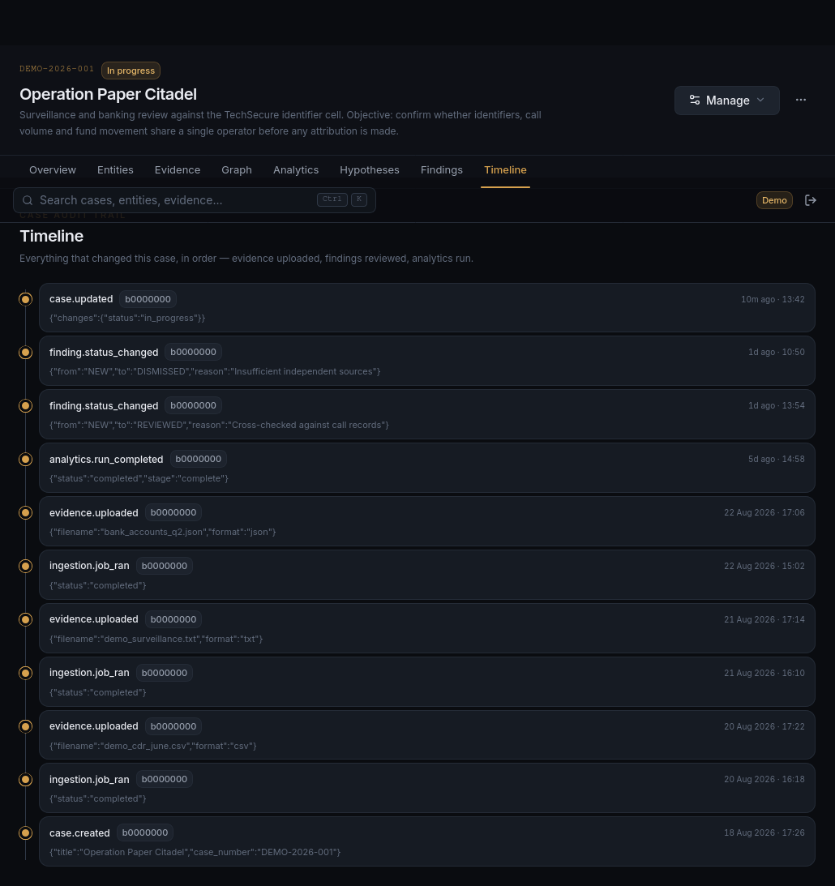 |
| Audit log | 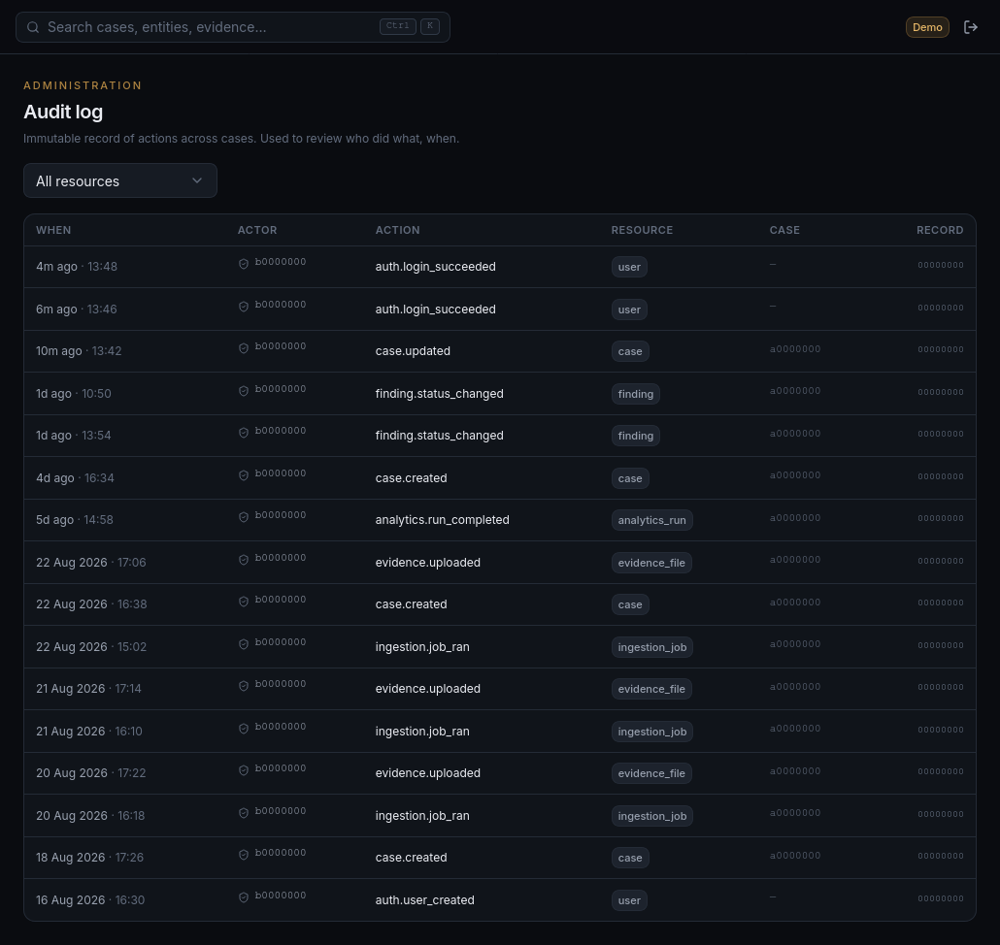 |
| Settings | 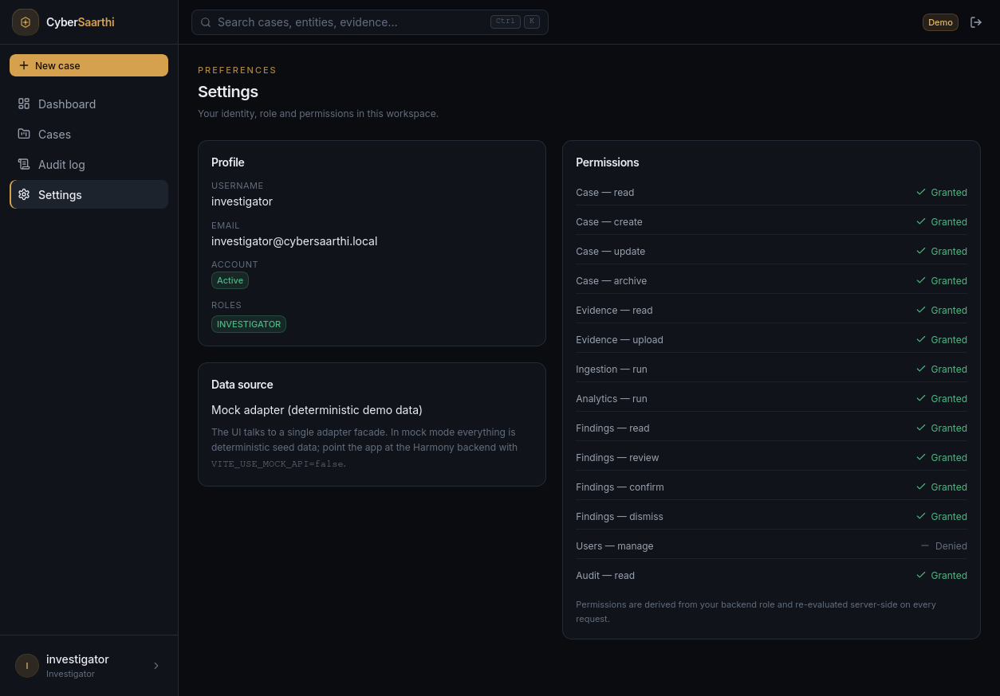 |

_(Screenshots reflect the mock-adapter demo mode, which is deterministic and representative of the
real adapter's behavior.)_

---

## Performance

These are engineering optimizations implemented in the codebase (no fabricated benchmarks):

- **Pagination** — list endpoints (`limit`/`offset`) avoid unbounded payloads.
- **Bounded graph queries** — Neo4j path queries are capped (`paths` bounded).
- **Node caps & sampling** — `ANALYTICS_GRAPH_NODE_CAP` (default 2000) bounds exact analytics;
  larger graphs use explicit, reported sampling.
- **Relationship limits** — ingestion/analysis bounds avoid runaway edge expansion.
- **Database indexes** — foreign keys, case scoping, and uniqueness constraints underpin lookups
  and idempotency.
- **Idempotent ingestion** — SHA-256 dedup + `MERGE` projection prevent duplicate work.
- **Hash deduplication** — content fingerprinting avoids re-processing identical files.
- **Async APIs** — FastAPI + SQLAlchemy async; async Neo4j driver.
- **Frontend lazy loading & code splitting** — pages are loaded on demand.
- **Graph isolation** — per-case projections keep queries scoped.

---

## Testing

Verified continuously in this repository's CI and local gates. Current results:

| Gate | Tool | Result |
| --- | --- | --- |
| Backend tests | pytest | **298 passed** (unit + api + integration) |
| Frontend tests | Vitest | **35 passed** |
| Lint | ruff check | **pass** |
| Format | ruff format --check | **pass** |
| Types | mypy | **0 errors** (97 files) |
| Migrations | alembic check | **no drift** |
| Frontend typecheck | tsc -b --noEmit | **pass** |
| Frontend build | vite build | **pass** |

CI (`.github/workflows/ci.yml`) installs dependencies deterministically from `backend/uv.lock` with
`uv` and runs lint, format-check, typecheck and unit tests on every push/PR.

```bash
# Backend (requires `make up` for integration tests)
make test          # full suite in the dev container
make lint
make format-check
make typecheck
docker compose exec -T backend alembic check

# Frontend
cd frontend
npm test -- --run
npm run typecheck
npm run lint
npm run build
cd ..
```

---

## Project Structure

```
cybersaarthi/
├── backend/                  # FastAPI modular monolith (Python 3.12)
│   ├── app/
│   │   ├── api/              # routers, error envelope, security middleware, dependencies
│   │   ├── analytics/        # deterministic engine (graph, centrality, communities, patterns,
│   │   │                     #   hypotheses, strength, network_dna, priority, paths, findings)
│   │   ├── core/             # settings, logging, security (auth, RBAC, secret validation)
│   │   ├── db/               # PostgreSQL, Neo4j, Redis, MinIO clients + readiness
│   │   ├── models/           # SQLAlchemy models
│   │   ├── repositories/     # data-access layer
│   │   ├── schemas/          # Pydantic schemas
│   │   └── services/         # validation, parsing, extraction, nlp, normalization, resolution,
│   │                         #   relationships, graph_sync, ingestion, audit, token, throttle
│   ├── migrations/           # Alembic async migrations
│   ├── scripts/              # seed_demo.py, preview_analytics.py
│   ├── tests/                # unit, api, integration suites
│   ├── docs/                 # frontend-contract + architecture docs
│   ├── pyproject.toml        # deps + tooling config (ruff, mypy, pytest)
│   └── uv.lock               # deterministic lockfile
├── frontend/                 # React 19 + Vite + TS UI
│   ├── src/
│   │   ├── api/              # typed facade: contract + mock/real adapters
│   │   ├── app/              # pages, layout, router
│   │   ├── components/       # design-system + feature components
│   │   ├── stores/           # Zustand stores (auth, etc.)
│   │   ├── hooks/            # TanStack Query hooks
│   │   └── lib/              # permissions, utils
│   └── docs/                 # design-system + frontend-final-report
├── docs/                     # adr/ (000..007), architecture/, audit/, development/
├── screenshots/              # committed UI previews
├── docker-compose.yml        # local services (PostgreSQL, Neo4j, Redis, MinIO, backend, backend-dev)
├── Makefile                  # dev workflow (make test/lint/format/typecheck/migrate/seed/...)
├── .github/workflows/ci.yml  # CI
└── .env.example              # config template (copy to .env; never commit .env)
```

Important directories:
- `backend/app/analytics/` — the deterministic investigation-intelligence engine.
- `backend/app/services/` — the evidence pipeline (ingestion, resolution, graph sync, security).
- `frontend/src/api/` — the typed API facade and its mock/real adapters.
- `docs/adr/` — decision records explaining *why* key choices were made.

---

## Installation — Linux

Targets **Ubuntu/Debian** (Arch Linux notes included). Everything runs through Docker; no host
Python or Node is required for the backend.

### Prerequisites

```bash
docker --version        # Docker Engine
docker compose version  # Docker Compose v2 plugin
git --version
```

### Install Docker (Ubuntu/Debian)

Follow Docker's official documentation (prefer official instructions over third-party scripts):

1. Set up Docker's apt repository and install `docker-ce` + the compose plugin — see
   [Docker Engine installation](https://docs.docker.com/engine/install/ubuntu/).
2. Add your user to the `docker` group (then re-login) so you can run Docker without `sudo`:

```bash
sudo usermod -aG docker "$USER"
newgrp docker
```

> **Note for rootless/rootful setups:** the repository is developed in a rootless-Docker friendly
> layout. If your Docker daemon runs rootful, `make test` etc. create containers that mount
> `./backend`; ensure the directory is readable by the daemon user.

**Arch Linux:** `sudo pacman -S docker docker-compose && sudo systemctl enable --now docker` then add
your user to the `docker` group.

### Clone & configure

```bash
git clone https://github.com/<your-org>/cybersaarthi.git
cd cybersaarthi
cp .env.example .env
```

Edit `.env` as needed. For local development the defaults are safe. **Never commit the real `.env`.**

The values you may want to configure:
- `SECRET_KEY` — set a strong value if the service will be exposed beyond localhost.
- `POSTGRES_PASSWORD`, `NEO4J_PASSWORD`, `S3_SECRET_KEY`, `REDIS_URL` — change in non-local environments.
- `CORS_ORIGINS` — the frontend origin(s) allowed to call the API (default `http://localhost:5173,http://localhost:3000`).

### Build & start

```bash
docker compose up -d --build
```

On cold start the backend entrypoint runs `alembic upgrade head` automatically, so migrations apply
before the API accepts traffic.

### Verify

```bash
docker compose ps
curl http://localhost:8000/api/v1/health
curl http://localhost:8000/api/v1/ready
```

`/api/v1/ready` returns `200` when PostgreSQL, Neo4j, Redis and MinIO are all healthy.

### Migrations & seed

```bash
make migrate      # apply any pending migrations (idempotent)
make seed         # seed the deterministic demo case DEMO-2026-001
```

### Frontend (optional, runs outside Docker)

```bash
cd frontend
npm install        # first time only
npm run dev        # Vite dev server → http://localhost:5173
```

By default the frontend runs in **mock mode** (deterministic, no backend needed). To use the real
backend, set `VITE_USE_MOCK_API=false` and `VITE_API_URL=http://localhost:8000` (see
`frontend/src/config/env.ts`).

### Local development without Docker (optional)

Docker is the primary path; for host-side backend work, install with `uv` matched to the committed
lockfile so versions match CI and the dev container:

```bash
cd backend
uv sync --frozen --all-extras
```

---

## Installation — Windows + Docker Desktop

> **Native Windows execution is not the primary supported environment.** This project is Linux- and
> container-oriented. The recommended Windows setup is:

```
 Windows
   │
   ▼
 Docker Desktop
   │
   ▼
 Linux containers
   │
   ▼
 CyberSaarthi
```

You do **not** need to install Linux manually. Docker Desktop provides a Linux VM via WSL 2.

### 1. Install Docker Desktop

Download and install **Docker Desktop for Windows** from
[docker.com/products/docker-desktop](https://www.docker.com/products/docker-desktop/).

### 2. Start Docker Desktop

Launch Docker Desktop and wait for the engine to be ready (the whale icon stops animating).

### 3. Enable WSL 2 backend

During install, choose the **WSL 2** backend. After install, in Docker Desktop → **Settings →
Resources → WSL Integration**, ensure the relevant WSL distributions are enabled. (WSL 2 must be
installed; Docker Desktop's installer usually configures it, or run `wsl --install` from an
admin PowerShell.)

### 4. Verify Docker

```powershell
docker --version
docker compose version
```

### 5. Clone & configure

From PowerShell (or Git Bash):

```powershell
git clone https://github.com/<your-org>/cybersaarthi.git
cd cybersaarthi
Copy-Item .env.example .env     # PowerShell equivalent of `cp .env.example .env`
```

Edit `.env` with your preferred editor as described in [Configuration](#configuration).

### 6. Build & start

```powershell
docker compose up -d --build
docker compose ps
curl http://localhost:8000/api/v1/health
curl http://localhost:8000/api/v1/ready
```

### 7. Migrations & seed

**`make` is not guaranteed on Windows.** Use the equivalent Docker Compose commands directly:

```powershell
# Apply pending migrations (runs automatically on backend start too)
docker compose exec -T backend alembic upgrade head
# Seed the deterministic demo case
docker compose exec -T backend python -m scripts.seed_demo
```

### 8. Run the frontend from Windows

The frontend runs on Node (outside Docker):

```powershell
cd frontend
npm install        # first time only
npm run dev        # Vite dev server → http://localhost:5173
```

Use the same environment variables (`VITE_USE_MOCK_API`, `VITE_API_URL`) as [above](#installation--linux).
If the backend is in Docker Desktop and the browser is on Windows, point `VITE_API_URL` at
`http://localhost:8000` (Docker Desktop publishes ports to localhost by default).

---

## Docker Architecture

Services are defined in [`docker-compose.yml`](docker-compose.yml) (verified):

| Service | Purpose | Image / Target | Notes |
| --- | --- | --- | --- |
| `backend` | API server (lean runtime image) | `./backend` build, target `runtime` | default image for `up`; runs as non-root |
| `backend-dev` | verification/tooling container | `./backend` build, target `dev` | profile `dev`; has pytest/ruff/mypy; mounts repo for infra tests |
| `postgres` | source of truth | `postgres:16-alpine` | port `5432` |
| `neo4j` | graph projection | `neo4j:5-community` | ports `7474` (`7474` HTTP), `7687` (Bolt) |
| `redis` | cache / denylist / throttle | `redis:7-alpine` | port `6379` |
| `minio` | evidence object storage | `minio/minio:RELEASE.…` (pinned) | ports `9000` (API), `9001` (console) |
| `minio-init` | create the bucket | `minio/mc:RELEASE.…` (pinned) | one-shot init |

Migrations run automatically on backend startup (Alembic), and `make seed` populates the demo case.

> **Port note.** `neo4j` publishes `7474:7474` (HTTP/Neo4j Browser) and `7687:7687` (Bolt). Verify
> live ports with `docker compose ps` in your environment.

---

## Configuration

Environment is read from `.env` (git-ignored). Copy `.env.example → .env` and adjust. The template:

| Variable | Purpose | Default |
| --- | --- | --- |
| `APP_NAME` | application name | `cybersaarthi` |
| `APP_ENV` | `development` / `production` | `development` |
| `LOG_LEVEL` | logging verbosity | `INFO` |
| `POSTGRES_HOST/PORT/DB/USER/PASSWORD` | PostgreSQL connection | local compose defaults |
| `NEO4J_URI/USER/PASSWORD` | Neo4j connection | `bolt://neo4j:7687` |
| `REDIS_URL` | Redis connection | `redis://redis:6379/0` |
| `S3_ENDPOINT/ACCESS_KEY/SECRET_KEY/BUCKET/REGION` | MinIO object storage | local compose defaults |
| `CORS_ORIGINS` | allowed frontend origins | `http://localhost:5173,http://localhost:3000` |
| `SECRET_KEY` | JWT signing secret | `dev-secret-change-me` (override in production) |

Frontend-only (in `frontend/.env`, copied from `frontend/.env.example`, or `frontend/src/config/env.ts`):
`VITE_USE_MOCK_API` (mock adapter on/off — defaults to mock unless set to `false`) and `VITE_API_URL`
(backend base URL, default `http://localhost:8000`).

> **Secrets are never committed.** The real `.env` is covered by `.gitignore`. Placeholder values in
> the template are development-only; production refuses to start with placeholders.

---

## Troubleshooting

| Symptom | Likely cause / fix |
| --- | --- |
| **Docker not running** | Start Docker Desktop (Windows) or the Docker service (`sudo systemctl start docker`); verify `docker ps`. |
| **Port already in use** | Another process holds `8000`/`5432`/`7687`/`9000`/`5173`… Stop it or change the host port mapping in `.env`/compose. |
| **Database not ready** | Wait; the backend's healthcheck gates `depends_on` (PostgreSQL/Neo4j/Redis/MinIO must be healthy). Check `docker compose ps`. |
| **Migration failure** | Ensure the DB user has rights; run `docker compose exec -T backend alembic upgrade head` and inspect logs. |
| **Frontend cannot reach the API** | Ensure the backend is up and `VITE_API_URL` points at `http://localhost:8000`; on Windows confirm Docker Desktop publishes the port to localhost. |
| **Permission problems mounting `./backend`** | The dev container runs as uid 1000; if your host mounts are root-owned, `make format` may not write through the mount (use `make format-check` for verification, or fix host ownership). |
| **Windows Docker Desktop problems** | Ensure the WSL 2 backend is enabled and the WSL integration is on; restart Docker Desktop; run `wsl --shutdown` then start Docker Desktop. |
| **WSL 2 problems** | `wsl --install` (admin), restart, then `wsl --update`; ensure a distribution is installed and Docker Desktop's WSL integration is enabled for it. |
| **Container rebuild needed** | `docker compose up -d --build` to rebuild images from changed Dockerfiles. |
| **Reset development volumes** | ⚠️ **Destructive** — deletes all local data (cases, evidence, graph, cache): `make down-v` then `make up`. |

---

## Contributing

Thanks for contributing to CyberSaarthi. The project follows a branch + conventional-commits
workflow.

### Backend development

- The backend is a modular monolith (FastAPI). Code lives under `backend/app`.
- New behavior ships with tests in `backend/tests/` (unit / api / integration).

### Frontend development

- The frontend is a reusable template. Add pages under `frontend/src/app/pages` and components under
  `frontend/src/components`.
- Use the typed API facade (`frontend/src/api`) and TanStack Query hooks; keep the mock adapter
  deterministic and in sync with the contract.

### Verification (backend)

```bash
make test           # full suite (needs `make up`)
make lint           # ruff check
make format         # ruff format
make format-check   # verify formatting
make typecheck      # mypy
docker compose exec -T backend alembic check
```

### Verification (frontend)

```bash
cd frontend
npm test -- --run
npm run typecheck
npm run lint
npm run build
cd ..
```

### Migration discipline

- Never hand-edit applied migrations.
- Generate changes with `make migration MSG="describe change"`.
- Apply with `make migrate`; verify with `alembic check`.
- Keep migrations additive and reversible.

### Feature branches & commits

- Work on feature branches off `main`; open a pull request.
- Use [Conventional Commits](https://www.conventionalcommits.org/): `feat:`, `fix:`, `docs:`,
  `refactor:`, `test:`, `chore:`.
- Keep each commit focused and its tests green.
- Never commit `.env`, secrets, `node_modules`, `.venv`, caches, or build output.

---

## Roadmap

**✅ Completed**
- Phase 1 foundation & infrastructure · Phase 2 data-intelligence pipeline · Phase 3 investigation
  intelligence engine · Phase 4 security & productization · premium frontend · security remediation
  (token revocation, audit scoping, iterative graph algorithms, secret validation, CSP/HSTS).

**🚧 Current**
- Frontend enhancement as a reusable template for teammates.

**📋 Planned**
- ML / model-training pipeline (directory currently a placeholder — no implementation ships yet).
- Background ingestion worker (ingestion is currently synchronous / single-worker).
- Deployment manifests (`infra/` placeholder) and container-orchestration packaging.

> The roadmap reflects the repository's actual state. Planned items are not presented as done.

---

## Engineering Principles

- **Determinism** — the same evidence always produces the same analytics; no random scoring.
- **Explainability** — every finding and score is inspectable and traceable to signals + evidence.
- **Provenance** — entities, relationships, and findings link back to the records that produced them.
- **Case isolation** — strict per-case scoping of data and authorization (IDOR guard).
- **Idempotency** — SHA-256 dedup, `MERGE` projection, and safe re-sync make reruns safe.
- **Source-of-truth architecture** — PostgreSQL owns authoritative data; Neo4j is a projection.
- **Security** — least-privilege RBAC, secret validation, token revocation, hardened headers.
- **Auditability** — an append-only audit trail records meaningful actions.
- **Bounded computation** — analytics and path traversal are capped and explicitly reported.

---

## License

This repository does not yet include a `LICENSE` file. The package metadata (`backend/pyproject.toml`)
declares `license = "MIT"`, but no license text is committed. Licensing terms should be finalized
before broader distribution. Until then, assume standard copyright restrictions apply and contact
the maintainers before reuse.

---

## Acknowledgements

CyberSaarthi is built on major open-source technologies:

- **Backend:** FastAPI, Uvicorn, Pydantic, SQLAlchemy, Alembic, PostgreSQL, Neo4j, Redis, MinIO,
  spaCy, RapidFuzz, Starlette.
- **Frontend:** React, Vite, TypeScript, Tailwind CSS, TanStack Query, Zustand, React Router,
  Cytoscape, Framer Motion, Radix UI, Lucide.
- **Tooling:** Docker, Docker Compose, uv, Ruff, mypy, pytest, Vitest, ESLint, Prettier.

Special thanks to the open-source maintainers of these projects.
