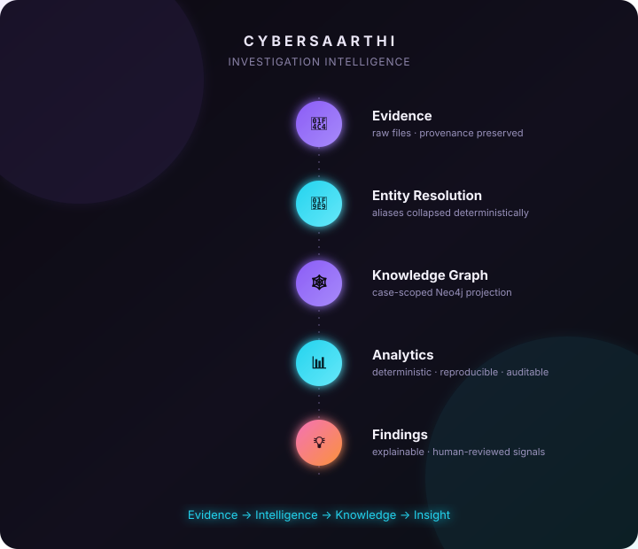
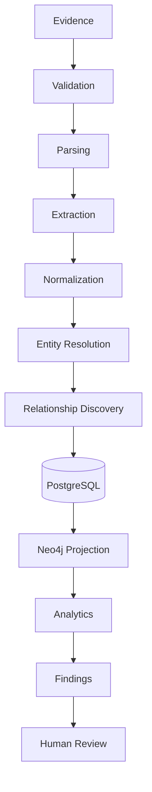
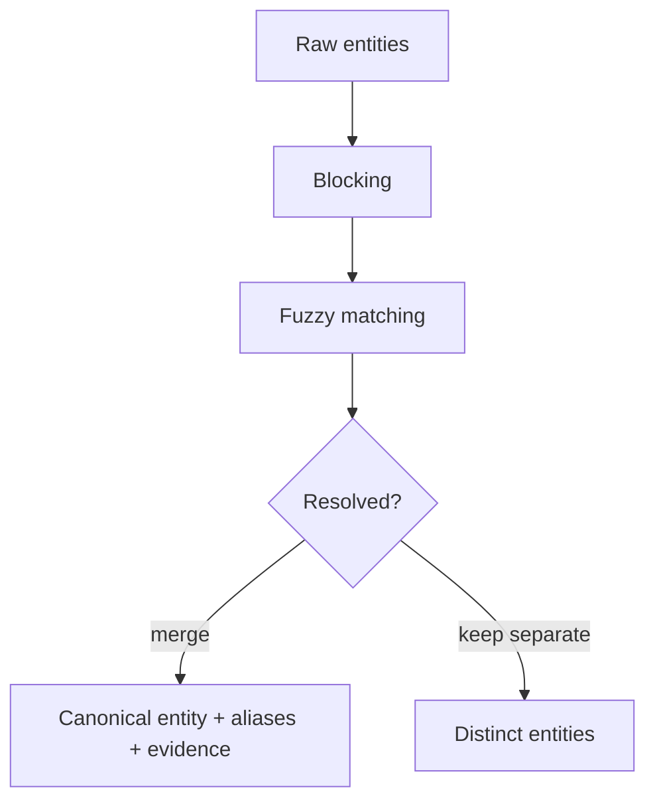
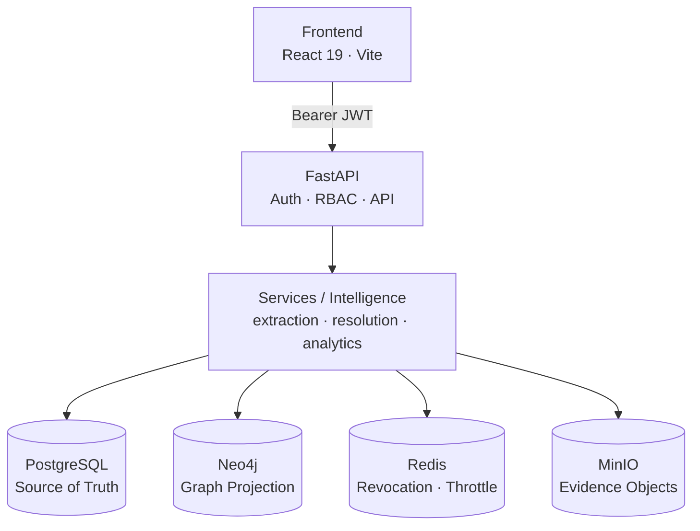
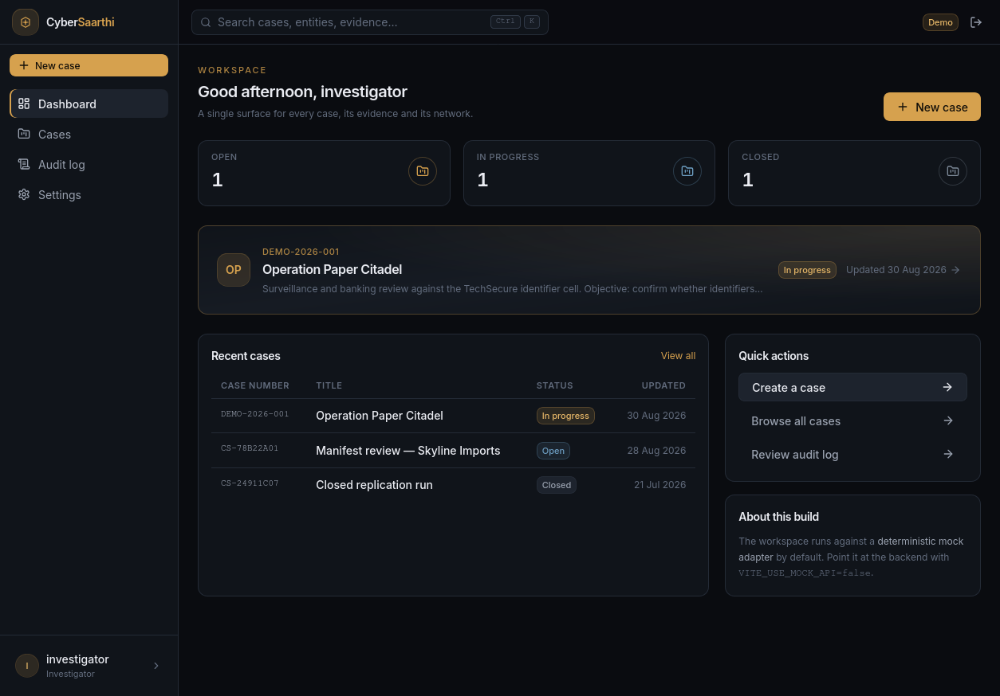
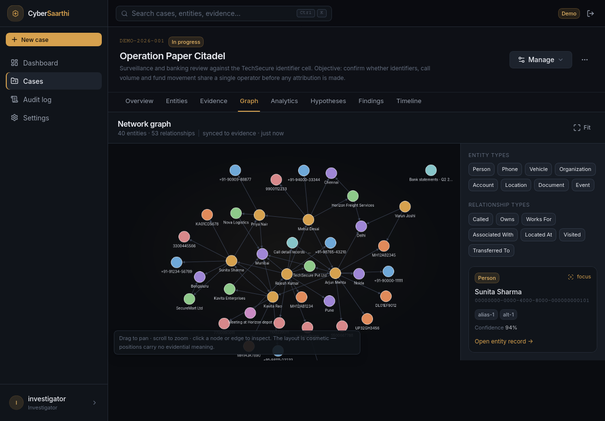
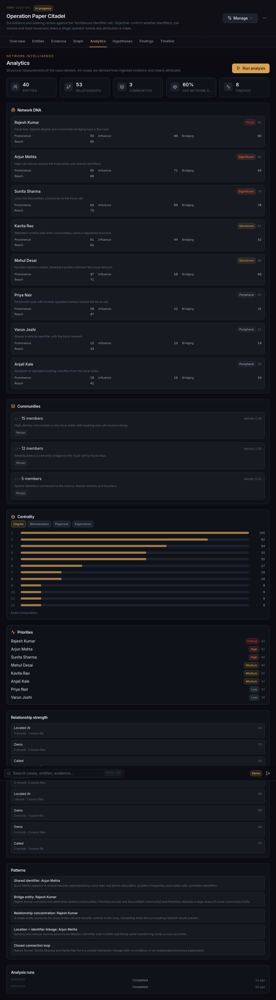
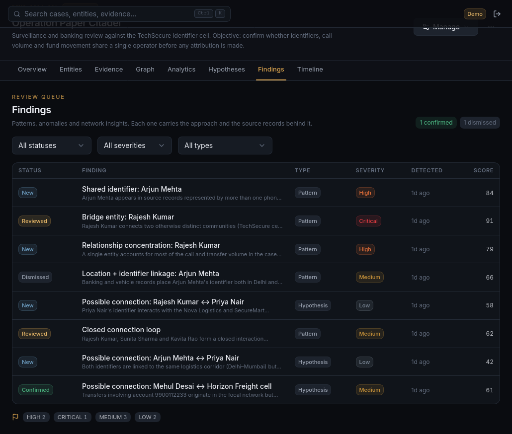
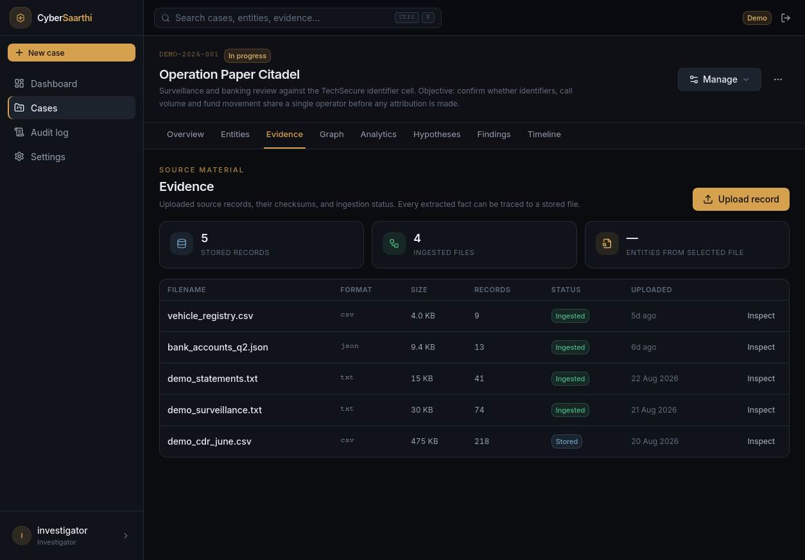

<div align="center">

# 🛡️ CyberSaarthi

### Investigation Intelligence Platform

**Turn fragmented evidence into explainable investigative intelligence.**

`Evidence → Entity Resolution → Knowledge Graph → Analytics → Findings`

<p>
<a href="#quick-start">⚡ Quick Start</a> ·
<a href="#architecture">◈ Architecture</a> ·
<a href="#demo">🎞 Demo</a> ·
<a href="#security">🔐 Security</a> ·
<a href="#documentation">📚 Docs</a>
</p>

</div>

<p align="center">
  
</p>

<div align="center">


</div>

---

## ✦ What is CyberSaarthi?

A self-hosted investigation workspace that turns **raw evidence into a resolved network of
entities** — then explains *why* it matters. It is a deterministic, explainable pipeline, not an
autocomplete oracle: every relationship, score and finding is traceable back to the evidence that
produced it, and a human investigator stays in the loop at every decision.

- **What** — a FastAPI + React platform for evidence ingestion, entity resolution, knowledge-graph
  exploration and explainable analytics.
- **Why** — fragmented evidence hides structure; a flat list of records hides who is connected to
  whom, and how.
- **How** — files → entities → relationships → a case-scoped graph → reviewable findings.

---

## 🧩 Intelligence Pipeline



> **PostgreSQL is the source of truth; Neo4j is the graph projection.** Neo4j is rebuilt
> idempotently for bounded traversal and never owns authoritative data.

---

## ✦ Core capabilities

| | | |
|---|---|---|
| 🔍 **Evidence Intelligence** — ingest, validate, parse and preserve provenance | 🧩 **Entity Resolution** — collapse aliases via blocking, fuzzy matching and context | 🕸️ **Knowledge Graph** — a case-scoped Neo4j projection from resolved entities |
| 📊 **Network Analytics** — centrality, communities, patterns and paths | 💡 **Explainable Findings** — signals, weights, affected entities and evidence | 🎯 **Investigation Priority** — surface what an analyst should look at next |
| 🔐 **Security & Auditability** — JWT, RBAC, token revocation and audit logging | 🖥️ **Investigator Workspace** — a premium, template-oriented React UI | ♻️ **Idempotent Processing** — repeat runs never create duplicate logical state |

---

## ✨ Key innovations

### ✦ Evidence-backed intelligence
Every finding carries its **approach, signals, weights, affected entities and evidence ids** — so an
analyst can pull up the underlying records behind any result.

### ✦ Deterministic analytics
Analytics are **reproducible functions of the ingested evidence** — no random scoring, no fabricated
confidence. Reruns on the same data produce the same answers.

### ✦ PostgreSQL + Neo4j separation
A clean **source/projection** split: PostgreSQL owns authoritative relational state; Neo4j holds an
idempotent projection used only for bounded graph traversal.

### ✦ Explainable findings
Findings are structured, inspectable outputs — filters, statuses and evidence are all exposed. They
are **analytical signals for review, never proof or an automated determination of guilt.**

### ✦ Human-in-the-loop hypotheses
Hypotheses surface candidate explanations, but **status is never auto-assigned** — an investigator
decides what deserves confirmation, dismissal or further review.

### ✦ Case-scoped graph intelligence
Every graph operation is **isolated to a single investigation case**, with owner/admin authorization
and IDOR guards across the API.

<details>
<summary>How Entity Resolution works (technical)</summary>

1. **Blocking** groups candidate entities into plausible pools (avoids all-pairs blow-up).
2. **Fuzzy matching** (RapidFuzz) measures string similarity on normalized values.
3. **Context** — field type, surrounding entities and co-occurrence inform the decision.
4. The result is a **canonical entity** carrying its aliases plus the candidate-match evidence.



</details>

---

## ◈ Architecture



A modular FastAPI monolith exposes the API, the deterministic intelligence engine and the evidence
pipeline. PostgreSQL is the source of truth; Neo4j is an idempotent graph projection over it; Redis
backs token revocation and login throttling; MinIO stores raw evidence objects. See
[`docs/architecture/`](docs/architecture/) and [`docs/adr/`](docs/adr/) for deeper design.

---

## 🎞 Demo

With `make seed` (demo case `DEMO-2026-001`), walk an end-to-end investigation:

1. **Login** → open the seeded demo account
2. **Open** the demo case
3. **Inspect** evidence and its provenance
4. **Explore** the interactive knowledge graph
5. **Run** deterministic analytics
6. **Open** an explainable finding
7. **Trace** to the underlying evidence
8. **Review** the audit trail



<div align="center">
  <table>
    <tr>
      <td></td>
      <td></td>
    </tr>
    <tr>
      <td></td>
      <td></td>
    </tr>
  </table>
</div>

_Screenshots reflect the deterministic mock adapter, representative of the real backend's behavior.
The full gallery lives in [`screenshots/`](screenshots/)._

---

## 🔐 Security

| Control | Detail |
|---|---|
| **Authentication** | JWT bearer tokens · bcrypt-hashed passwords |
| **RBAC** | ADMIN / INVESTIGATOR / ANALYST / VIEWER with per-endpoint permissions |
| **Case isolation** | owner/admin authorization · cross-case access refused |
| **IDOR protection** | per-case resource guards |
| **Token revocation** | `jti` denylist in Redis |
| **Rate limiting** | keyed login throttling with exponential lockout |
| **Audit logging** | append-only, permission-scoped (`audit.read`) |
| **Security headers** | CSP + HSTS in production, `x-request-id` correlation |
| **Input validation** | size caps, format sniffing, strict error envelope, Cypher label allowlist |

Defense-in-depth — continuously reviewed, **never "100% secure."** See [`docs/audit/`](docs/audit/).

---

## 🧰 Tech stack

| Category | Technology | Purpose |
|---|---|---|
| **Frontend** | React 19 · Vite · TypeScript · Tailwind | Premium **Vite + React 19 UI**, mock & real API modes |
| **Backend** | FastAPI · Uvicorn · SQLAlchemy · Alembic · Pydantic | API, pipeline, deterministic analytics engine |
| **Data** | PostgreSQL 16 | Source of truth (relational) |
| **Graph** | Neo4j 5 · Cytoscape | Graph projection · browser visualization |
| **Storage** | MinIO (S3) · Redis 7 | Evidence objects · revocation/cache/throttle |
| **AI / NLP** | spaCy (NER) | Named-entity extraction (rules-first) |
| **Infrastructure** | Docker Compose · uv · Ruff · mypy | Local stack · deterministic deps · tooling |
| **Testing** | pytest · Vitest | Backend + frontend suites |

---

## ⚡ Quick start

### Prerequisites

- [Git](https://git-scm.com/)
- [Docker Engine](https://docs.docker.com/engine/install/) + [Docker Compose](https://docs.docker.com/compose/install/)
- Node.js + npm (only for the frontend)

### Linux / macOS

```bash
git clone https://github.com/0xhroot/cybersaarthi.git
cd cybersaarthi

cp .env.example .env            # dev-safe defaults; never commit .env
docker compose up -d --build    # start postgres, neo4j, redis, minio, backend
docker compose ps               # confirm all services are up

make migrate                    # apply migrations (also runs automatically on startup)
make seed                       # seed the deterministic demo case DEMO-2026-001
```

**Verify it's ready:**

```bash
curl http://localhost:8000/api/v1/health   # 200 — API is up
curl http://localhost:8000/api/v1/ready    # 200 — postgres, neo4j, redis, minio healthy
```

**Access:**
- Backend API: `http://localhost:8000` · Swagger: `http://localhost:8000/docs`
- Frontend: `cd frontend && npm install && npm run dev` → `http://localhost:5173`
  (mock mode by default; set `VITE_USE_MOCK_API=false` to use the real backend)

### Windows + Docker Desktop

> **Native Windows is not the primary environment.** The recommended path is
> **Windows → Docker Desktop → Linux containers (WSL 2) → CyberSaarthi**. Docker Desktop provides
> the Linux VM, so no manual Linux install is needed.

1. Install [Docker Desktop for Windows](https://www.docker.com/products/docker-desktop/).
2. During install choose the **WSL 2** backend; start Docker Desktop.
3. Verify the engine (PowerShell):

```powershell
docker --version
docker compose version
```

4. Clone and configure (PowerShell):

```powershell
git clone https://github.com/0xhroot/cybersaarthi.git
cd cybersaarthi
Copy-Item .env.example .env        # PowerShell equivalent of `cp`
```

5. Build and start:

```powershell
docker compose up -d --build
docker compose ps
```

6. Migrations and seed — **`make` is not guaranteed on Windows**, so use Docker Compose directly:

```powershell
docker compose exec -T backend alembic upgrade head
docker compose exec -T backend python -m scripts.seed_demo
```

7. Frontend (Node on Windows):

```powershell
cd frontend
npm install
npm run dev
```

If the backend runs in Docker Desktop, point `VITE_API_URL` at `http://localhost:8000` — Docker
Desktop publishes ports to localhost by default.

---

## ⚡ 2-Minute Demo

```
Start stack ──▶ Login ──▶ Open demo case ──▶ Explore graph
     └──────────▶ Run analytics ──▶ Open finding ──▶ View evidence ──▶ Audit
```

After `make seed`, open the UI, log in, open `DEMO-2026-001`, explore the graph, run analytics,
inspect a finding, trace its evidence, then review the audit log.

---

## 🧪 Verification

Run without installing anything on the host — `make` targets inside the `backend-dev` container.
Windows users without `make` can use the Docker equivalents.

| Gate | Linux (`make`) | Windows / Docker equivalent |
|---|---|---|
| Tests | `make test` | `docker compose run --rm backend-dev pytest` |
| Lint | `make lint` | `docker compose run --rm backend-dev ruff check .` |
| Typecheck | `make typecheck` | `docker compose run --rm backend-dev mypy app` |
| Format check | `make format-check` | `docker compose run --rm backend-dev ruff format --check .` |

**Current verified status:**

| Gate | Status |
|---|---|
| Backend tests | ✅ 298 passed (unit · api · integration) |
| Frontend tests | ✅ 35 passed |
| Ruff | ✅ pass |
| Mypy | ✅ 0 errors |
| Alembic check | ✅ no drift |
| Frontend typecheck / lint / build | ✅ pass |

---

## 🗂️ Project structure

```
cybersaarthi/
├── backend/            # FastAPI modular monolith (Python 3.12)
│   ├── app/            #   api · analytics · services · models · repositories
│   ├── migrations/     #   Alembic migrations
│   └── tests/          #   unit · api · integration
├── frontend/           # React 19 + Vite + TypeScript UI (template)
├── docs/               # architecture · adr · audit
├── screenshots/        # UI previews
├── docs/assets/        # README visuals (hero)
├── docker-compose.yml  # postgres · neo4j · redis · minio · backend
└── Makefile            # dev workflow
```

---

## 📚 Documentation

| Resource | Purpose |
|---|---|
| [`docs/architecture/`](docs/architecture/) | Phase architecture reports |
| [`docs/adr/`](docs/adr/) | Architecture decision records |
| [`docs/audit/`](docs/audit/) | Security & project audits |
| [`backend/docs/frontend-contract.md`](backend/docs/frontend-contract.md) | Full API / frontend contract |
| [`frontend/docs/`](frontend/docs/) | Design system & frontend report |

---

## 🗺️ Roadmap

**✅ Completed** — evidence pipeline, entity resolution, knowledge graph, deterministic analytics,
explainable findings, security controls, premium frontend.

**🚧 Current** — extending the frontend as a reusable template.

**🔭 Future** — ML / model-training pipeline (`ml/` is a placeholder; **no training pipeline ships
today**), background ingestion worker (ingestion is currently synchronous), OIDC / MFA and deployment
manifests.

---

## 🤝 Contributing

- **Backend** — modular monolith under `backend/app`; ship changes with tests in `backend/tests/`.
- **Frontend** — add pages under `frontend/src/app/pages`; reuse the typed API facade and query layer.
- **Tests** — backend `make test`; frontend `npm test -- --run`.
- **Lint / typecheck** — `make lint` · `make format-check` · `make typecheck`, and frontend
  `npm run lint` · `npm run typecheck`.
- **Docker** — everything runs through `docker compose`; regenerate schema with
  `make migration MSG="describe change"` and never hand-edit applied migrations.
- Use [Conventional Commits](https://www.conventionalcommits.org/); never commit `.env`, secrets,
  `node_modules`, `.venv`, caches or build output.

---

## License

**Not yet specified.** No `LICENSE` file is present in the repository. The backend package metadata
(`backend/pyproject.toml`) declares an MIT notice, but no license text is committed — please contact
the maintainers before reuse.

---

## Acknowledgements

Built on great open-source software: FastAPI · Uvicorn · SQLAlchemy · Alembic · Pydantic ·
PostgreSQL · Neo4j · Redis · MinIO · spaCy · RapidFuzz · React · Vite · TypeScript · Tailwind CSS ·
TanStack Query · Zustand · React Router · Cytoscape · Framer Motion · Docker · uv · Ruff · mypy ·
pytest · Vitest.
