<div align="center">

# **CYBERSAARTHI**

### Cyber Fraud Recovery & Evidence Intelligence Platform

**From fragmented evidence → connected intelligence → actionable investigation.**

`Evidence → Entity Resolution → Knowledge Graph → Analytics → Decisions`

<p>
<a href="#one-minute-overview">Overview</a> ·
<a href="#why-cybersaarthi">Why</a> ·
<a href="#architecture">Architecture</a> ·
<a href="#testing-and-verification">Verification</a> ·
<a href="#sih-demo-workflow">Demo Workflow</a> ·
<a href="#quick-start">Quick Start</a>
<br>
<sub>Smart India Hackathon submission — built for the investigator, not the demo slide.</sub>
</p>

</div>

<div align="center">

| | | | |
|---|---|---|---|
| 🟢 **SIH DEMO READY** | **379** Backend Tests Passed | **67** Frontend Tests Passed | **Real-Mode E2E Verified** |
| Persistent Multi-Store | RBAC + JWT | Evidence Provenance | Victim + IoT Intelligence |
| Graph Analytics | REST API + UI | Audit Trail | Docker Compose |

</div>

<div align="center">


</div>

---

## Table of Contents

- [One-Minute Overview](#one-minute-overview)
- [Problem](#problem)
- [Solution](#solution)
- [Why CyberSaarthi?](#why-cybersaarthi)
- [Key Features](#key-features)
- [Application Screenshots](#application-screenshots)
- [Investigator Workflow](#investigator-workflow)
- [Architecture](#architecture)
- [Data Model](#data-model)
- [Evidence and Provenance](#evidence-and-provenance)
- [Victim Intelligence](#victim-intelligence)
- [Criminal Intelligence](#criminal-intelligence)
- [Graph Analytics](#graph-analytics)
- [IoT Integration](#iot-integration)
- [Security](#security)
- [Technology Stack](#technology-stack)
- [Project Structure](#project-structure)
- [Quick Start](#quick-start)
- [Configuration](#configuration)
- [Running the System](#running-the-system)
- [Docker](#docker)
- [Persistence](#persistence)
- [API Overview](#api-overview)
- [Testing and Verification](#testing-and-verification)
- [SIH Demo Workflow](#sih-demo-workflow)
- [What Makes It Different](#what-makes-it-different)
- [Roadmap](#roadmap)
- [Limitations](#limitations)
- [Troubleshooting](#troubleshooting)
- [Contributing](#contributing)
- [Team](#team)
- [License](#license)

---

## One-Minute Overview

CyberSaarthi is a self-hosted, investigator-centric cyber-fraud investigation and evidence-management
platform. It unifies **case management, victim intelligence, persons/suspects, phone and device
intelligence, financial transactions, digital evidence with provenance, investigation timelines and
criminal-network analysis** into a single persistent workspace.

Evidence is ingested deterministically: files are parsed, entities are extracted and resolved, and
relationships are discovered — then materialized into a case-scoped knowledge graph with
**explainable analytics** and a complete audit trail. Every relationship and score is traceable back
to the evidence that produced it, and a human investigator stays in control of every finding.

> **PostgreSQL is the source of truth; Neo4j is an idempotent graph projection.**
> Victim and IoT data are first-class, PostgreSQL-backed subsystems that currently live **outside**
> the Neo4j projection by deliberate architecture decision.

---

## Problem

Cyber-fraud investigations in the field are drowning in fragments:

| Conventional problem | What actually happens |
|---|---|
| **Fragmented data** | Calls, device records, bank statements, victim statements and evidence are stored in disconnected spreadsheets and folders. |
| **Manual correlation** | Investigators join records by hand against memory and grepped CSVs. |
| **Disconnected evidence** | No link between the uploaded file and the entity it implicates. |
| **Weak relationship visibility** | "Who is connected to whom?" is the hardest question to answer. |
| **Lost provenance** | No chain between a claim, its source file and its integrity hash. |
| **Victim blind spot** | Victim impact and recovery status are an afterthought, not a first-class record. |
| **Fragile demos** | Data vanishes on restart; the "demo" is a mockup, not the product. |

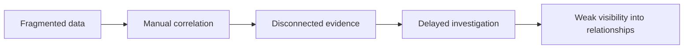
```mermaid
flowchart LR
    A["Fragmented data"] --> B["Manual correlation"] --> C["Disconnected evidence"]
    C --> D["Delayed investigation"] --> E["Weak visibility into relationships"]
```

---

## Solution

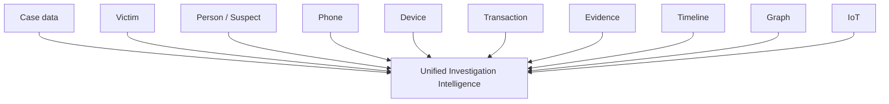
```mermaid
flowchart TB
    C["Case data"] --> U
    V["Victim"] --> U
    S["Person / Suspect"] --> U
    P["Phone"] --> U
    D["Device"] --> U
    T["Transaction"] --> U
    E["Evidence"] --> U
    L["Timeline"] --> U
    G["Graph"] --> U
    I["IoT"] --> U
    U["Unified Investigation Intelligence"]
```

CyberSaarthi collapses those fragments into one durable investigation workspace where **everything
is connected to the case, survives restarts, and is backed by an audit log**.

---

## Why CyberSaarthi?

The conventional workflow is a chain of disconnected steps where intelligence accumulates through
manual effort:

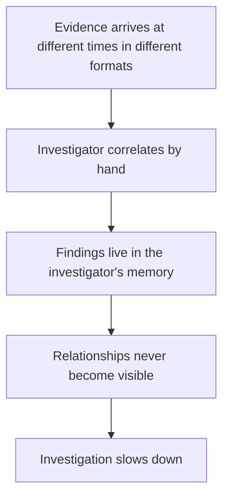
```mermaid
flowchart TD
    A["Evidence arrives at different times in different formats"] --> B["Investigator correlates by hand"]
    B --> C["Findings live in the investigator's memory"]
    C --> D["Relationships never become visible"]
    D --> E["Investigation slows down"]
```

CyberSaarthi replaces the chain with a connected workspace that keeps a **single source of truth**:

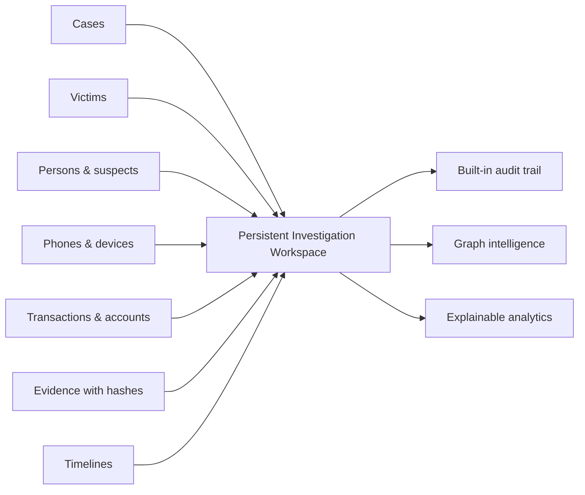
```mermaid
flowchart LR
    A["Cases"] --> WS
    B["Victims"] --> WS
    C["Persons & suspects"] --> WS
    D["Phones & devices"] --> WS
    E["Transactions & accounts"] --> WS
    F["Evidence with hashes"] --> WS
    G["Timelines"] --> WS
    WS["Persistent Investigation Workspace"] --> H["Built-in audit trail"]
    WS --> I["Graph intelligence"]
    WS --> J["Explainable analytics"]
```

| Investigation challenge | CyberSaarthi response |
|---|---|
| Fragmented evidence | Unified, case-scoped workspace |
| Disconnected entities | Relationship and graph analysis |
| Evidence integrity concerns | SHA-256 hashing + provenance + duplicate detection |
| Victim information scattered | Dedicated first-class victim subsystem |
| Financial data disconnected | Transaction, account and bank intelligence |
| Phone/device relationships | Entity linkage and resolution |
| Physical-world evidence | IoT device/event foundation |
| Poor traceability | Append-only audit trail and timeline |
| Data loss after restart | Persistent PostgreSQL, Neo4j, MinIO and Redis volumes |

---

## Key Features

### Investigation & Case Management

- Case lifecycle with severity, status and archive
- Case membership management and per-case visibility controls
- Owner/administrator authorization with cross-case isolation
- Lead, entity, relationship and hypothesis tracking inside the case
- Append-only **timeline** (audit log plus explicit case timeline events for
  uploads, collections, devices, hypotheses, runs, reports, resolutions and case lifecycle)

### Intelligence

- **Person/suspect records** — names, phones, vehicles, organizations, accounts, locations
- **Victim records** — profile, incident, financial impact, recovery status
- **Phone intelligence** — numbers, call relationships, registration context
- **Device intelligence** — vehicles and device IDs linked to persons
- **Financial intelligence** — accounts, transactions, banking organizations
- **Vehicle information** — registration numbers when present in evidence

### Evidence

- Multipart upload (`text/csv`, JSON and other formats supported by the parser)
- **SHA-256 integrity fingerprint** calculated on upload
- **Duplicate detection** — re-upload of the same bytes is rejected (HTTP 409)
- Object storage in MinIO with case-scoped keys
- Provenance metadata and ingestion jobs
- Every mutation recorded in the audit log

### Graph Intelligence

- Case-scoped knowledge graph with entity and relationship discovery
- Centrality, communities, network DNA, priorities, relationship strength
- Path and pattern analysis, ego-graphs
- Human-reviewable entity resolution review queue

### IoT Integration (subsystem foundation)

- IoT device registration tied to a case (unique serial per case)
- Telemetry event ingestion — location, connectivity and custom payloads
- Per-device event statistics
- Persistent PostgreSQL storage

### Security

- Authentication with bcrypt password hashing and JWT
- Token revocation (`jti` denylist) and login throttling
- RBAC with per-endpoint permissions (ADMIN / INVESTIGATOR / ANALYST / VIEWER)
- Per-case IDOR and visibility guards
- Audit logging and security headers
- Input validation with strict error envelopes

---

## Application Screenshots

> Screenshots are captured from the running CyberSaarthi application (`vite dev`, mock API
> disabled) against the seeded SIH demo dataset — **real UI, no mocked or generated imagery**.

### Investigation Dashboard

The sign-in flow lands an investigator directly in a live workspace showing case-state
summary, recent activity and one-click case creation.

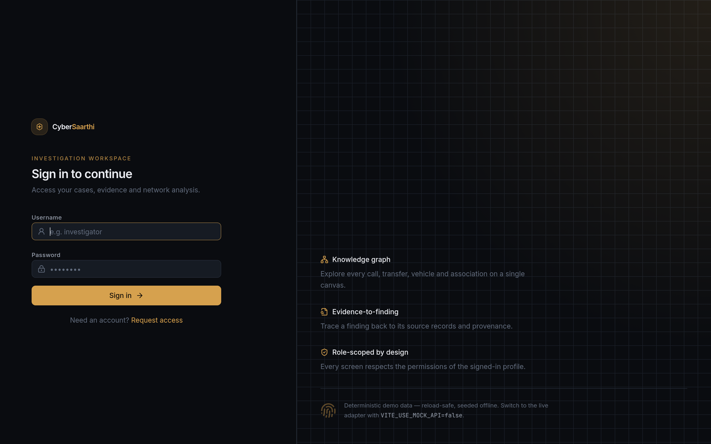
_The sign-in screen with the seeded evaluation credentials._

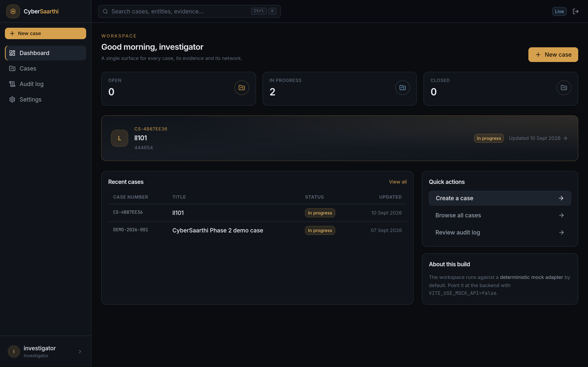
_Investigation workspace — open/in-progress case summary and quick case creation._

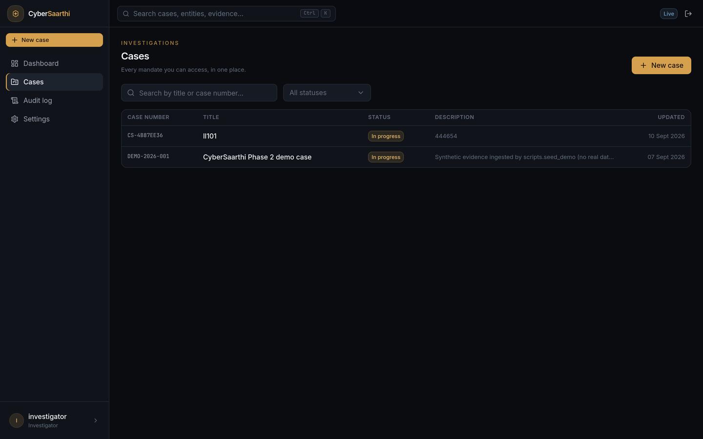
_Case management: every investigation the signed-in profile can access._

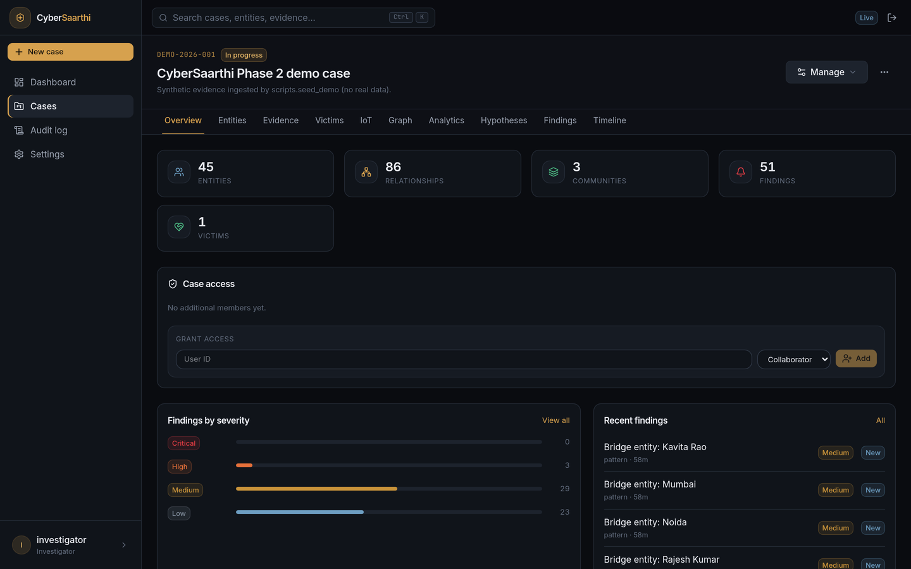
_Case record — synthetic evidence traceable through the entire pipeline._

### Case & Victim Intelligence

<details>
<summary>Victim intelligence · Evidence · Criminal/person intelligence (expand)</summary>

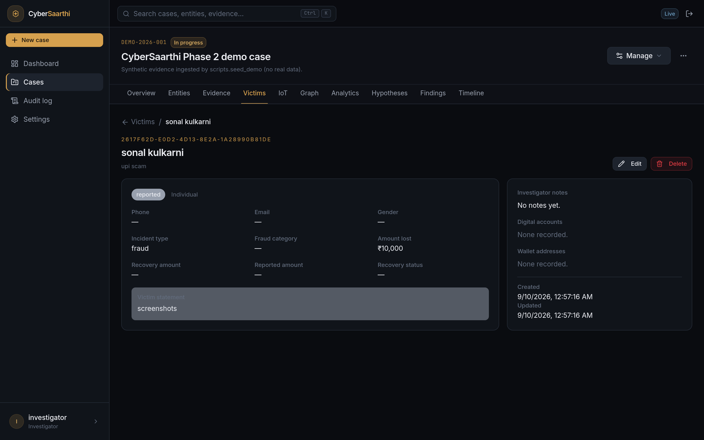
_Single-view victim profile: incident, loss amount, classification and investigator notes._

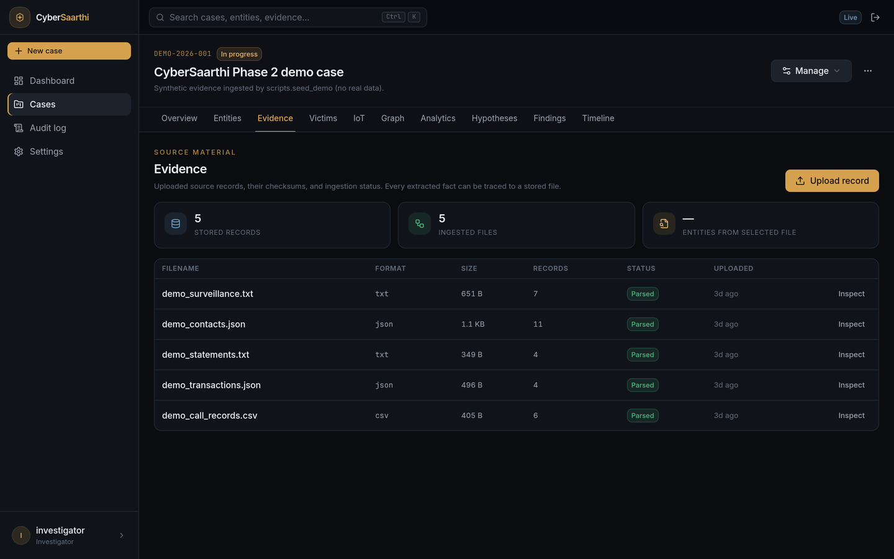
_Evidence vault with checksums and per-file ingestion status — every extractable fact traces to a stored file._

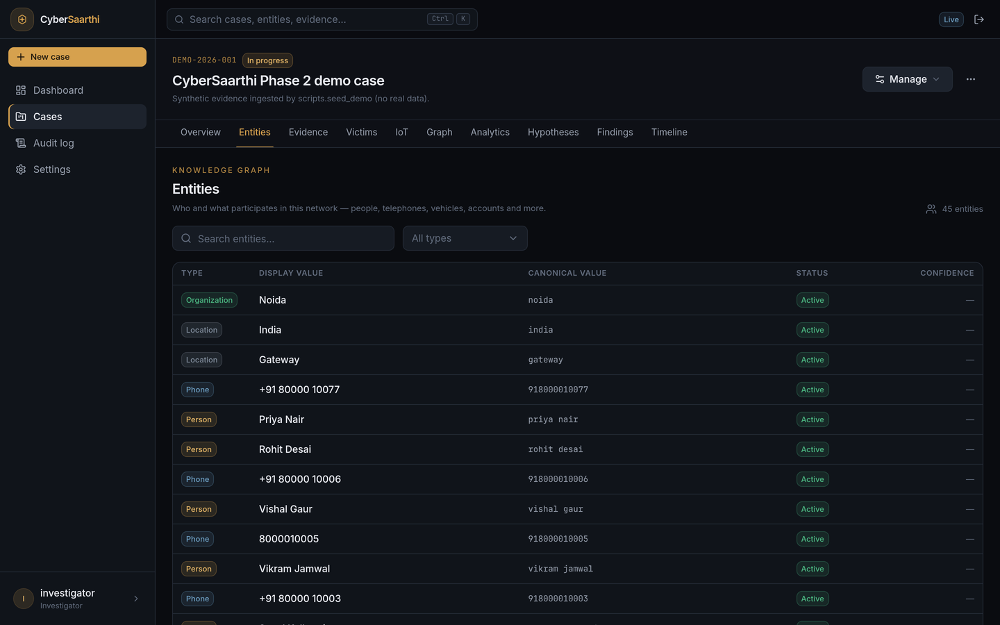
_Entity-resolution view: persons, phones, accounts, vehicles and organisations with aliases._

</details>

### Criminal Network Graph

<details>
<summary>Graph investigation · Analytics (expand)</summary>

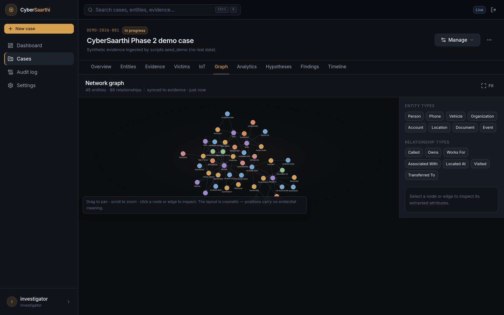
_Relationship canvas — Cytoscape rendering of every entity and link in the seeded dataset._


_Centrality and community analytics computed from the case graph._

</details>

### IoT Intelligence & Audit Trail

<details>
<summary>IoT devices/events · Timeline audit trail (expand)</summary>

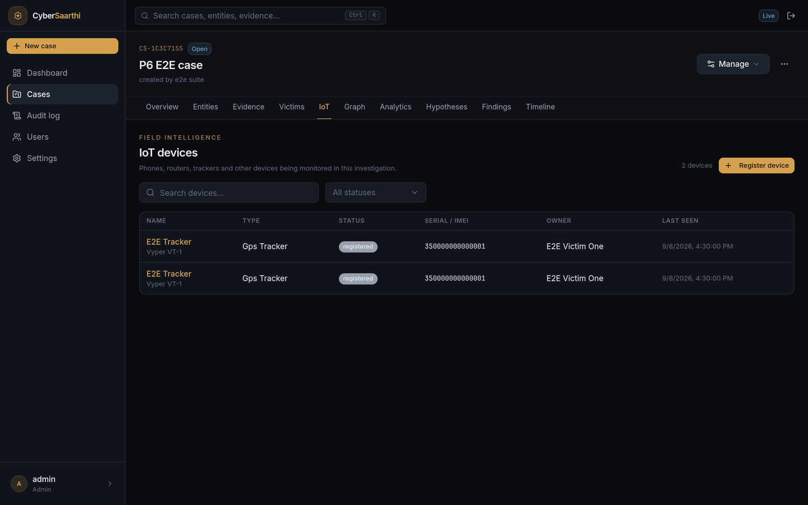
_Registered devices and their telemetry events in the IoT subsystem._

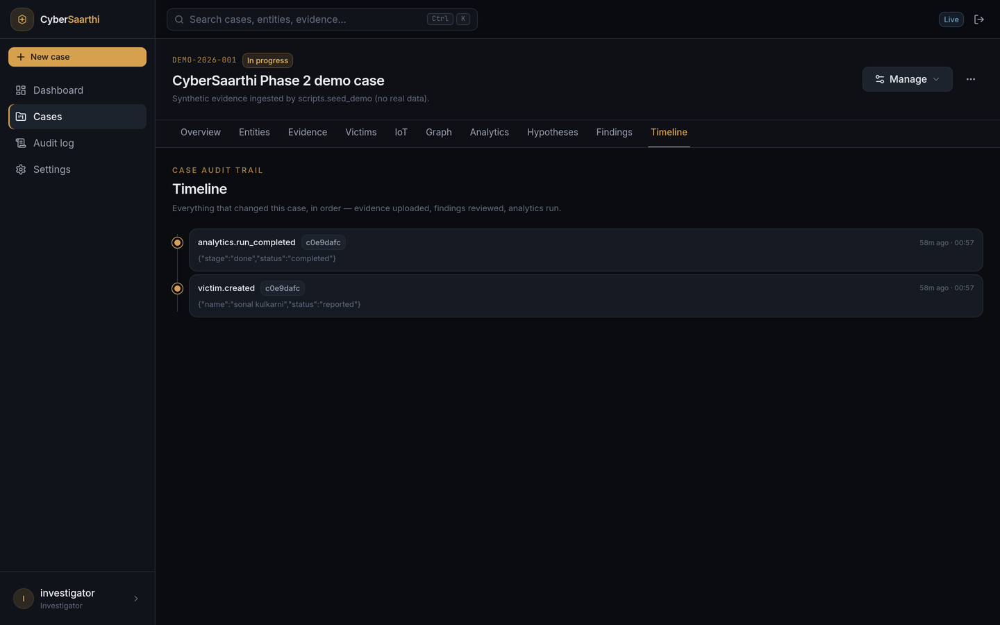
_Chronological audit trail of every state change on the case._

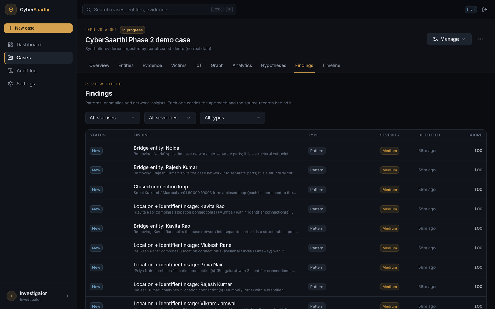
_The evidence → analytics → finding pipeline — the full explainable investigation workflow end to end._

</details>

---

## Investigator Workflow

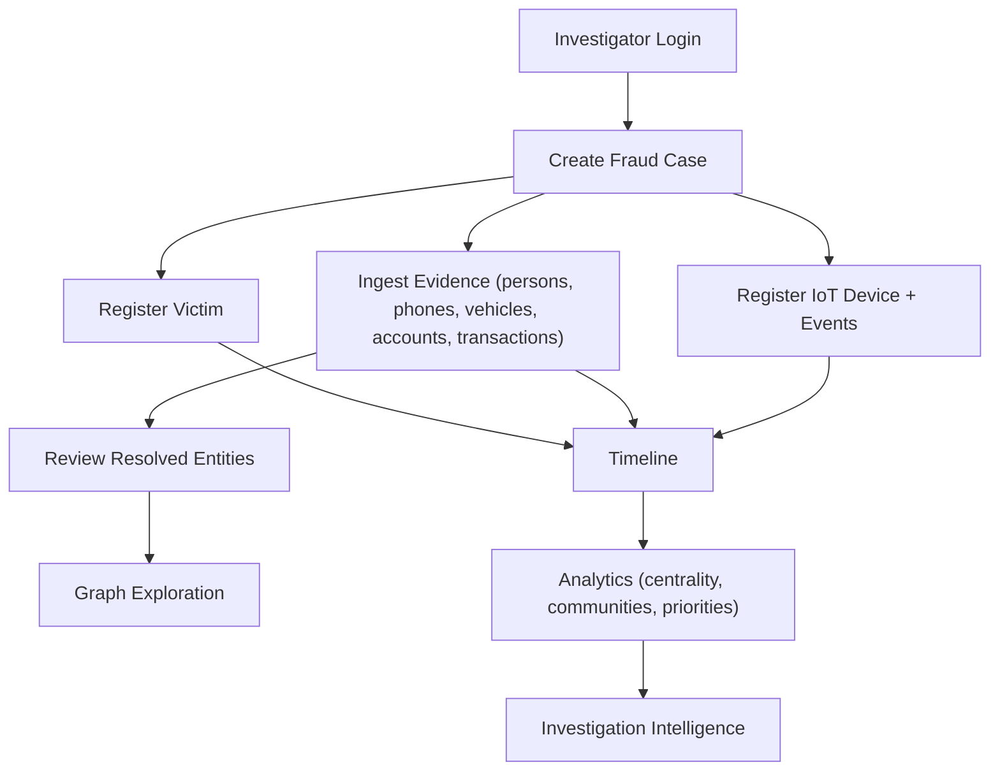
```mermaid
flowchart TB
    A["Investigator Login"] --> B["Create Fraud Case"]
    B --> C["Register Victim"]
    B --> D["Ingest Evidence (persons, phones, vehicles, accounts, transactions)"]
    D --> E["Review Resolved Entities"]
    B --> F["Register IoT Device + Events"]
    C --> G["Timeline"]
    D --> G
    F --> G
    E --> H["Graph Exploration"]
    G --> I["Analytics (centrality, communities, priorities)"]
    I --> J["Investigation Intelligence"]
```

---

## Architecture

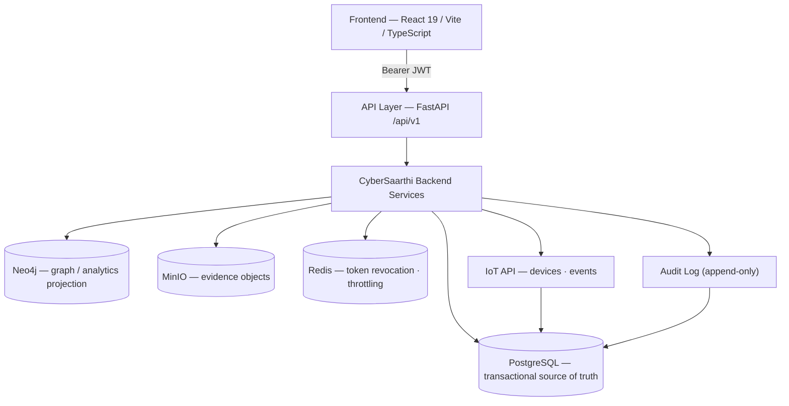
```mermaid
flowchart TB
    FE["Frontend — React 19 / Vite / TypeScript"] --> |"Bearer JWT"| API["API Layer — FastAPI /api/v1"]
    API --> APP["CyberSaarthi Backend Services"]
    APP --> PG[("PostgreSQL — transactional source of truth")]
    APP --> NEC[("Neo4j — graph / analytics projection")]
    APP --> MIN[("MinIO — evidence objects")]
    APP --> RED[("Redis — token revocation · throttling")]
    APP --> IOT["IoT API — devices · events"]
    IOT --> PG
    APP --> AUD["Audit Log (append-only)"]
    AUD --> PG
```

### The four data stores are deliberately specialized

| Store | Role in CyberSaarthi | Persistence |
|---|---|---|
| **PostgreSQL** | Authoritative transactional store — users, cases, victims, entities, relationships, evidence metadata, audit log, IoT devices/events | `postgres_data` volume |
| **Neo4j** | Relationship/graph analytics **projection**, rebuilt idempotently; never owns authoritative data | `neo4j_data` volume |
| **MinIO** | Object storage for raw evidence files (S3 API) | `minio_data` volume |
| **Redis** | Token revocation denylist + login throttling + cache (operational state, **not** a source of truth) | `redis_data` volume |

> The frontend talks only to the FastAPI backend; the backend composes the stores. Redis is
> infrastructure, not the postgres for any durable record.

---

## Data Model

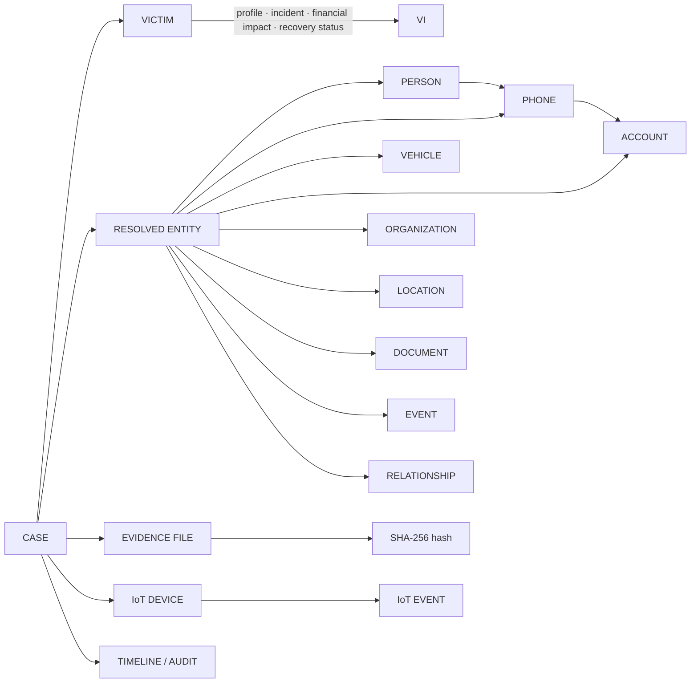
```mermaid
flowchart LR
    CASE["CASE"]
    CASE --> VIC["VICTIM"]
    VIC --> |"profile · incident · financial impact · recovery status"| VI
    CASE --> ENT["RESOLVED ENTITY"]
    ENT --> P["PERSON"]
    ENT --> PH["PHONE"]
    ENT --> VE["VEHICLE"]
    ENT --> AC["ACCOUNT"]
    ENT --> ORG["ORGANIZATION"]
    ENT --> LOC["LOCATION"]
    ENT --> DOC["DOCUMENT"]
    ENT --> EV["EVENT"]
    P --> PH
    PH --> AC
    ENT --> REL["RELATIONSHIP"]
    CASE --> EVD["EVIDENCE FILE"]
    EVD --> H["SHA-256 hash"]
    CASE --> IOD["IoT DEVICE"]
    IOD --> IOE["IoT EVENT"]
    CASE --> TL["TIMELINE / AUDIT"]
```

Implemented entity types: `person`, `phone`, `vehicle`, `organization`, `account`, `location`,
`document`, `event` — connected by relationships such as `called`, `owns`, `located_at`, `visited`,
`works_for`, `associated_with`.

---

## Evidence and Provenance

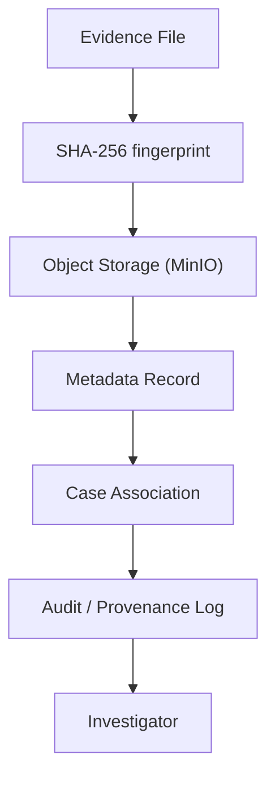
```mermaid
flowchart TB
    A["Evidence File"] --> B["SHA-256 fingerprint"]
    B --> C["Object Storage (MinIO)"]
    C --> D["Metadata Record"]
    D --> E["Case Association"]
    E --> F["Audit / Provenance Log"]
    F --> G["Investigator"]
```

**Verified behavior (E2E):**

1. Upload accepts the file and returns its metadata.
2. The SHA-256 returned by the API **matches the local bytes exactly**.
3. Re-uploading the same file is **rejected with 409** (duplicate detection).
4. The stored MinIO object was verified **byte-identical** to the uploaded file.
5. Metadata, case association and provenance persist across restarts.

> CyberSaarthi provides **technical integrity and provenance mechanisms**. Legal admissibility
> remains dependent on jurisdiction, collection procedures and institutional policy.

---

## Victim Intelligence

Victims are **first-class investigation entities**, not a checkbox inside a case. Each victim record
carries a structured profile:

| Dimension | Fields in the implementation |
|---|---|
| Identity | Name, age, date of birth, gender, classification, phone, email, address |
| Incident | Incident date, incident type, fraud category, description, statement |
| Financial impact | Reported amount, currency, amount lost, recovery amount |
| Recovery | Recovery status |
| Digital footprint | Digital accounts, devices, wallet addresses |
| Investigation | Investigator notes, case association |

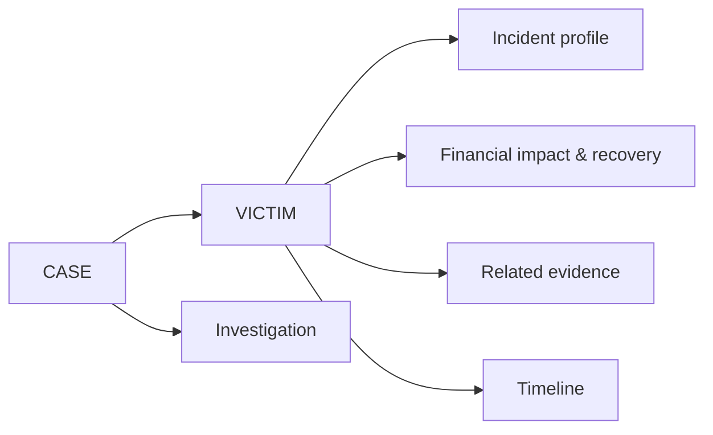
```mermaid
flowchart LR
    CASE["CASE"] --> VIC["VICTIM"]
    VIC --> A["Incident profile"]
    VIC --> B["Financial impact & recovery"]
    VIC --> C["Related evidence"]
    VIC --> D["Timeline"]
    CASE --> E["Investigation"]
```

Victim operations are **authorization-gated** (per-case permission checks) and fully **audit-logged**.
Handled with a professional care befitting real victims of fraud.

---

## Criminal Intelligence

The same evidence pipeline drives suspect-focused intelligence:

- **Persons / suspects** — resolved from names and aliases with entity resolution identity management
- **Phones** — extracted numbers linked back to the records they appear in
- **Accounts & banks** — financial identifiers and banking organizations
- **Vehicles** — registration numbers when present
- **Transactions** — surfaced as financial records and account relationships

These entities live in one case-scoped graph, so a phone number's callers, an account's owners and a
person's vehicles are queryable in a single view — with the evidence trail behind every link.

---

## Graph Analytics

Every case owns its own graph. The projection supports network science over the resolved entities:

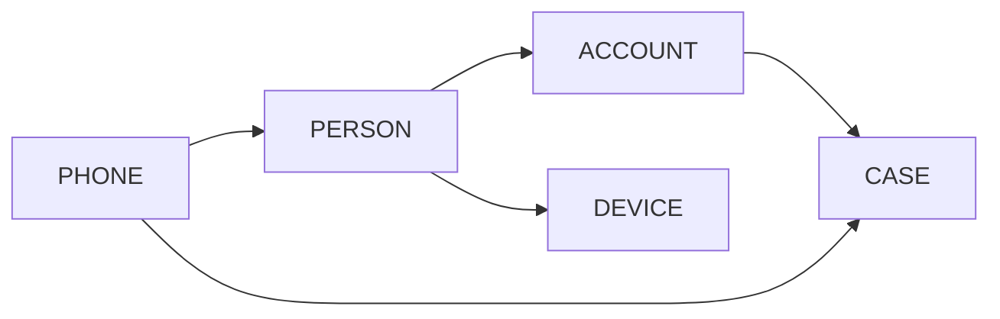
```mermaid
flowchart LR
    PHONE["PHONE"] --> PERSON["PERSON"]
    PERSON --> ACCOUNT["ACCOUNT"]
    PERSON --> DEVICE["DEVICE"]
    ACCOUNT --> CASE["CASE"]
    PHONE --> CASE
```

The analytics engine implements: **centrality**, **communities**, **network DNA**,
**priorities**, **relationship strength**, **paths** (pair and ego), **patterns** and
**hypotheses** — all case-scoped and deterministic.

> The seeded demo case (`DEMO-2026-001`) currently holds **45 entities and 86 relationships**.
> These are values from the demo dataset — not universal system limits.

---

## IoT Integration

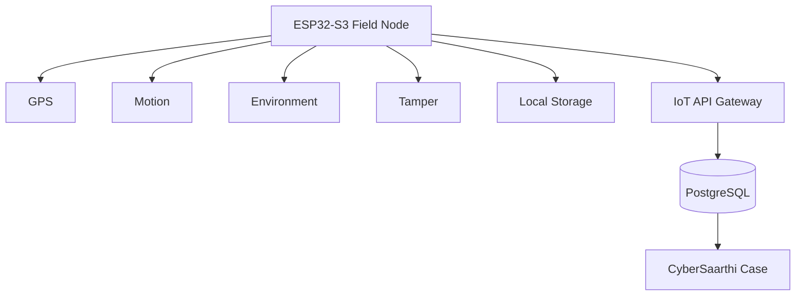
```mermaid
flowchart TB
    NODE["ESP32-S3 Field Node"] --> S1["GPS"]
    NODE --> S2["Motion"]
    NODE --> S3["Environment"]
    NODE --> S4["Tamper"]
    NODE --> S5["Local Storage"]
    NODE --> GW["IoT API Gateway"]
    GW --> PG[("PostgreSQL")]
    PG --> CASE["CyberSaarthi Case"]
```

The shipped implementation is the **complete backend IoT foundation**:

- device registration (unique `(case, serial)`), update and listing
- event ingestion with location/connectivity payloads
- per-device statistics and case-scoped queries
- PostgreSQL persistence and full audit coverage

Physical ESP32 hardware integration is a **planned** extension on this foundation — it is not yet
part of the verified build.

---

## Security

| Control | Implementation |
|---|---|
| Password hashing | bcrypt with minimum-password-length validation |
| Authentication | JWT bearer tokens with expiration |
| Token revocation | `jti` denylist in Redis enforced on every request |
| RBAC | ADMIN / INVESTIGATOR / ANALYST / VIEWER with per-endpoint permissions |
| Case isolation | owner/admin authorization · cross-case access refused |
| IDOR protection | per-case resource guards on every nested route |
| Rate limiting | keyed login throttling with exponential lockout |
| Audit logging | append-only, permission-scoped (`audit.read`) |
| Input validation | size caps, format sniffing, strict error envelope, Cypher label allowlist |
| Security headers | CSP + HSTS in production, `x-request-id` correlation |

<details>
<summary>Security model detail (expand)</summary>

Every authenticated route resolves the caller against case membership, role permissions and record
ownership before touching data. Findings and hypotheses are analytical signals for **review**, never
an automated determination of guilt. Security is defense-in-depth and continuously reviewed — like
any real system, it is **never "100% secure"**.
</details>

---

## Technology Stack

| Layer | Technology | Version |
|---|---|---|
| Language (frontend) | TypeScript | 5.7 |
| Frontend framework | Vite + React 19 UI | 19 / 6 |
| UI layer | React Router 7 · TanStack Query · Zustand · Tailwind CSS 4 · Radix UI · Cytoscape (graph) | — |
| Language (backend) | Python | 3.12 |
| API framework | FastAPI + Uvicorn | 0.141 / 0.52 |
| ORM & migrations | SQLAlchemy 2 (async) + Alembic | 2.0 / 1.19 |
| Relational DB | PostgreSQL | 16 |
| Graph DB | Neo4j | 5 (community) |
| Cache / state | Redis | 7 |
| Object storage | MinIO (S3 API) + boto3 | — |
| NLP / extraction | spaCy 3.8 with `en_core_web_sm` + RapidFuzz | — |
| Serialization | Pydantic | 2.13 |
| Containers | Docker Compose (`backend`, `postgres`, `neo4j`, `redis`, `minio`, `backend-dev`) | — |
| Testing | pytest + Vitest | — |
| Tooling | Ruff · mypy · ESLint · Prettier | — |

<details>
<summary>Backend runtime dependencies</summary>

`fastapi`, `uvicorn[standard]`, `pydantic`, `pydantic-settings`, `sqlalchemy[asyncio]`, `alembic`,
`psycopg[binary]`, `neo4j`, `redis`, `boto3`, `bcrypt`, `spacy`, `en_core_web_sm`, `rapidfuzz`,
`charset-normalizer`, `python-multipart` — all pinned. No unnecessary runtime dependencies.
</details>

---

## Project Structure

```
CyberSaarthi/
├── backend/                 # FastAPI modular monolith (Python 3.12)
│   ├── app/
│   │   ├── api/             # routers: cases, victims, iot, evidence, entities,
│   │   │                    #          graph, analytics, findings, audit, auth, users
│   │   ├── analytics/       # deterministic analytics engine
│   │   ├── services/        # ingestion · extraction · normalization · resolution
│   │   ├── models/          # SQLAlchemy models
│   │   └── core/            # settings, security, codes
│   ├── migrations/          # Alembic migrations (single head)
│   └── tests/               # unit · API · integration
├── frontend/                # React 19 + Vite + TypeScript UI
│   ├── src/app/pages/       # dashboard, cases, victims, iot, evidence, graph, ...
│   ├── src/api/             # mock + real adapters (mock disabled for the demo)
│   └── src/components/ui/   # design-system components
├── docs/                    # architecture reports · ADRs · audit
├── screenshots/             # UI previews from the demo dataset
├── docker-compose.yml       # postgres · neo4j · redis · minio · backend
├── Makefile                 # dev workflow (make up / seed / test / ...)
├── .env.example             # documented configuration template
├── LICENSE                  # MIT
└── README.md
```

---

## Quick Start

### Prerequisites

- [Docker Engine](https://docs.docker.com/engine/install/) + [Docker Compose](https://docs.docker.com/compose/install/)
- Node.js + npm (frontend only)
- Git

### Clone and start

```bash
git clone https://github.com/0xhroot/cybersaarthi.git
cd cybersaarthi

cp .env.example .env            # dev-safe defaults; never commit the real .env
docker compose up -d --build    # postgres, neo4j, redis, minio, backend
docker compose ps               # wait for all services to be healthy
```

### Bootstrap the first administrator

Registration is public and creates a `PENDING` account that cannot sign in until an administrator
approves it. To get the first admin, use the idempotent bootstrap CLI (it refuses to create a second
admin):

```bash
docker compose exec -T backend python -m scripts.create_admin
```

Credentials default to development values; override with `ADMIN_USERNAME` / `ADMIN_EMAIL` /
`ADMIN_PASSWORD`. Seed the deterministic demo case with:

```bash
docker compose exec -T backend python -m scripts.seed_demo
```

### Access

- **Backend API:** `http://localhost:8000` · Swagger UI: `http://localhost:8000/docs`
- **Frontend:** `cd frontend && npm install && npm run dev` → `http://localhost:5173`

```bash
curl http://localhost:8000/api/v1/health   # 200 — API is up
curl http://localhost:8000/api/v1/ready    # 200 — postgres, neo4j, redis, minio healthy
```

---

## Configuration

All configuration is environment-driven and git-ignored; no secrets are committed.

| File | Purpose |
|---|---|
| `.env` | Compose + backend settings (Postgres, Neo4j, Redis, MinIO, CORS, `SECRET_KEY`) |
| `frontend/.env` | Frontend runtime configuration |
| `.env.example` | Documented template — safe to copy to `.env` |

Key frontend variable:

```text
VITE_USE_MOCK_API=false
```

`false` makes the UI call the **real backend** (`VITE_API_URL`, default `http://localhost:8000`).
The automated frontend test suite forces mock mode itself, so tests never depend on a live stack.
The actual `.env` files are intentionally git-ignored (see `.gitignore`).

<details>
<summary>Required environment variables (documented in `.env.example`)</summary>

`APP_NAME`, `APP_ENV`, `LOG_LEVEL`, `POSTGRES_HOST/PORT/DB/USER/PASSWORD`,
`NEO4J_URI/USER/PASSWORD`, `REDIS_URL`, `S3_ENDPOINT/ACCESS_KEY/SECRET_KEY/BUCKET/REGION`,
`CORS_ORIGINS`, `SECRET_KEY`. The example ships with explicit **dev-only** placeholders — replace
every password and the secret for any non-local deployment.
</details>

---

## Running the System

```bash
docker compose up -d        # start the stack
docker compose ps           # status of all services
docker compose logs --tail=100 backend
```

Optional `make` targets (Docker is the source of truth for these commands):

```bash
make up            # build + start
make migrate       # docker compose exec -T backend alembic upgrade head
make seed          # seed DEMO-2026-001 (idempotent)
make admin         # bootstrap the first ADMIN (idempotent)
make down          # stop the stack (keeps volumes)
make logs          # tail all services
```

Services: `backend`, `postgres` (16-alpine), `neo4j` (5-community), `redis` (7-alpine, with AOF
persistence), `minio` (+ one-shot `minio-init`), and the dev-only `backend-dev` test image.

---

## Docker

```bash
docker compose up -d            # start
docker compose ps               # inspect health
docker compose logs --tail=100  # follow backend logs
docker compose down             # stop — volumes preserved
```

> ⚠️ **Do NOT run `docker compose down -v`** unless you intentionally want to destroy persistent
> development volumes. All investigation data lives in volumes; `-v` deletes it for good.

| Service | Image | Healthcheck |
|---|---|---|
| postgres | `postgres:16-alpine` | `pg_isready` |
| neo4j | `neo4j:5-community` | `cypher-shell RETURN 1` |
| redis | `redis:7-alpine` (`--appendonly`) | `redis-cli ping` |
| minio | `minio/minio` | HTTP `/minio/health/live` |
| backend | built from `backend/Dockerfile` | `GET /api/v1/health` |

---

## Persistence

Data survives because each store keeps a **named volume** that outlives the container:

```text
PostgreSQL  → postgres_data
Neo4j       → neo4j_data
Redis       → redis_data
MinIO       → minio_data
```

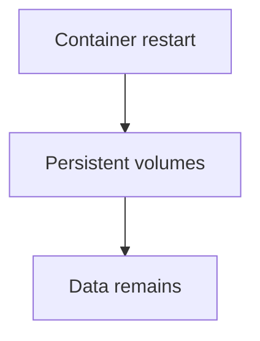
```mermaid
flowchart TD
    A["Container restart"] --> B["Persistent volumes"]
    B --> C["Data remains"]
```

**Verified in the release audit:**

| Scenario | Result |
|---|---|
| `docker compose restart` of every service | Pass — all records survive |
| `docker compose down` + `docker compose up -d` (no `-v`) | Pass — all records survive |
| Full browser reload | Pass — state persists |
| Logout → login cycle | Pass — investigation state persists |
| MinIO object integrity after restart | Pass — stored bytes byte-identical |
| Neo4j projection after restart | Pass — graph intact |

A physical host reboot has **not** been part of automated verification.

---

## API Overview

All endpoints live under `/api/v1`. Summary of the main surface:

| Area | Endpoint pattern | Purpose |
|---|---|---|
| Health | `GET /health`, `GET /ready` | Service and dependency readiness |
| Auth | `POST /auth/register`, `POST /auth/login`, `GET /auth/me`, `POST /auth/logout` | Identity lifecycle |
| Admin | `/admin/users/{id}/approve · /reject · /suspend · /role` | User governance |
| Cases | `GET/POST /cases`, `GET/PATCH /cases/{id}`, `POST /cases/{id}/archive` | Case management |
| Victims | `GET/POST /cases/{id}/victims`, `GET/PUT /cases/{id}/victims/{vid}` | Victim subsystem |
| IoT | `/cases/{id}/iot/devices`, `/cases/{id}/iot/devices/{did}`, `/cases/{id}/iot/devices/{did}/stats`, `/cases/{id}/iot/events` | Device + telemetry |
| Evidence | `POST /cases/{id}/evidence`, `GET /cases/{id}/evidence`, `POST /cases/{id}/ingest` | Upload + integrity + ingestion |
| Entities | `/cases/{id}/entities`, `/cases/{id}/entities/{eid}`, `/cases/{id}/relationships` | Resolved intelligence |
| Graph | `/cases/{id}/graph`, `/cases/{id}/graph/stats`, `/cases/{id}/graph/entity/{eid}` | Network views |
| Analytics | `/cases/{id}/analytics/{summary,centrality,communities,network-dna,priorities,strength,paths,patterns,hypotheses}`, `POST /cases/{id}/analytics/run` | Deterministic analytics |
| Findings | `/cases/{id}/findings`, `GET /cases/{id}/findings/{fid}`, `PATCH /cases/{id}/findings/{fid}/status` | Reviewable outputs |
| Audit | `GET /audit-logs?case_id=...` | Timeline / audit trail |

Interactive API documentation is generated by FastAPI at `/docs`.

---

## Testing and Verification

Every number below is a **verified current result** from this build (commit `7e3e74b`), not a
theoretical claim.

| Gate | Result |
|---|---|
| Backend tests (pytest: unit + API + integration) | **379 passed** |
| Frontend tests (Vitest) | **67 passed** (13 files) |
| SIH primary-flow E2E checks | **28/28 passed** |
| Real-browser E2E (headless Chromium, production build) | **6/6 passed** |
| Persistence (restart · down/up · reload · logout/login) | **PASS** |
| Ruff lint | **PASS** |
| Mypy typecheck | **PASS** (107 files) |
| TypeScript (`tsc -b --noEmit`) | **PASS** |
| ESLint | **PASS** |
| Vite production build | **PASS** |

<details>
<summary>How to run the verification yourself</summary>

Everything runs in Docker — nothing needs to be installed on the host for the backend:

```bash
# backend
docker compose --profile dev run --rm -T backend-dev pytest       # 379 tests
docker compose --profile dev run --rm -T backend-dev ruff check . # lint
docker compose --profile dev run --rm -T backend-dev mypy app     # typecheck

# frontend
cd frontend
npm run lint
npx tsc -b --noEmit
npx vitest run
npx vite build
```
</details>

---

## SIH Demo Workflow

A complete, verified investigation path — every step persists.

```
01  Investigator Login
        ↓
02  Create Fraud Case
        ↓
03  Register Victim
        ↓
04  Add Suspect / Person
        ↓
05  Link Phones, Devices & Vehicles
        ↓
06  Add Transactions / Accounts
        ↓
07  Upload Evidence
        ↓
08  Generate Timeline
        ↓
09  Explore Network Graph
        ↓
10  Analyze Centrality & Analytics
        ↓
11  Inspect IoT Device Events
        ↓
12  Refresh · Logout · Login — Everything Remains
```

This flow was executed end-to-end against the live stack (roles: ADMIN and INVESTIGATOR) and
passed **28/28** checks including persistence across refresh and logout/login.

---

## What Makes It Different

1. **Unified investigation workspace** — one persistent, case-scoped surface instead of isolated records.
2. **Evidence integrity + provenance** — SHA-256 fingerprints, duplicate detection and object storage, not just file upload.
3. **Victim-first support** — structured victim intelligence (incident, financial impact, recovery) built into the workflow.
4. **Relationship intelligence** — entities resolved and linked, not scattered rows.
5. **Persistent multi-database architecture** — PostgreSQL (truth), Neo4j (graph), MinIO (objects), Redis (state), each with a named volume.
6. **IoT-ready investigation layer** — a shipped backend foundation ready for physical telemetry.
7. **Security-aware by design** — RBAC, case isolation, IDOR guards, revocation, throttling and an audit trail on every mutation.

---

## Roadmap

Status legend: ✅ Completed · 🔄 In Progress · 📌 Planned

| Item | Status |
|---|---|
| Evidence ingestion, entity resolution, knowledge graph | ✅ Completed |
| Deterministic analytics and explainable findings | ✅ Completed |
| Security controls (RBAC, JWT, revocation, throttling, audit) | ✅ Completed |
| Victim subsystem | ✅ Completed |
| IoT backend foundation | ✅ Completed |
| Explore extending the Neo4j projection to Victim/IoT data | 📌 Planned (deliberate defer decision documented) |
| Physical ESP32 field-node integration | 📌 Planned |
| Richer IoT telemetry (motion, environment, tamper) | 📌 Planned |
| Background ingestion worker (ingestion is currently synchronous) | 📌 Planned |
| Deployment hardening, production secrets management, backup/restore | 📌 Planned |
| OIDC / MFA | 📌 Planned |
| Additional evidence input formats | 📌 Planned |

---

## Limitations

- The IoT subsystem is a **backend foundation**; physical hardware integration is not yet shipped.
- The Neo4j projection **intentionally excludes Victim and IoT** data today (an explicit architecture
  decision that protects the tested entity graph).
- Development configuration targets `localhost`; a real deployment needs proper secret management,
  TLS termination and container hardening.
- Demo bootstrap credentials (`admin` / `investigator`) and the seed passwords are development
  defaults — **replace them before any non-demo deployment**. Override with
  `ADMIN_PASSWORD` / `SEED_INVESTIGATOR_PASSWORD`.
- Evidence handling provides technical integrity and provenance; **legal admissibility** depends on
  jurisdiction, collection procedures and institutional policy.
- A physical host reboot has not been part of automated verification.
- The frontend is run from the host (`npm run dev` / preview) rather than a Compose service.

---

## Troubleshooting

### Docker permission denied

Add your user to the Docker group and re-login:

```bash
sudo usermod -aG docker "$USER"
newgrp docker          # or log out and back in
```

### Docker daemon not running

```bash
systemctl status docker
sudo systemctl enable --now docker   # auto-start at boot
```

### Frontend shows mock/seed data instead of real data

Verify the frontend is configured for the real backend:

```text
frontend/.env  →  VITE_USE_MOCK_API=false
```

and that the API is reachable: `curl http://localhost:8000/api/v1/health`.

### Data appears missing

```bash
docker compose ps             # confirm all services healthy
docker compose logs --tail=100 backend
```

The typical cause is a backend that was restarted with old code while the frontend points at the
wrong API — not data loss.

### Do not delete volumes

```bash
docker compose down -v        # ❌ destroys PostgreSQL, Neo4j, Redis and MinIO volumes
```

---

## Contributing

1. **Branch** — create a feature branch per change.
2. **Change** — keep changes small and focused; follow the existing architecture.
3. **Test** — backend: `make test`; frontend: `npm test -- --run`.
4. **Lint** — backend: `make lint` · `make format-check`; frontend: `npm run lint`.
5. **Typecheck** — backend: `make typecheck`; frontend: `npm run typecheck`.
6. **Build** — verify the frontend production build (`npm run build`) before opening a PR.
7. **Commit** — use Conventional Commits; never commit `.env`, secrets, `node_modules`, `.venv`,
   caches or build output.

See [CONTRIBUTING.md](CONTRIBUTING.md) for the full developer guide,
[CODE_OF_CONDUCT.md](CODE_OF_CONDUCT.md) for collaboration expectations, and
[SECURITY.md](SECURITY.md) for private security reporting.

---

## Team

CyberSaarthi is developed by a small, focused team covering security engineering, backend
systems, frontend and data — with every layer of the platform documented throughout this README.

This project is prepared for submission under the **Smart India Hackathon**.

---

## License

Released under the [MIT License](LICENSE). Copyright © 2026 0xhroot.

---

<div align="center">

### CyberSaarthi

**Connect the evidence. Understand the network. Recover the truth.**

<sub>Built with FastAPI · React · PostgreSQL · Neo4j · Redis · MinIO · Docker — and a determination
to make cyber-fraud investigations explainable, persistent and victim-aware.</sub>

</div>