<div align="center">

# **CyberSaarthi**

### Cyber Fraud Recovery & Investigation Intelligence Platform

> From fragmented field evidence to connected, explainable investigation intelligence.


**📱 Field Collection** → **🔐 Verified Evidence** → **🕸️ Network Intelligence** → **🔎 Investigation**

<p align="center">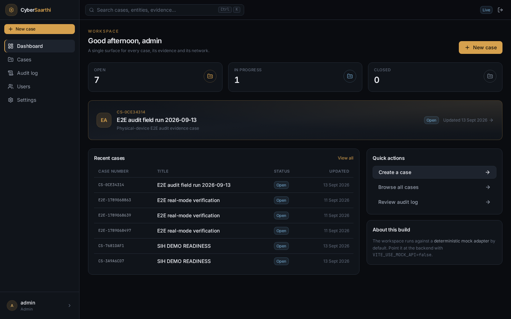</p>

CyberSaarthi unifies case management, victim, person, phone and financial intelligence, evidence
provenance, and criminal-network analysis in one persistent web workspace — paired with an **Android
field agent** that captures evidence offline, signs it, and hands it to the same case.

Built for investigators, verified end-to-end on a real device.

<br>

**What it does** · **Workflow** · **See it in action** · **Architecture** · **Security** · **Quick start**

</div>

---

## What it does

Fragmented evidence becomes connected, evidence-backed intelligence — from capture to case.

| 📱 Field Agent | 🔐 Evidence Integrity | 🕸️ Graph Intelligence |
|---|---|---|
| Android collection | Hash + RSA signature verification | Networks + relationships |

| 👤 Victim Intelligence | 📊 Analytics | 🧾 Provenance |
|---|---|---|
| Victim-centric case view | Centrality + communities | Timeline + audit |

---

## The workflow

One connected path — **field capture → verified evidence → connected intelligence → decision**.

```mermaid
flowchart TB
    subgraph FIELD["FIELD"]
        direction TB
        FO["Field Officer"] --> AG["Android Field Agent"]
        AG --> CP["Connect / Pair<br/>LAN discovery · QR · manual"]
        CP --> DE["Device Enrollment"]
        DE --> AA["Administrator Approval"]
        AA --> CS["Case Selection"]
        CS --> EC["Evidence Capture<br/>photo · video · audio · notes"]
        EC --> H["SHA-256 Hashing"]
        H --> SP["Signed Evidence Package<br/>RSA-2048 signature"]
    end
    SP -->|"submit · POST /import/packages"| API["FastAPI Backend"]
    subgraph BACKEND["BACKEND"]
        direction TB
        API --> VF["Verification<br/>device · signature · integrity · replay"]
        VF --> SR["PostgreSQL + MinIO"]
        SR --> PROC["Evidence Processing"]
        PROC --> EX["Entity Extraction"]
        EX --> RES["Entity Resolution"]
        RES --> RD["Relationship Discovery"]
    end
    RD --> PROJ["Graph Projection"]
    subgraph DATA["DATA"]
        direction TB
        PROJ --> NEO[("Neo4j")]
    end
    subgraph INTELLIGENCE["INTELLIGENCE"]
        direction TB
        NEO --> GA["Graph Analytics"]
        GA --> NI["Priorities · Communities · Network Intelligence"]
    end
    NI --> WS["React Investigator Workspace"]
    subgraph INVESTIGATION["INVESTIGATION"]
        direction TB
        WS --> FB["Evidence-backed Findings"]
        FB --> TL["Timeline + Audit Trail"]
    end
```

---

## See it in action

Real screenshots from the running system — the seeded demo case, a physical-device E2E run, and the
live backend API. No mocked imagery.

### Android field agent

Captured on a physical device (RSA-2048 Android Keystore identity), in the order an officer uses it.

<table>
<tr>
<td width="33%"><p align="center">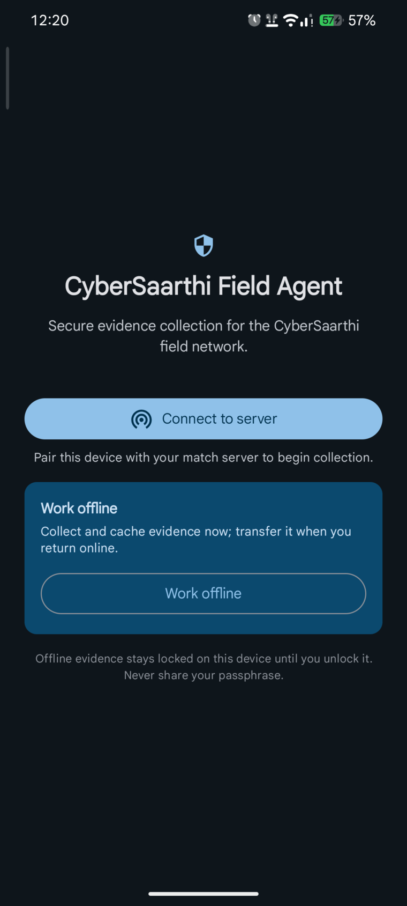<br/><b>Connect</b></p></td>
<td width="33%"><p align="center"><br/><b>Discover</b></p></td>
<td width="33%"><p align="center">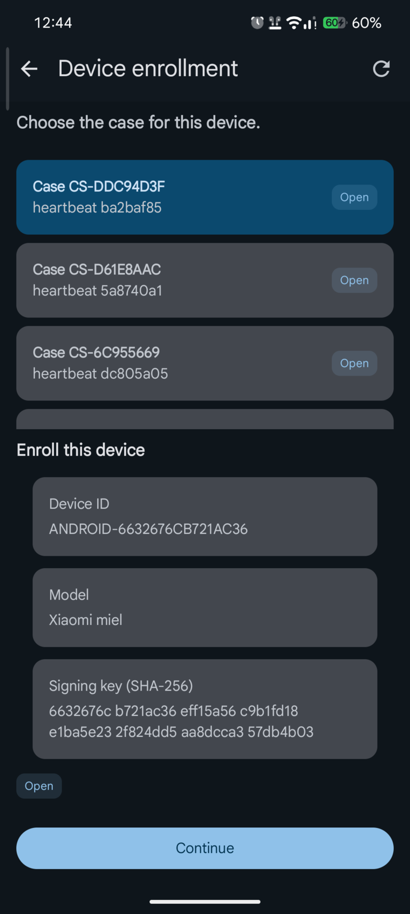<br/><b>Enroll</b></p></td>
</tr>
<tr>
<td width="33%"><p align="center"><br/><b>Field hub</b></p></td>
<td width="33%"><p align="center">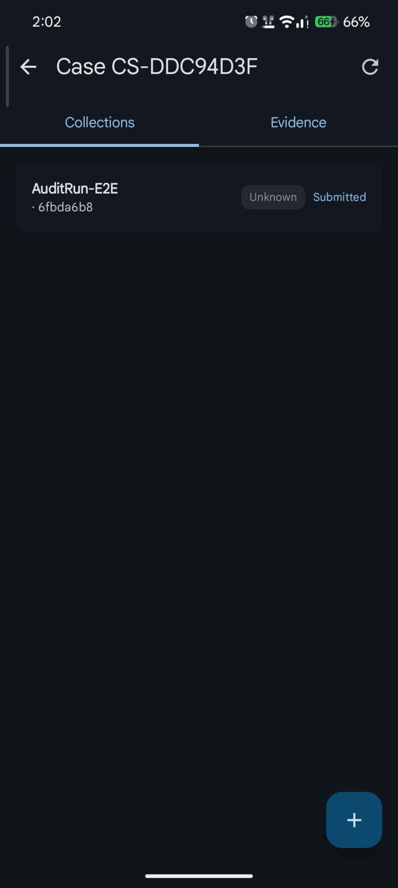<br/><b>Select case</b></p></td>
<td width="33%"><p align="center">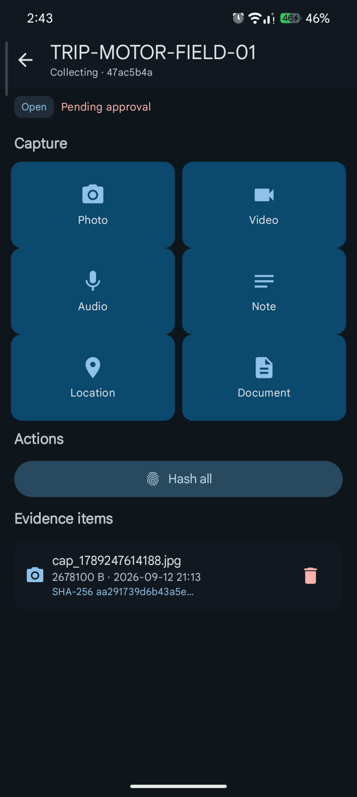<br/><b>Capture</b></p></td>
</tr>
<tr>
<td width="33%"><p align="center"><br/><b>Evidence</b></p></td>
<td width="33%"><p align="center"><br/><b>Offline</b></p></td>
<td width="33%"><p align="center">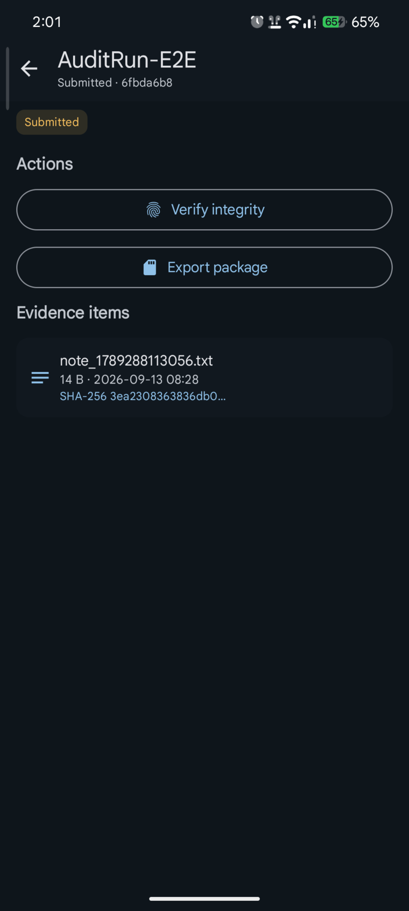<br/><b>Transfer</b></p></td>
</tr>
</table>

### Web investigator

#### Investigation

<table>
<tr>
<td width="33%"><p align="center"><b>Workspace</b></p></td>
<td width="33%"><p align="center"><b>Case</b></p></td>
<td width="33%"><p align="center">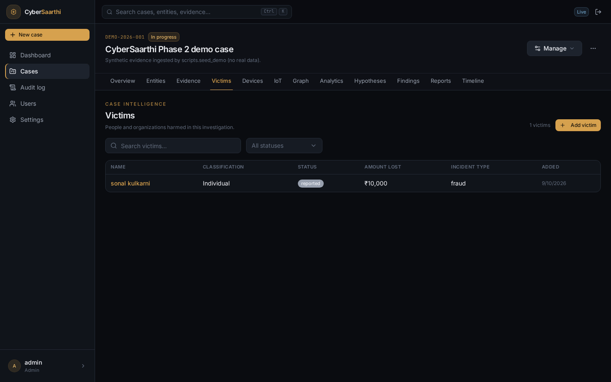<b>Victim</b></p></td>
</tr>
</table>

#### Intelligence

<table>
<tr>
<td width="33%"><p align="center">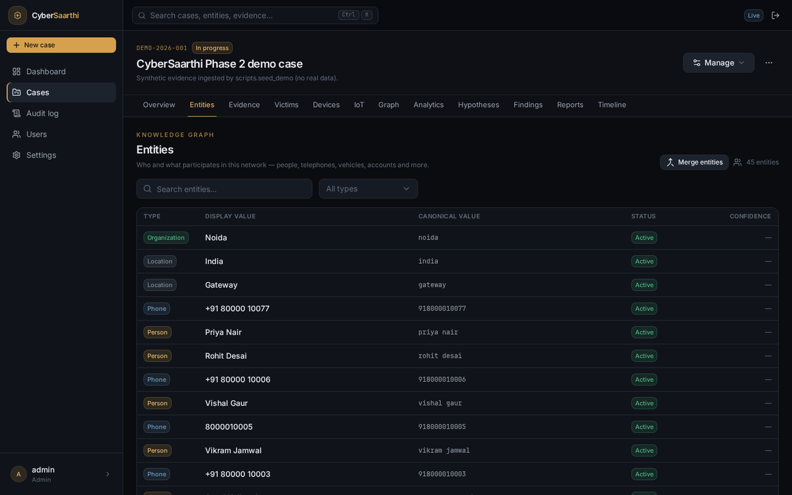<b>Entities</b></p></td>
<td width="33%"><p align="center">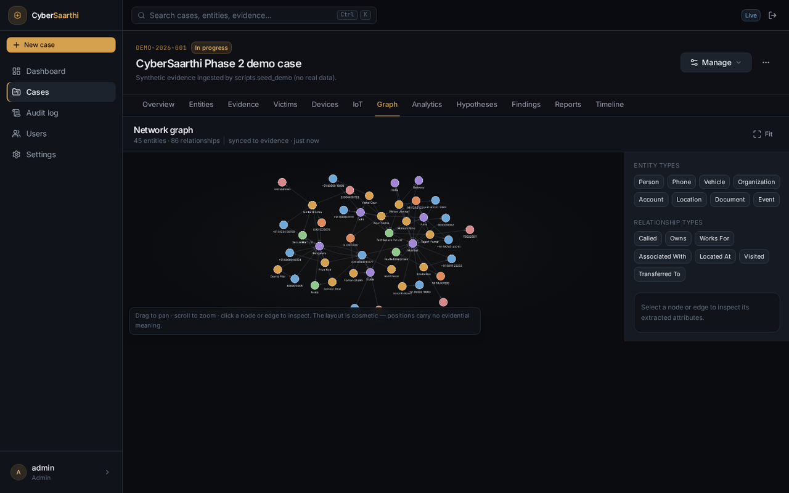<b>Graph</b></p></td>
<td width="33%"><p align="center"><b>Analytics</b></p></td>
</tr>
</table>

#### Evidence

<table>
<tr>
<td width="33%"><p align="center"><b>Evidence</b></p></td>
<td width="33%"><p align="center">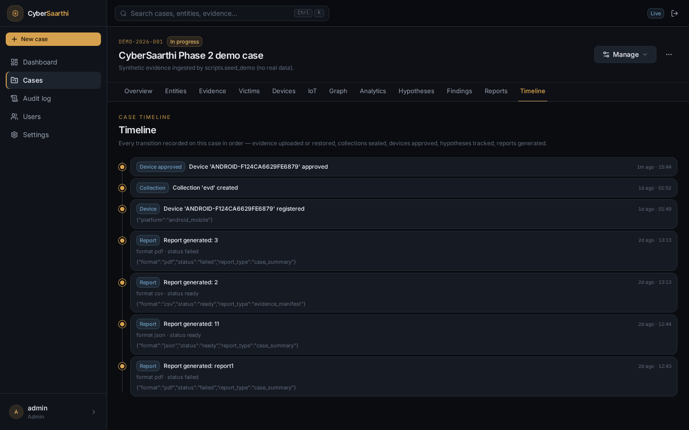<b>Timeline</b></p></td>
<td width="33%"><p align="center">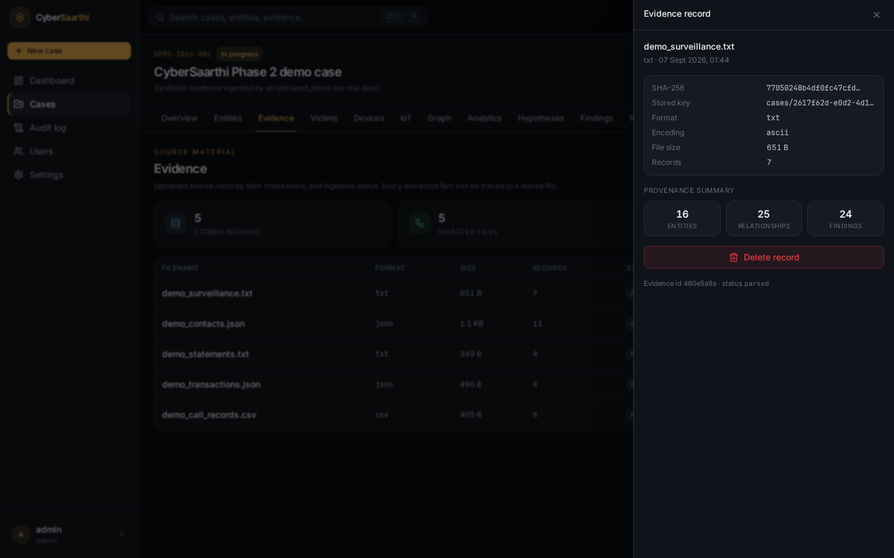<b>Provenance</b></p></td>
</tr>
</table>

#### Devices

<table>
<tr>
<td width="50%"><p align="center">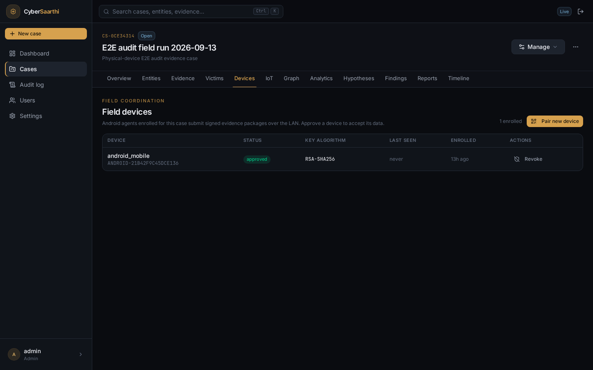<b>Field devices</b></p></td>
<td width="50%"><p align="center">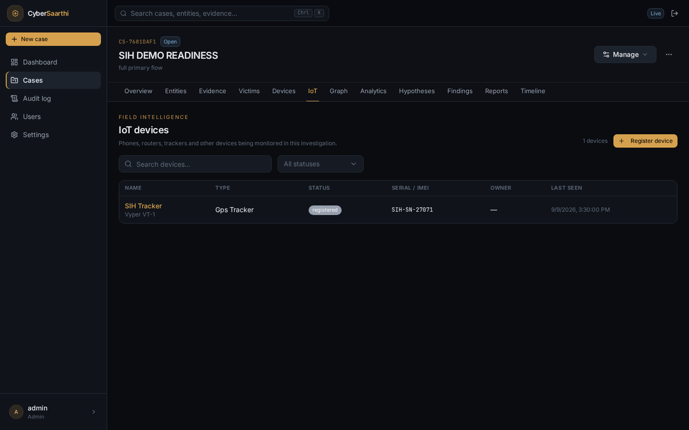<b>IoT</b></p></td>
</tr>
</table>

### Android → Backend → Web

<table>
<tr>
<td width="33%" align="center"><b>[ Android ]</b><br/>Capture + sign</td>
<td width="33%" align="center"><b>[ Backend ]</b><br/>Verify + store + process</td>
<td width="33%" align="center"><b>[ Web ]</b><br/>Investigate + analyze</td>
</tr>
<tr>
<td><p align="center"></p></td>
<td><p align="center">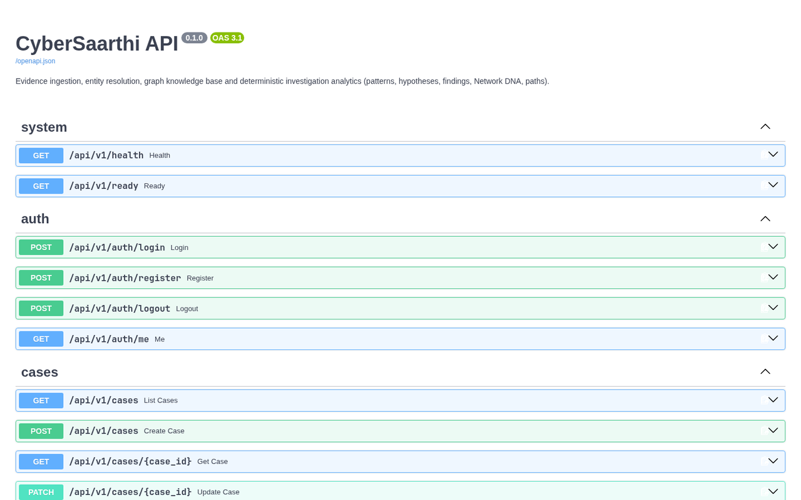</p></td>
<td><p align="center"></p></td>
</tr>
</table>

---

## Architecture

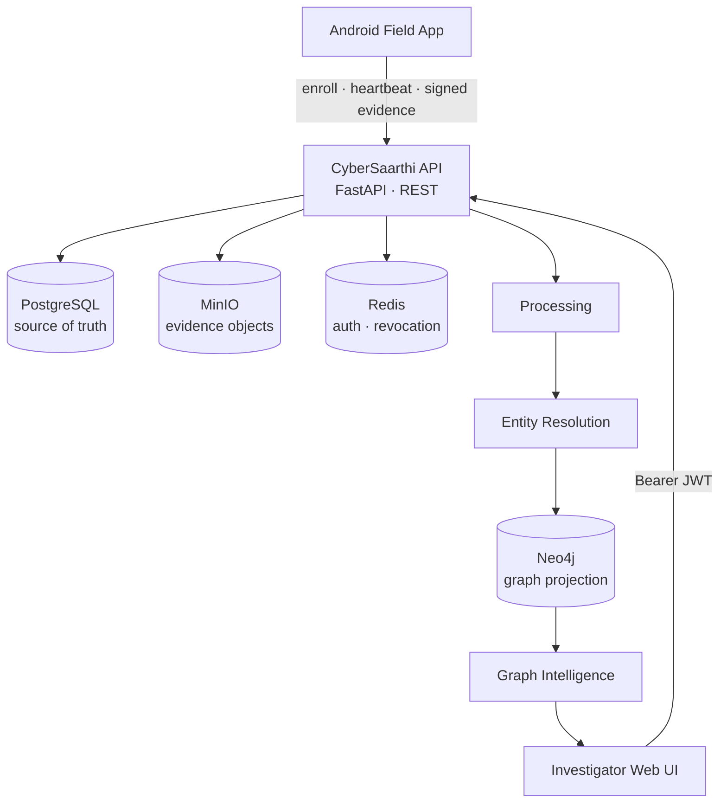

| Store | Responsibility |
|---|---|
| **PostgreSQL** | Source of truth — users, cases, victims, entities, evidence metadata, audit log |
| **Neo4j** | Idempotent graph projection + analytics (centrality, communities) |
| **MinIO** | Raw evidence objects (S3 API) |
| **Redis** | Token revocation denylist + login throttling — operational state, not a source of truth |

<details>
<summary><b>Detailed data architecture</b></summary>

Entity types: `person`, `phone`, `vehicle`, `organization`, `account`, `location`, `document`,
`event` — linked by relationships such as `called`, `owns`, `located_at`, `visited`, `works_for`,
`associated_with`. The seeded demo case holds **45 entities and 86 relationships**; all stores persist
on named Docker volumes.

</details>

---

## Evidence → Intelligence

How raw evidence becomes actionable intelligence.

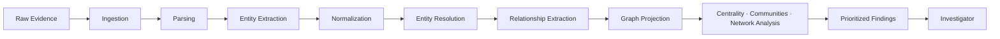

<details>
<summary><b>Evidence integrity pipeline</b></summary>

1. Upload computes a **SHA-256** fingerprint; byte-identical re-uploads are rejected (`409`).
2. Field packages re-verify the **RSA-2048 signature** against the enrolled device; packages from
   unapproved devices are rejected.
3. Raw objects land in **MinIO**, metadata in **PostgreSQL**, and every mutation is **audit-logged**.
4. Provenance links every finding to the evidence file and hashes that produced it.

</details>

---

## Security

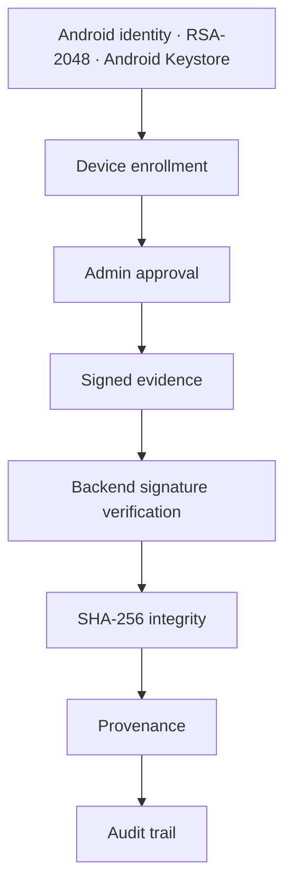

Every device presents a canonical fingerprint — **SHA-256 over the SubjectPublicKeyInfo DER bytes** of
its key — at enrollment; only **approved** devices may submit packages, and every accept/reject is
recorded.

<details>
<summary><b>Detailed security model</b></summary>

| Control | Implementation |
|---|---|
| Password hashing | bcrypt + minimum length |
| Authentication | JWT with expiry; `jti` denylist in Redis |
| Authorization | RBAC — ADMIN / INVESTIGATOR / ANALYST / VIEWER |
| Isolation | owner/admin checks + per-case IDOR guards |
| Rate limiting | keyed login throttling with exponential lockout |
| Input validation | size caps, format sniffing, strict error envelope, Cypher label allowlist |
| Field-agent trust | canonical fingerprint cross-check · approve/revoke · per-device key verification |
| Audit | append-only, permission-scoped (`audit.read`) |

</details>

---

## Field device

- **Enrollment** — stable `ANDROID-…` serial derived from the public key; fingerprint cross-checked against the backend.
- **Approval** — administrators approve or revoke devices per case; only approved devices may submit packages.
- **Heartbeat** — agents publish status so the dashboard reflects live / unapproved / revoked.
- **Offline-first** — capture and sign evidence without connectivity; **Go online** syncs queued packages.
- **Pairing** — LAN discovery broadcast (mDNS), QR code with server fingerprint, or manual server entry.

<details>
<summary><b>Detailed Android protocol</b></summary>

The agent keeps an **RSA-2048 key in the Android Keystore** and derives its identity as
`ANDROID-` + the first 16 hex chars of `sha256(publicKey SubjectPublicKeyInfo DER)`. Enrollment
registers the public key with a case. A sealed package contains a canonical `manifest.json` (per-file
SHA-256 hashes), an **RSA/SHA-256 signature** over that manifest, and the files. The backend re-derives
the canonical fingerprint from the submitted public key, checks device approval, verifies the signature,
hash-integrity, and duplicate/replay, then stores the package.

</details>

---

## Technology stack

| Layer | Technology |
|---|---|
| API | FastAPI · Python 3.12 · SQLAlchemy 2 (async) · Alembic |
| Web | React 19 · TypeScript 5.7 · Vite · Tailwind CSS 4 |
| Data | PostgreSQL 16 · Neo4j 5 · Redis 7 · MinIO (S3) |
| Mobile | Kotlin · Jetpack Compose · Android Keystore (RSA-2048) |
| Ops | Docker Compose · Make · GitHub Actions CI |

---

## Quick start

**Prerequisites**: Docker (with compose plugin), Node.js 22+ for the web UI.

```bash
git clone https://github.com/0xhroot/cybersaarthi.git && cd cybersaarthi
cp .env.example .env                                  # dev-safe defaults
docker compose up -d --build                          # postgres · neo4j · redis · minio · backend
docker compose exec -T backend python -m scripts.create_admin   # first admin (idempotent)
docker compose exec -T backend python -m scripts.seed_demo      # demo case (idempotent)

cd frontend && npm install && npm run dev             # → http://localhost:5173
```

Backend API `http://localhost:8000` · Swagger `http://localhost:8000/docs` · health `curl http://localhost:8000/api/v1/health`

Android agent: `gradle assembleDebug` from `mobile/`, then **Connect → Enroll → Approve** in the web **Devices** tab — see [`mobile/README.md`](mobile/README.md).

---

## Try the demo

1. **Sign in** to the workspace.
2. **Create a case** and register the **victim**.
3. **Upload evidence** — fingerprinted and duplicate-checked.
4. **Enroll the Android agent**, then **approve** it in the web Devices tab.
5. **Capture and sign** evidence in the field — offline, then **Go online** and submit.
6. **Explore the graph** and run analytics.
7. **Review findings** and the audit trail.

---

<details>
<summary><b>Repository structure · API · testing · documentation</b></summary>

**Structure**: `backend/` (FastAPI + services) · `frontend/` (React/Vite workspace) · `mobile/`
(Android field agent) · `desktop-importer/` (bulk evidence upload script) · `scripts/`
(mDNS LAN advertisement) · `docs/` (architecture, ADRs).

**API surface** (all under `/api/v1`): auth, users, cases, victims, entities/relationships, evidence and
ingestion, collections + package import (`/import/packages`), field devices (approve / revoke /
heartbeat / verify-key), graph + analytics, findings, hypotheses, reports, timeline, IoT devices/events,
audit. Interactive docs at `/docs`.

**Verification** (re-verified on `main`, 2026-09-13): **390** backend tests pass · **80** frontend tests
pass · ruff/mypy clean (127 files) · `tsc` + ESLint + Vite build pass · Android unit tests pass · Android
lint 0 errors · physical-device E2E passed (enrollment → approval → signed heartbeat → offline capture →
signature verification).

**Documentation**: [`docs/`](docs/README.md) index · [Android ↔ backend connectivity](docs/architecture/android-connectivity.md)
(design + physical-device verification) · [Architecture decision records](docs/adr/) · [Android agent](mobile/README.md).

</details>

---

<div align="center">

**Connect the evidence. Understand the network. Recover the truth.**

Built with **FastAPI · React · PostgreSQL · Neo4j · MinIO · Redis · Android · Docker**.

Released under the [MIT License](LICENSE). Copyright © 2026 0xhroot.

</div>