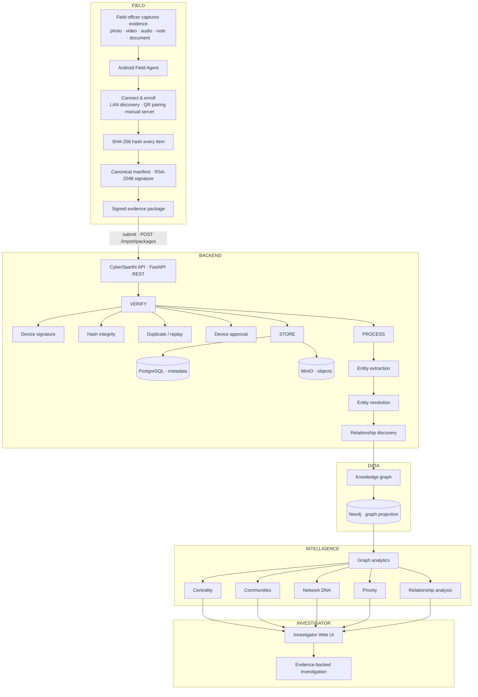
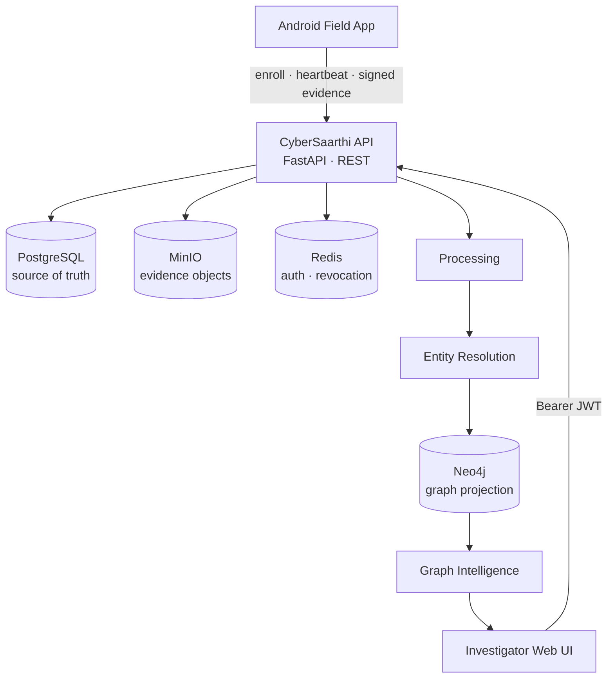
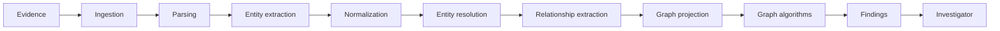
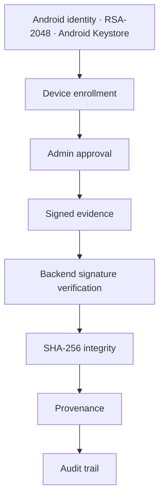

<div align="center">

# **CYBERSAARTHI**

**Cyber Fraud Recovery & Evidence Intelligence Platform**

> From field evidence to connected investigation intelligence.


*Evidence → Verification → Intelligence → Investigation*

<p align="center"></p>

CyberSaarthi unifies investigation **case management, victim, person, phone and financial intelligence,
evidence provenance, and criminal-network analysis** in one persistent web workspace — and pairs it with an
**Android field agent** that captures evidence offline, signs it, and hands it to the same case.

Built for investigators, verified end-to-end on a real device.

<br>

**What it does** · **Workflow** · **See it in action** · **Architecture** · **Features** · **Setup**

</div>

---

## What it does

Fragmented evidence becomes connected, evidence-backed intelligence — from capture to case.

<table>
<tr>
<td width="33%" align="center"><b>📱 Field Evidence</b><br/>Android agent, offline-first capture — photo, video, audio, notes</td>
<td width="33%" align="center"><b>🔐 Verified Evidence</b><br/>SHA-256 hashed, RSA-signed; signatures re-verified by the backend</td>
<td width="33%" align="center"><b>🕸️ Network Intelligence</b><br/>Case knowledge graph — centrality, communities, paths</td>
</tr>
<tr>
<td width="33%" align="center"><b>👤 Victim Intelligence</b><br/>First-class victim records — incident, impact, recovery</td>
<td width="33%" align="center"><b>📊 Analytics</b><br/>Deterministic graph analytics with explainable findings</td>
<td width="33%" align="center"><b>🧾 Auditability</b><br/>Append-only audit trail and full evidence provenance</td>
</tr>
</table>

---

## The workflow

One connected path — **field capture → verified evidence → connected intelligence → decision**.



---

## See it in action

> Real screenshots from the running system: the seeded `DEMO-2026-001` SIH case, the physical-device
> E2E run (POCO "Xiaomi miel"), and the live backend — no mocked imagery.

### Web investigator

<table>
<tr>
<td width="33%"><p align="center"><b>Workspace</b></p></td>
<td width="33%"><p align="center"><b>Case</b></p></td>
<td width="33%"><p align="center"><b>Victim</b></p></td>
</tr>
<tr>
<td width="33%"><p align="center"><b>Graph</b></p></td>
<td width="33%"><p align="center"><b>Analytics</b></p></td>
<td width="33%"><p align="center"><b>Entities</b></p></td>
</tr>
<tr>
<td width="33%"><p align="center"><b>Evidence</b></p></td>
<td width="33%"><p align="center"><b>Provenance</b></p></td>
<td width="33%"><p align="center"><b>Audit timeline</b></p></td>
</tr>
<tr>
<td width="33%"><p align="center"><b>Field devices</b></p></td>
<td width="33%"><p align="center"><b>IoT</b></p></td>
<td width="33%"><p align="center"></p></td>
</tr>
</table>

### Android field agent

Captured on a physical device — the agent flow in order.

<table>
<tr>
<td width="33%"><p align="center"><br/><b>Connect</b></p></td>
<td width="33%"><p align="center"><br/><b>Discover</b></p></td>
<td width="33%"><p align="center"><br/><b>Enroll</b></p></td>
</tr>
<tr>
<td width="33%"><p align="center"><br/><b>Field hub</b></p></td>
<td width="33%"><p align="center"><br/><b>Select case</b></p></td>
<td width="33%"><p align="center"><br/><b>Capture</b></p></td>
</tr>
<tr>
<td width="33%"><p align="center"><br/><b>Evidence</b></p></td>
<td width="33%"><p align="center"><br/><b>Transfer</b></p></td>
<td width="33%"><p align="center"><br/><b>Offline</b></p></td>
</tr>
</table>

### Android → CyberSaarthi → Investigator

<table>
<tr>
<td width="33%" align="center"><b>[ Android ]</b><br/>Capture + sign</td>
<td width="33%" align="center"><b>[ Backend ]</b><br/>Verify + store + process</td>
<td width="33%" align="center"><b>[ Web ]</b><br/>Investigate + analyze</td>
</tr>
<tr>
<td><p align="center"></p></td>
<td><p align="center"></p></td>
<td><p align="center"></p></td>
</tr>
</table>

---

## Architecture



Four stores, each deliberately specialized: **PostgreSQL** is the source of truth, **Neo4j** is an
idempotent graph projection, **MinIO** holds evidence objects, **Redis** is operational state
(revocation + throttling) — all persisted on named Docker volumes.

<details>
<summary><b>Data stores & data model</b></summary>

| Store | Role | Persistence |
|---|---|---|
| PostgreSQL | Users, cases, victims, entities, relationships, evidence metadata, audit log, IoT devices/events | `postgres_data` |
| Neo4j | Relationship/graph analytics projection, rebuilt idempotently | `neo4j_data` |
| MinIO | Raw evidence files (S3 API) | `minio_data` |
| Redis | Token revocation denylist + login throttling (state, not a source of truth) | `redis_data` |

Entity types: `person`, `phone`, `vehicle`, `organization`, `account`, `location`, `document`,
`event` — linked by relationships such as `called`, `owns`, `located_at`, `visited`, `works_for`,
`associated_with`. The seeded demo case currently holds **45 entities and 86 relationships**.

</details>

---

## Evidence → Intelligence

> How CyberSaarthi actually produces intelligence.



<details>
<summary><b>Evidence verification pipeline</b></summary>

1. Upload computes a **SHA-256** fingerprint; byte-identical re-uploads are rejected (`409`).
2. For field packages, the backend re-verifies the **RSA-2048 signature** against the enrolled device
   and rejects packages from unapproved devices.
3. Raw objects land in **MinIO**, metadata in **PostgreSQL**, and every mutation is **audit-logged**.
4. Provenance links every finding to the evidence file (and hashes) that produced it.

</details>

---

## Features

- **Case management** — lifecycle, severity, membership, per-case visibility, owner/admin isolation.
- **Field capture** — offline Android agent, canonical signed manifests, LAN/QR/manual hand-off.
- **Evidence integrity** — hashing, duplicate detection, signature verification, object storage.
- **Entity resolution** — persons, phones, accounts, vehicles, organizations with a human review queue.
- **Knowledge graph & analytics** — centrality, communities, network DNA, priorities, paths, patterns.
- **Victim intelligence** — incident profile, financial impact, recovery status, digital footprint.
- **IoT subsystem** — device enrollment and telemetry events (backend foundation; hardware planned).
- **Security** — RBAC, JWT + revocation, throttling, IDOR guards, append-only audit.

---

## Security



Every device carries a DER-SPKI fingerprint presented at enrollment; only **approved** devices can
submit packages, and every accept/reject is recorded.

<details>
<summary><b>Security controls</b></summary>

| Control | Implementation |
|---|---|
| Password hashing | bcrypt + minimum length |
| Authentication | JWT with expiry; `jti` denylist in Redis |
| Authorization | RBAC — ADMIN / INVESTIGATOR / ANALYST / VIEWER |
| Isolation | owner/admin checks + per-case IDOR guards |
| Rate limiting | keyed login throttling with lockout |
| Input validation | size caps, format sniffing, strict error envelope, Cypher label allowlist |
| Field-agent trust | fingerprint cross-check · approve/revoke · per-device key verification |
| Audit | append-only, permission-scoped (`audit.read`) |

</details>

---

## Quick start

```bash
git clone https://github.com/0xhroot/cybersaarthi.git && cd cybersaarthi
cp .env.example .env                                  # dev-safe defaults
docker compose up -d --build                          # postgres · neo4j · redis · minio · backend
docker compose exec -T backend python -m scripts.create_admin   # first admin (idempotent)
docker compose exec -T backend python -m scripts.seed_demo      # DEMO-2026-001 (idempotent)

cd frontend && npm install && npm run dev             # → http://localhost:5173
```

Backend API `http://localhost:8000` · Swagger `http://localhost:8000/docs` · health `curl http://localhost:8000/api/v1/health`

Android agent: build with `gradle assembleDebug` from `mobile/`, then **Connect → Enroll → Approve** in the web **Devices** tab — see [`mobile/README.md`](mobile/README.md).

---

## SIH demo

1. **Sign in** to the workspace.
2. **Create the case** and register the **victim**.
3. **Upload evidence** — fingerprinted and duplicate-checked.
4. **Enroll the Android agent**, then **approve** it in the web Devices tab.
5. **Capture + sign** evidence in the field — offline, then **go online** and submit.
6. **Explore** the graph and run analytics.
7. **Review** findings and the audit trail.

---

<details>
<summary><b>Technical details · API · testing · documentation</b></summary>

**API surface** (all under `/api/v1`): auth (`/auth/*`), users (`/admin/users/*`), cases
(`/cases`, `/cases/{id}`), victims, IoT devices/events, evidence (`/cases/{id}/evidence`, `/ingest`),
field devices (`/cases/{id}/devices` + `approve`/`revoke`/`heartbeat`), collections and package import
(`/import/packages`), entities/relationships, graph + analytics, findings, audit. Interactive docs at
`/docs`.

**Verification** (re-verified on `main`, 2026-09-13): **390** backend tests pass · **80** frontend tests
pass · ruff/mypy clean (127 files) · `tsc` + ESLint + Vite build pass · Android unit tests pass · Android
lint 0 errors · physical-device E2E passed (enrollment → approval → signed heartbeat → offline capture →
signature verification).

**Documentation**: [`docs/`](docs/README.md) index · [Android ↔ backend connectivity](docs/architecture/android-connectivity.md)
(design + physical-device verification) · [Architecture decision records](docs/adr/) · [Android agent](mobile/README.md).

</details>

---

<div align="center">

**Connect the evidence. Understand the network. Recover the truth.**

Built with **FastAPI · React · PostgreSQL · Neo4j · MinIO · Redis · Android · Docker**.

Released under the [MIT License](LICENSE). Copyright © 2026 0xhroot.

</div>