<div align="center">

# **CYBERSAARTHI**

### Cyber Fraud Recovery & Evidence Intelligence Platform

**From fragmented evidence → connected intelligence → actionable investigation.**

`Field evidence → Signed capture → Entity Resolution → Knowledge Graph → Graph Analytics → Decisions`

<p>
<a href="#one-minute-overview">Overview</a> ·
<a href="#the-problem">The Problem</a> ·
<a href="#end-to-end-investigation-workflow">Workflow</a> ·
<a href="#application-screenshots">Screenshots</a> ·
<a href="#system-architecture">Architecture</a> ·
<a href="#verification--testing">Verification</a> ·
<a href="#quick-start">Quick Start</a>
<br>
<sub>Smart India Hackathon submission — built for the investigator, not the demo slide.</sub>
</p>

</div>

<div align="center">

| | | | |
|---|---|---|---|
| 🟢 **SIH DEMO READY** | **390** Backend Tests Passing | **80** Frontend Tests Passing | **Real-Mode E2E Verified** |
| Persistent Multi-Store | RBAC + JWT | Evidence Provenance | Victim + IoT Intelligence |
| Graph Analytics | REST API + UI | Audit Trail | Android Field Agent |

</div>

<div align="center">


</div>

---

## Table of Contents

- [One-Minute Overview](#one-minute-overview)
- [The Problem](#the-problem)
- [The Solution](#the-solution)
- [End-to-End Investigation Workflow](#end-to-end-investigation-workflow)
- [Complete System Workflow](#complete-system-workflow)
- [Key Capabilities](#key-capabilities)
- [Application Screenshots](#application-screenshots)
  - [Investigator Web Platform](#investigator-web-platform)
  - [Android Field Agent](#android-field-agent)
- [Android Field Agent](#android-field-agent-1)
- [Investigator Web Platform & Device Management](#investigator-web-platform--device-management)
- [Evidence Integrity & Provenance](#evidence-integrity--provenance)
- [Criminal Network Intelligence](#criminal-network-intelligence)
- [Victim Intelligence](#victim-intelligence)
- [Device & IoT Intelligence](#device--iot-intelligence)
- [Security Architecture](#security-architecture)
- [System Architecture](#system-architecture)
- [Data Architecture](#data-architecture)
- [Technology Stack](#technology-stack)
- [Project Structure](#project-structure)
- [Quick Start](#quick-start)
- [Running the System & the Android Field Agent](#running-the-system--the-android-field-agent)
- [Configuration](#configuration)
- [API Overview](#api-overview)
- [Verification & Testing](#verification--testing)
- [SIH Demonstration Flow](#sih-demonstration-flow)
- [Limitations](#limitations)
- [Roadmap](#roadmap)
- [Contributing](#contributing)
- [Team](#team)
- [License](#license)

---

## One-Minute Overview

CyberSaarthi is a **self-hosted, investigator-centric cyber-fraud investigation and evidence-intelligence
platform**. A single connected workspace brings together **case management, victim intelligence, person,
phone, financial and device intelligence, digital evidence with verifiable provenance, investigation
timelines, and criminal-network analysis**.

That is only half the story. A companion **Android Field Agent** turns a plain smartphone into a secure
field-evidence capture device: it collects evidence **offline**, hashes and signs a canonical package with a
device-protected RSA key, and submits it to the backend (in-app LAN discovery, manual server entry or QR
pairing) where the signature is re-verified against the enrolled device before the evidence is accepted.

Evidence is then ingested deterministically: files are parsed, entities extracted and resolved, and
relationships discovered — then materialized into a case-scoped knowledge graph with explainable analytics
and a complete audit trail. Every relationship and score is traceable back to the evidence that produced
it, and a human investigator stays in control of every finding.

> **PostgreSQL is the source of truth; Neo4j is an idempotent graph projection.**
> Victim and IoT data are first-class, PostgreSQL-backed subsystems that currently live **outside** the
> Neo4j projection by deliberate architecture decision.

---

## The Problem

Cyber-fraud investigations in the field are drowning in fragments:

| Conventional problem | What actually happens |
|---|---|
| **Fragmented data** | Calls, device records, bank statements, victim statements and evidence are stored in disconnected spreadsheets and folders. |
| **Manual correlation** | Investigators join records by hand against memory and grepped CSVs. |
| **Disconnected evidence** | No link between the uploaded file and the entity it implicates. |
| **Field captures are mutable** | Evidence taken in the field can be edited, replaced or lost before it reaches a record. |
| **Weak relationship visibility** | "Who is connected to whom?" is the hardest question to answer. |
| **Lost provenance** | No chain between a claim, its source file and its integrity hash. |
| **Victim blind spot** | Victim impact and recovery status are an afterthought, not a first-class record. |
| **Fragile demos** | Data vanishes on restart; the "demo" is a mockup, not the product. |

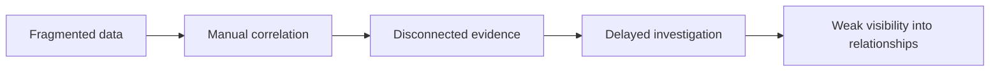

---

## The Solution

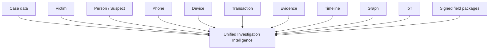

CyberSaarthi collapses those fragments into one durable investigation workspace where **everything is
connected to the case, survives restarts, and is backed by an audit log** — and it brings field capture
into that same workspace through a signed, offline-first Android agent.

| Investigation challenge | CyberSaarthi response |
|---|---|
| Fragmented evidence | Unified, case-scoped workspace |
| Disconnected entities | Relationship and graph analysis |
| Evidence integrity concerns | SHA-256 hashing + signature verification + provenance + duplicate detection |
| Field capture integrity | Offline capture hashed and signed on-device, re-verified by the backend |
| Victim information scattered | Dedicated first-class victim subsystem |
| Financial data disconnected | Transaction, account and bank intelligence |
| Phone/device relationships | Entity linkage and resolution |
| Physical-world evidence | IoT device/event foundation |
| Poor traceability | Append-only audit trail and timeline |
| Data loss after restart | Persistent PostgreSQL, Neo4j, MinIO and Redis volumes |

---

## End-to-End Investigation Workflow

The investigation lifecycle is one connected path — field capture to actionable intelligence:

> **FIELD → ANDROID AGENT → ENROLLMENT & APPROVAL → EVIDENCE CAPTURE → HASH + SIGNATURE →
> FASTAPI BACKEND → VERIFY + STORE → ENTITY RESOLUTION → NEO4J GRAPH → GRAPH ANALYTICS →
> INVESTIGATOR WEB UI → ACTIONABLE LEADS**

1. An investigator enrolls a field agent against a case in the web workspace; the operator approves the
   device from the same UI.
2. On the ground, the agent records evidence — photos, video, audio, notes, documents — **offline**.
3. Each item is SHA-256 hashed on-device; the set is assembled into a canonical manifest and signed with
   the device's Android-Keystore-protected RSA key.
4. Back in coverage, the signed package is submitted over the LAN (in-app mDNS discovery, manual server
   entry or QR pairing). The backend re-verifies the signature against the enrolled device public key.
5. Raw objects land in MinIO, metadata lands in PostgreSQL, and the deterministic pipeline extracts and
   resolves entities into the case graph.
6. Network-science analytics — centrality, communities, network DNA, paths and patterns — surface
   reviewable findings for the investigator.
7. The investigator works leads, evidence provenance and the audit trail in the web workspace; every
   action persists.

## Complete System Workflow

```mermaid
flowchart LR
    subgraph FIELD["Field operations"]
        A["Agent captures evidence<br/>photo · video · audio · note · document"] --> B["Offline device store"]
    end
    subgraph AGENT["Android Field Agent (mobile/)"]
        B --> C["Hash each item (SHA-256)"]
        C --> D["Canonical manifest"]
        D --> E["Sign with RSA-2048 key<br/>Android Keystore"]
    end
    subgraph HANDOFF["Secure hand-off"]
        E --> F["mDNS discovery · manual server · QR pair"]
        F --> G["Submit signed package — POST /import/packages"]
    end
    subgraph CORE["FastAPI backend"]
        G --> H["Verify signature<br/>against enrolled device key"]
        H --> I["PostgreSQL metadata · MinIO objects"]
        I --> J["Deterministic extraction<br/>and entity resolution"]
    end
    subgraph GRAPH["Graph and analytics"]
        J --> K["Case-scoped knowledge graph (Neo4j)"]
        K --> L["Centrality · communities · network DNA · paths"]
        L --> M["Reviewable findings"]
    end
    subgraph WEB["Investigator web workspace"]
        M --> N["Investigate and act on leads"]
        N --> O["Provenance and audit trail"]
    end
    O --> N
```

---

## Key Capabilities

| Capability | What it does |
|---|---|
| **Case management** | Case lifecycle, severity, status and archive; membership and per-case visibility; owner/admin authorization with cross-case isolation. |
| **Evidence integrity** | SHA-256 fingerprints on upload, duplicate detection (409), MinIO object storage with case-scoped keys, provenance and ingestion jobs. |
| **Field capture** | Android agent captures evidence offline, hashes and signs a canonical package; the backend re-verifies the signature against the enrolled device key. |
| **Entity resolution** | Persons, phones, vehicles, accounts, organizations, locations, documents, events — resolved and linked with a human review queue. |
| **Knowledge graph** | Case-scoped entity/relationship graph with path, pattern, ego-graph and centrality views. |
| **Graph analytics** | Deterministic centrality, communities, network DNA, priorities, relationship strength and hypotheses — all explainable. |
| **Victim intelligence** | First-class victim records: incident, financial impact, recovery status and digital footprint. |
| **Device & IoT intelligence** | Registered IoT devices and telemetry events per case (unique serial per case), persistent in PostgreSQL. |
| **Timeline & audit** | Append-only audit log and explicit case timeline events for uploads, collections, devices, hypotheses, runs, reports and case lifecycle. |
| **Security** | bcrypt + JWT, token revocation, login throttling, RBAC (ADMIN / INVESTIGATOR / ANALYST / VIEWER), IDOR guards, security headers. |

---

## Application Screenshots

> All screenshots below are **captured from the running CyberSaarthi application** — real UI against the
> live stack (Vite dev, mock API disabled) using the seeded SIH demo dataset and a real physical-device
> field run. No mocked or generated imagery.

### Investigator Web Platform


_Sign-in to the investigation workspace._


_Workspace home: case-state summary and recent cases._

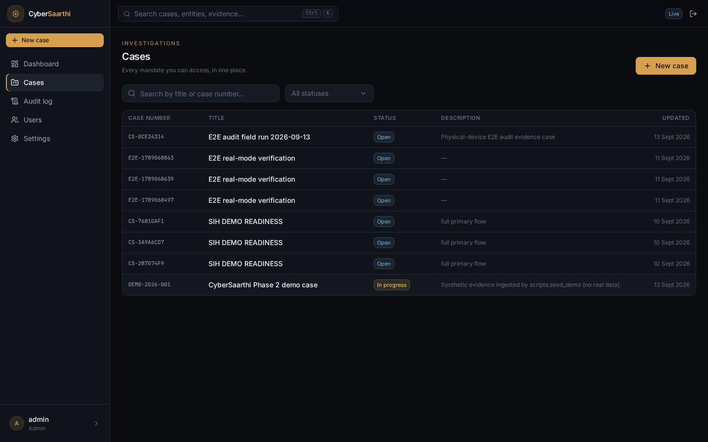
_Case management — every investigation the signed-in profile can access._

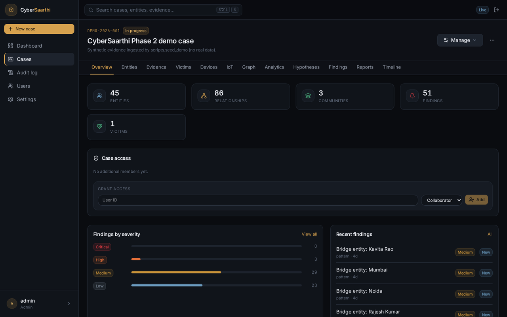
_Seeded demo case `DEMO-2026-001`: 45 resolved entities, 86 relationships, 1 victim and 51 reviewable
findings._


_Entity-resolution view with confidence, status and merge review controls._

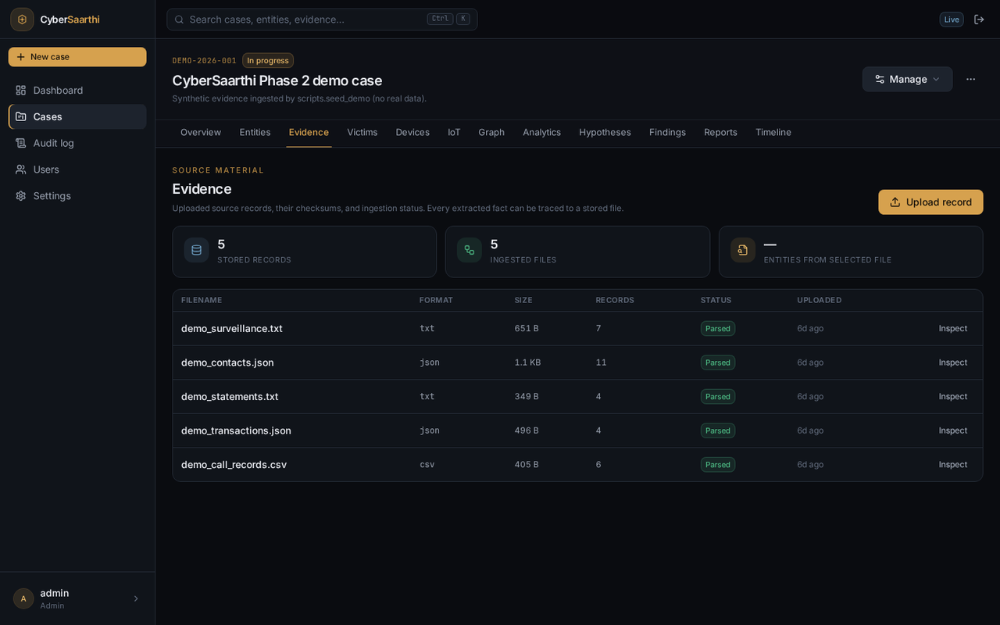
_Evidence with per-file intake status — every extractable fact traces to a stored file._

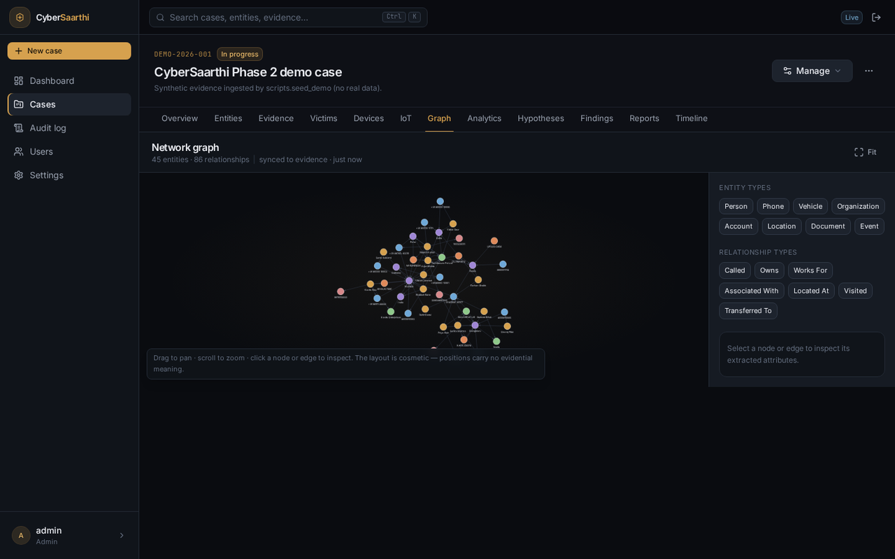
_Relationship canvas — Cytoscape rendering of the resolved case graph._

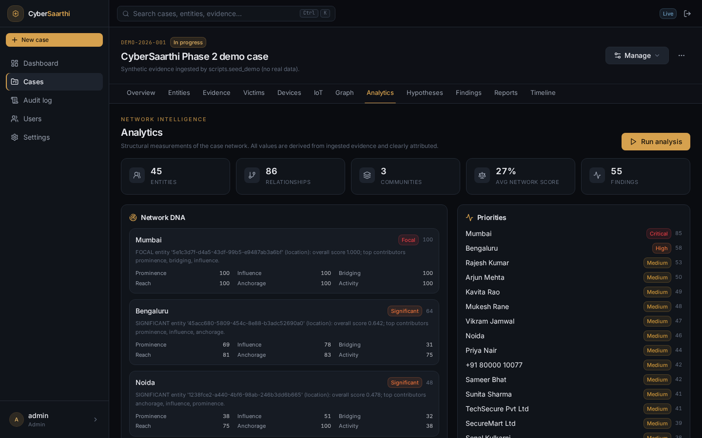
_Deterministic network analytics: network DNA, communities and severity-ranked findings._

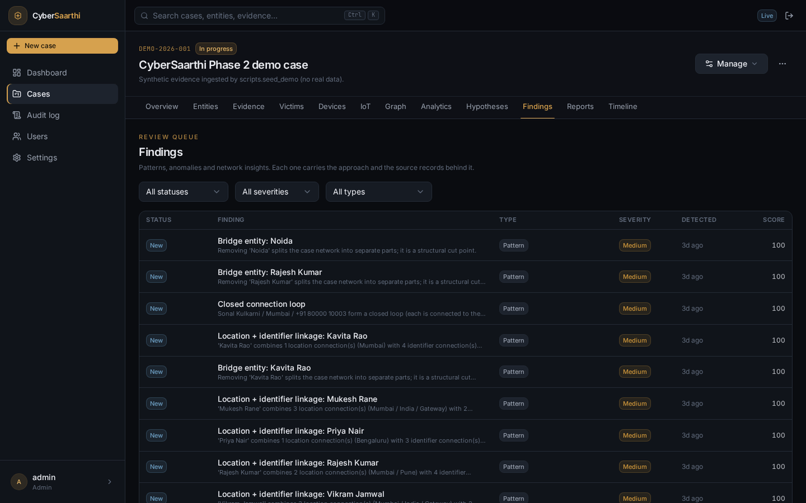
_Human-reviewable findings with evidence-backed scores._

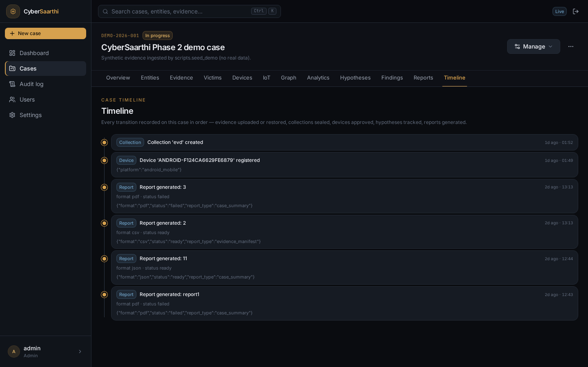
_Chronological audit trail of every state change on the case._


_The Devices workspace: an enrolled Android field agent listed with approval status, key algorithm and
last-seen, with approve/revoke actions._

### Android Field Agent


_Secure evidence collection for the field — offline evidence stays locked on the device until unlocked._

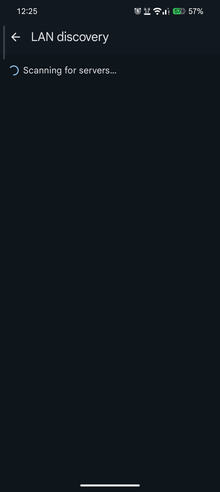
_In-app LAN discovery scans for the matching backend on the same network._


_Device identity shown for operator approval: device ID, model and signing-key fingerprint._

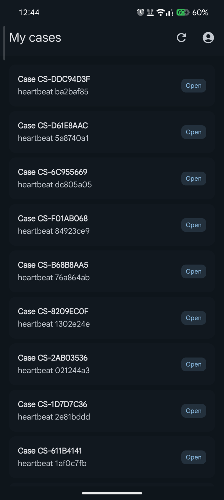
_My cases — the agent's active assignments with heartbeat identifiers._


_Capture hub: photo, video, audio, location and document capture with on-demand hashing._

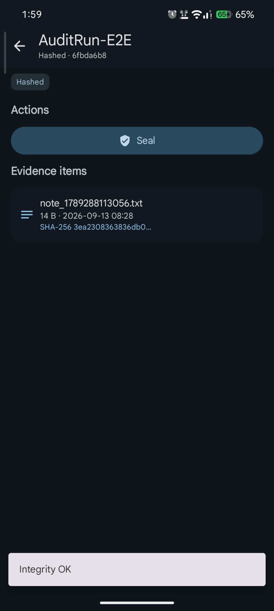
_Captured evidence item with its SHA-256 shown and integrity verified._


_Collection submitted; the operator can verify integrity or export the package._

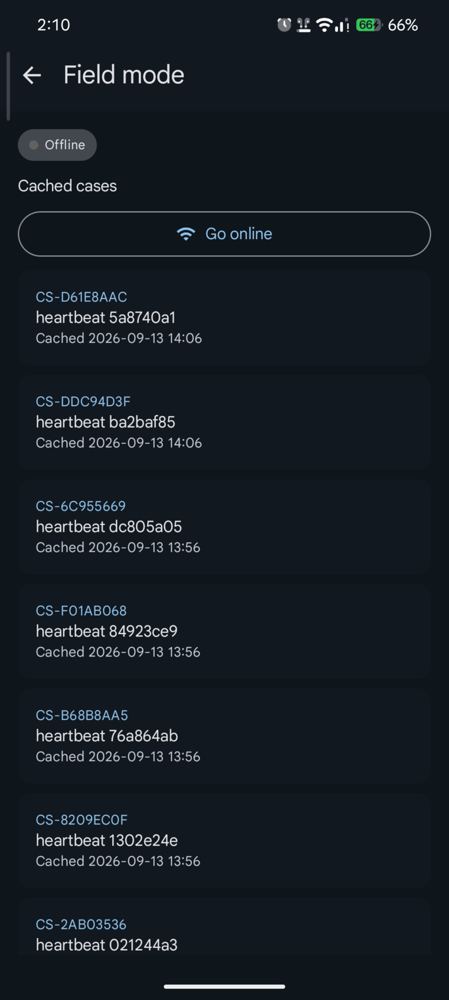
_Offline-first field mode — cached cases retained, with one-tap "go online" recovery._

---

## Android Field Agent

A Kotlin + Compose Android app (`mobile/`) turns a standard smartphone into a secure field-evidence
capture device — **offline-first, zero cloud**:

- **Offline-first** — evidence is captured, hashed and packaged on the device itself; a signed package can
  be submitted later from the offline hub when the agent is back online or handed off via the desktop
  importer (`desktop-importer/`).
- **LAN, not internet** — the agent finds the backend over the same LAN via manual server entry, in-app
  mDNS discovery, or QR pairing, and establishes trust from the backend identity fingerprint.
- **Enrollment & approval** — the agent mints a hardware-backed RSA-2048 keypair (Android Keystore); the
  operator approves or revokes the device in the web **Devices** tab.
- **Signed liveness heartbeat** — every 60 s the agent signs a canonical heartbeat message so the backend
  shows "last seen" per field device.
- **Provable evidence** — each capture is SHA-256 hashed, assembled into a canonical manifest and signed
  with the device key; the backend re-verifies the signature against the registered public key
  (RSA-PKCS1-v1_5/SHA-256). A device that loses or rotates its Keystore key re-enrolls under a fresh
  identity — in this stack the physical device appears as a sequence of approved `ANDROID-*` identities
  (POCO "Xiaomi miel").

```
Field capture (offline) → hash + canonical manifest → sign (RSA-2048)
  → submit package (online / LAN) → backend verifies signature → case evidence
```

Refer to [`mobile/README.md`](mobile/README.md) for the agent's modules and build/test commands, and
[`docs/architecture/android-connectivity.md`](docs/architecture/android-connectivity.md) for the
LAN/trust/heartbeat design (verified end-to-end on a physical device).

---

## Investigator Web Platform & Device Management

The web workspace (React 19 + Vite + TypeScript) exposes the complete investigation surface:

- **Dashboard & case list** — case-state summary, quick creation, per-case access.
- **Case workspace** — Overview, Entities, Evidence, Victims, Devices, IoT, Graph, Analytics, Hypotheses,
  Findings, Reports and Timeline in one case-scoped shell.
- **Entities** — resolved persons, phones, vehicles, accounts, organizations and locations with confidence
  scores and a merge review queue.
- **Evidence** — upload with SHA-256 fingerprint, duplicate rejection, file-level ingestion status and a
  provenance drawer linking each file to the entities, relationships and findings it produced.
- **Graph & analytics** — Cytoscape graph canvas plus deterministic network analytics.
- **Field device management** (`/cases/{id}/devices`) — enroll, **approve**, **revoke**, and monitor
  "last seen" for every Android agent on the case. Approved devices are the only ones whose signed
  packages are accepted (`web-devices.png` above).
- **Audit** — permission-scoped (`audit.read`) append-only log of every mutation.

---

## Evidence Integrity & Provenance

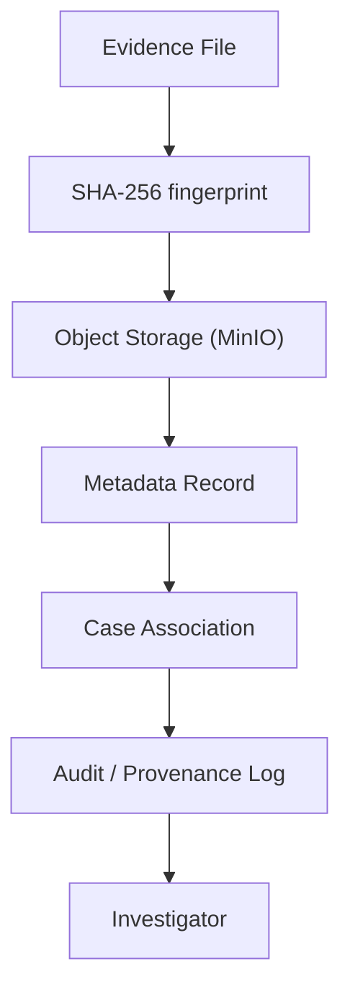

**Verified behavior (E2E):**

1. Upload accepts the file and returns its metadata.
2. The SHA-256 returned by the API **matches the local bytes exactly**.
3. Re-uploading the same file is **rejected with 409** (duplicate detection).
4. The stored MinIO object was verified **byte-identical** to the uploaded file.
5. Metadata, case association and provenance persist across restarts.
6. On a physical device, a captured item, its on-device SHA-256, the canonical manifest and the RSA
   signature were all re-verified by the backend, and `manifest.sig` was verified independently with
   OpenSSL against the registered device public key.

> CyberSaarthi provides **technical integrity and provenance mechanisms**. Legal admissibility remains
> dependent on jurisdiction, collection procedures and institutional policy.

---

## Criminal Network Intelligence

The same evidence pipeline drives suspect-focused intelligence:

- **Persons / suspects** — resolved from names and aliases with entity-resolution identity management.
- **Phones** — extracted numbers linked back to the records they appear in.
- **Accounts & banks** — financial identifiers and banking organizations.
- **Vehicles** — registration numbers when present.
- **Transactions** — surfaced as financial records and account relationships.

These entities live in one case-scoped graph, so a phone number's callers, an account's owners and a
person's vehicles are queryable in a single view — with the evidence trail behind every link. The
analytics engine implements **centrality**, **communities**, **network DNA**, **priorities**,
**relationship strength**, **paths** (pair and ego), **patterns** and **hypotheses** — all
case-scoped and deterministic.

> The seeded demo case (`DEMO-2026-001`) currently holds **45 entities and 86 relationships** (verified
> from the running stack) — values from the demo dataset, not universal system limits.

---

## Victim Intelligence

Victims are **first-class investigation entities**, not a checkbox inside a case. Each victim record
carries a structured profile:

| Dimension | Fields in the implementation |
|---|---|
| Identity | Name, age, date of birth, gender, classification, phone, email, address |
| Incident | Incident date, incident type, fraud category, description, statement |
| Financial impact | Reported amount, currency, amount lost, recovery amount |
| Recovery | Recovery status |
| Digital footprint | Digital accounts, devices, wallet addresses |
| Investigation | Investigator notes, case association |

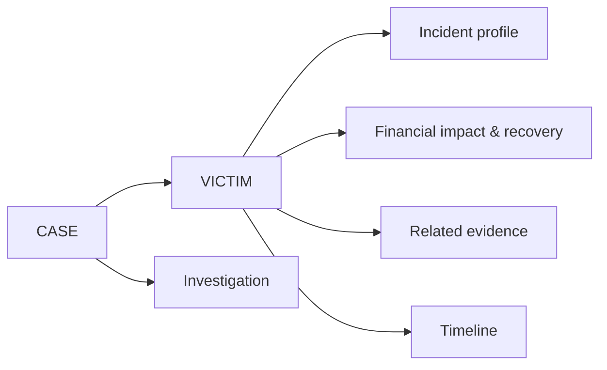

Victim operations are **authorization-gated** (per-case permission checks) and fully **audit-logged**,
handled with the care befitting real victims of fraud.

---

## Device & IoT Intelligence

The shipped implementation is the **complete backend IoT foundation**:

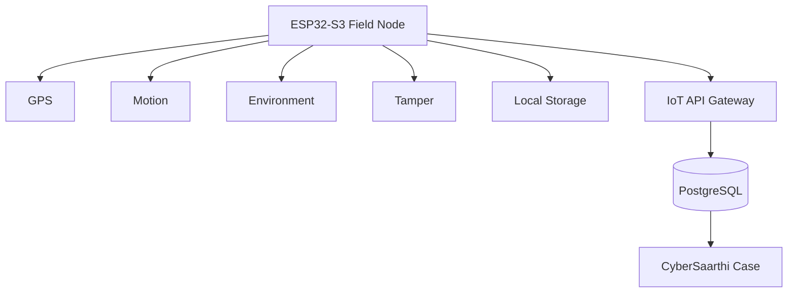

- Device registration (unique `(case, serial)`), update and listing.
- Event ingestion with location/connectivity payloads.
- Per-device statistics and case-scoped queries.
- PostgreSQL persistence and full audit coverage.

Physical ESP32 hardware integration is a **planned** extension on this foundation — it is not yet part of
the verified build. Android **field agents** (distinct from IoT nodes) are fully covered today via the
Devices workspace and the signed-package pipeline.

---

## Security Architecture

| Control | Implementation |
|---|---|
| Password hashing | bcrypt with minimum-password-length validation |
| Authentication | JWT bearer tokens with expiration |
| Token revocation | `jti` denylist in Redis enforced on every request |
| RBAC | ADMIN / INVESTIGATOR / ANALYST / VIEWER with per-endpoint permissions |
| Case isolation | owner/admin authorization · cross-case access refused |
| IDOR protection | per-case resource guards on every nested route |
| Rate limiting | keyed login throttling with exponential lockout |
| Audit logging | append-only, permission-scoped (`audit.read`) |
| Input validation | size caps, format sniffing, strict error envelope, Cypher label allowlist |
| Security headers | CSP + HSTS in production, `x-request-id` correlation |
| Field-agent trust | device fingerprint (`SHA-256` over the DER `SubjectPublicKeyInfo`), approve/revoke, per-device signature verification |

Every authenticated route resolves the caller against case membership, role permissions and record
ownership before touching data. Findings and hypotheses are analytical signals for **review**, never an
automated determination of guilt. Security is defense-in-depth and continuously reviewed — like any real
system, it is **never "100% secure"**.

---

## System Architecture

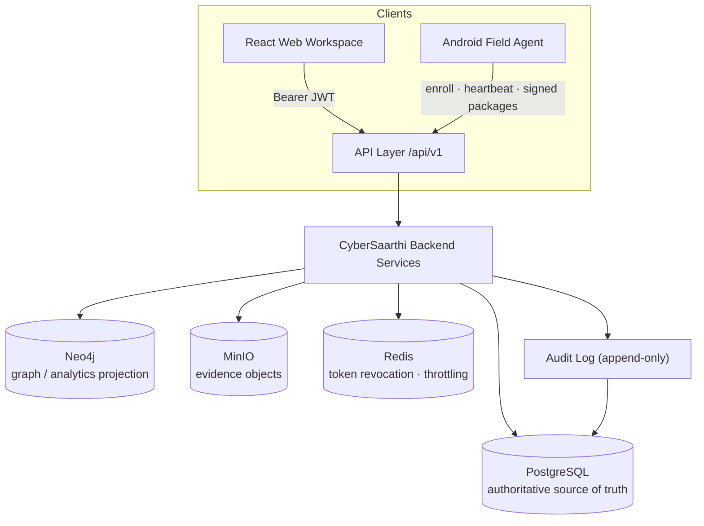

### The four data stores are deliberately specialized

| Store | Role in CyberSaarthi | Persistence |
|---|---|---|
| **PostgreSQL** | Authoritative transactional store — users, cases, victims, entities, relationships, evidence metadata, audit log, IoT devices/events | `postgres_data` volume |
| **Neo4j** | Relationship/graph analytics **projection**, rebuilt idempotently; never owns authoritative data | `neo4j_data` volume |
| **MinIO** | Object storage for raw evidence files (S3 API) | `minio_data` volume |
| **Redis** | Token revocation denylist + login throttling + cache (operational state, **not** a source of truth) | `redis_data` volume |

> The frontend talks only to the FastAPI backend; the backend composes the stores. Redis is
> infrastructure, not the postgres for any durable record.

---

## Data Architecture

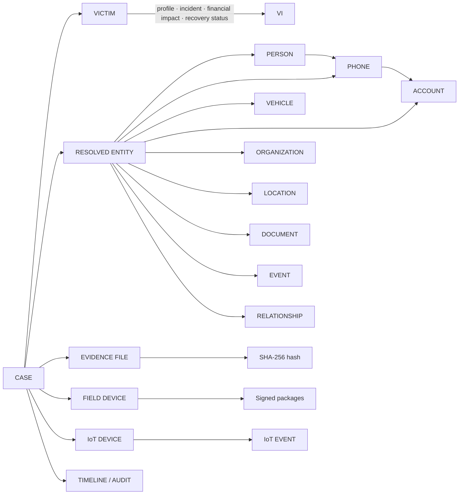

Implemented entity types: `person`, `phone`, `vehicle`, `organization`, `account`, `location`,
`document`, `event` — connected by relationships such as `called`, `owns`, `located_at`, `visited`,
`works_for`, `associated_with`.

---

## Technology Stack

| Layer | Technology | Version |
|---|---|---|
| Language (frontend) | TypeScript | 5.7 |
| Frontend framework | Vite + React 19 UI | 19 / 6 |
| UI layer | React Router 7 · TanStack Query · Zustand · Tailwind CSS 4 · Radix UI · Cytoscape (graph) | — |
| Language (backend) | Python | 3.12 |
| API framework | FastAPI + Uvicorn | 0.141 / 0.52 |
| ORM & migrations | SQLAlchemy 2 (async) + Alembic | 2.0 / 1.19 |
| Relational DB | PostgreSQL | 16 |
| Graph DB | Neo4j | 5 (community) |
| Cache / state | Redis | 7 |
| Object storage | MinIO (S3 API) + boto3 | — |
| NLP / extraction | spaCy 3.8 with `en_core_web_sm` + RapidFuzz | — |
| Serialization | Pydantic | 2.13 |
| Containers | Docker Compose (`backend`, `postgres`, `neo4j`, `redis`, `minio`, plus `discovery` mDNS profile and `backend-dev` test image) | — |
| Field agent | Android (Kotlin + Compose, CameraX, Android Keystore RSA signing, OkHttp) | — |
| Testing | pytest + Vitest | — |
| Tooling | Ruff · mypy · ESLint · Prettier | — |

Backend runtime dependencies: `fastapi`, `uvicorn[standard]`, `pydantic`, `pydantic-settings`,
`sqlalchemy[asyncio]`, `alembic`, `psycopg[binary]`, `neo4j`, `redis`, `boto3`, `bcrypt`, `spacy`,
`en_core_web_sm`, `rapidfuzz`, `charset-normalizer`, `python-multipart` — all pinned. No unnecessary
runtime dependencies.

---

## Project Structure

```
CyberSaarthi/
├── backend/                 # FastAPI modular monolith (Python 3.12)
│   ├── app/
│   │   ├── api/             # routers: cases, victims, iot, evidence, entities,
│   │   │                    #          graph, analytics, findings, audit, auth, users, devices, collections
│   │   ├── analytics/       # deterministic analytics engine
│   │   ├── services/        # ingestion · extraction · normalization · resolution
│   │   ├── models/          # SQLAlchemy models
│   │   └── core/            # settings, security, codes, RBAC
│   ├── migrations/          # Alembic migrations (single head)
│   └── tests/               # unit · API · integration
├── frontend/                # React 19 + Vite + TypeScript UI
│   ├── src/app/pages/       # dashboard, cases, victims, iot, evidence, graph, devices, ...
│   ├── src/api/             # mock + real adapters (mock disabled for the demo)
│   └── src/components/ui/   # design-system components
├── mobile/                  # Android Field Agent (Kotlin + Compose)
│   ├── app/                 # Compose UI: login → dashboard → case → capture
│   └── *-lib/               # offline signature · hashing · manifest · state-machine libraries
├── desktop-importer/        # desktop utility to import signed USB packages into the backend
├── scripts/                 # mDNS advertiser + demo seed helpers
├── docs/                    # ADRs · connectivity design · screenshots · tooling
├── docker-compose.yml       # postgres · neo4j · redis · minio · backend (+ discovery)
├── Makefile                 # dev workflow (make up / seed / test / ...)
├── .env.example             # documented configuration template
├── LICENSE                  # MIT
└── README.md
```

---

## Quick Start

### Prerequisites

- [Docker Engine](https://docs.docker.com/engine/install/) + [Docker Compose](https://docs.docker.com/compose/install/)
- Node.js + npm (frontend only)
- Git

### Clone and start

```bash
git clone https://github.com/0xhroot/cybersaarthi.git
cd cybersaarthi

cp .env.example .env            # dev-safe defaults; never commit the real .env
docker compose up -d --build    # postgres, neo4j, redis, minio, backend
docker compose ps               # wait for all services to be healthy
```

### Bootstrap the first administrator

Registration is public and creates a `PENDING` account that cannot sign in until an administrator approves
it. To get the first admin, use the idempotent bootstrap CLI (it refuses to create a second admin):

```bash
docker compose exec -T backend python -m scripts.create_admin
```

Credentials default to development values; override with `ADMIN_USERNAME` / `ADMIN_EMAIL` /
`ADMIN_PASSWORD`. Seed the deterministic demo case with:

```bash
docker compose exec -T backend python -m scripts.seed_demo
```

### Access

- **Backend API:** `http://localhost:8000` · Swagger UI: `http://localhost:8000/docs`
- **Frontend:** `cd frontend && npm install && npm run dev` → `http://localhost:5173`

```bash
curl http://localhost:8000/api/v1/health   # 200 — API is up
curl http://localhost:8000/api/v1/ready    # 200 — postgres, neo4j, redis, minio healthy
```

---

## Running the System & the Android Field Agent

```bash
docker compose up -d        # start the stack
docker compose ps           # status of all services
docker compose logs --tail=100 backend
```

Optional `make` targets (Docker is the source of truth for these commands):

```bash
make up            # build + start
make migrate       # docker compose exec -T backend alembic upgrade head
make seed          # seed DEMO-2026-001 (idempotent)
make admin         # bootstrap the first ADMIN (idempotent)
make down          # stop the stack (keeps volumes)
make logs          # tail all services
```

Services: `backend`, `postgres` (16-alpine), `neo4j` (5-community), `redis` (7-alpine, with AOF
persistence), `minio` (+ one-shot `minio-init`), the mDNS advertiser `discovery` (on an opt-in profile)
and the dev-only `backend-dev` test image.

For the field-agent LAN discovery the mDNS advertiser must publish on the host network (UDP 5353). Start
it when needed:

```bash
docker compose --profile discovery up -d discovery
```

> ⚠️ **Do NOT run `docker compose down -v`** unless you intentionally want to destroy persistent
> development volumes. All investigation data lives in volumes; `-v` deletes it for good.

### Android Field Agent

```bash
cd mobile
gradle assembleDebug          # build the app
gradle testDebugUnitTest      # unit tests
gradle lintDebug              # lint (0 errors expected)
```

Install the APK on the device, then on the agent: **Connect to server** → in-app **LAN discovery** (or
manual server entry / QR pairing) → **Enroll this device** against a case → the operator clicks
**Approve** in the web Devices tab → capture evidence offline → **go online** and **submit** the signed
package. See [`mobile/README.md`](mobile/README.md) for module details.

---

## Configuration

All configuration is environment-driven and git-ignored; no secrets are committed.

| File | Purpose |
|---|---|
| `.env` | Compose + backend settings (Postgres, Neo4j, Redis, MinIO, CORS, `SECRET_KEY`) |
| `frontend/.env` | Frontend runtime configuration |
| `.env.example` | Documented template — safe to copy to `.env` |

Key frontend variable:

```text
VITE_USE_MOCK_API=false
```

`false` makes the UI call the **real backend** (`VITE_API_URL`, default `http://localhost:8000`). The
automated frontend test suite forces mock mode itself, so tests never depend on a live stack. The actual
`.env` files are intentionally git-ignored (see `.gitignore`).

Required backend variables (documented in `.env.example`): `APP_NAME`, `APP_ENV`, `LOG_LEVEL`,
`POSTGRES_HOST/PORT/DB/USER/PASSWORD`, `NEO4J_URI/USER/PASSWORD`, `REDIS_URL`,
`S3_ENDPOINT/ACCESS_KEY/SECRET_KEY/BUCKET/REGION`, `CORS_ORIGINS`, `SECRET_KEY`. The example ships with
explicit **dev-only** placeholders — replace every password and the secret for any non-local deployment.

---

## API Overview

All endpoints live under `/api/v1`. Summary of the main surface:

| Area | Endpoint pattern | Purpose |
|---|---|---|
| Health | `GET /health`, `GET /ready` | Service and dependency readiness |
| Auth | `POST /auth/register`, `POST /auth/login`, `GET /auth/me`, `POST /auth/logout` | Identity lifecycle |
| Admin | `/admin/users/{id}/approve · /reject · /suspend · /role` | User governance |
| Cases | `GET/POST /cases`, `GET/PATCH /cases/{id}`, `POST /cases/{id}/archive` | Case management |
| Victims | `GET/POST /cases/{id}/victims`, `GET/PUT /cases/{id}/victims/{vid}` | Victim subsystem |
| IoT | `/cases/{id}/iot/devices`, `/cases/{id}/iot/devices/{did}`, `/cases/{id}/iot/devices/{did}/stats`, `/cases/{id}/iot/events` | Device + telemetry |
| Evidence | `POST /cases/{id}/evidence`, `GET /cases/{id}/evidence`, `POST /cases/{id}/ingest` | Upload + integrity + ingestion |
| Field devices | `POST /cases/{id}/devices`, `GET /cases/{id}/devices`, `POST /cases/{id}/devices/{device_id}/heartbeat`, admin `approve`/`revoke`/`verify-key` | Field-agent enrollment + liveness |
| Collections | `/cases/{id}/collections`, `/cases/{id}/collections/{cid}`, `POST .../seal`, `POST /cases/{id}/import/packages` | Signed field-agent evidence packages |
| Entities | `/cases/{id}/entities`, `/cases/{id}/entities/{eid}`, `/cases/{id}/relationships` | Resolved intelligence |
| Graph | `/cases/{id}/graph`, `/cases/{id}/graph/stats`, `/cases/{id}/graph/entity/{eid}` | Network views |
| Analytics | `/cases/{id}/analytics/{summary,centrality,communities,network-dna,priorities,strength,paths,patterns,hypotheses}`, `POST /cases/{id}/analytics/run` | Deterministic analytics |
| Findings | `/cases/{id}/findings`, `GET /cases/{id}/findings/{fid}`, `PATCH /cases/{id}/findings/{fid}/status` | Reviewable outputs |
| Audit | `GET /audit-logs?case_id=...` | Timeline / audit trail |

Interactive API documentation is generated by FastAPI at `/docs`.

---

## Verification & Testing

Every number below was **re-verified on `main` on 2026-09-13** — the gate results are fresh, not copied
from an old report:

| Gate | Result |
|---|---|
| Backend tests (pytest: unit + API + integration) | **390 passed** |
| Frontend tests (Vitest) | **80 passed** |
| Backend lint (ruff) · typecheck (mypy) | **PASS** (127 files) |
| TypeScript (`tsc -b --noEmit`) · ESLint · Vite build | **PASS** |
| Android unit tests (`gradle testDebugUnitTest`) | **PASS** |
| Android lint (`gradle lintDebug`) | **PASS** (0 errors) |
| Persistence (restart · down/up · reload · logout/login) | **PASS** (release audit) |
| Real-browser E2E (headless Chromium, production build) | **6/6 passed** (release audit) |
| Android Field Agent E2E (physical device vs live stack) | **PASS** on 2026-09-13 |

The Android Field Agent run covered, on a physical device: LAN discovery + manual server entry,
enrollment → web approval, live heartbeat (`last seen`), offline capture → SHA-256 → canonical manifest →
RSA signature → package submission with backend signature verification, and forced-offline recovery.
Details of the connectivity/trust design are in
[`docs/architecture/android-connectivity.md`](docs/architecture/android-connectivity.md).

<details>
<summary>How to run the verification yourself</summary>

Everything runs in Docker — nothing needs to be installed on the host for the backend:

```bash
# backend
docker compose --profile dev run --rm -T backend-dev pytest       # 390 tests
docker compose --profile dev run --rm -T backend-dev ruff check . # lint
docker compose --profile dev run --rm -T backend-dev mypy app     # typecheck

# frontend
cd frontend
npm run lint
npx tsc -b --noEmit
npx vitest run
npm run build

# Android field agent (JDK 17+ and Android SDK required)
cd mobile
gradle testDebugUnitTest   # unit tests
gradle lintDebug           # lint (0 errors expected)
```
</details>

---

## SIH Demonstration Flow

A complete, verified investigation path — every step persists:

```
01  Investigator Login
02  Create Fraud Case
03  Register Victim
04  Add Suspect / Person
05  Link Phones, Devices & Vehicles
06  Add Transactions / Accounts
07  Upload Evidence (fingerprinted, duplicate-detected)
08  Enroll + Approve an Android Field Agent
09  Capture + Sign Evidence in the Field (offline → go online → submit)
10  Generate Timeline
11  Explore Network Graph
12  Analyze Centrality & Analytics
13  Inspect IoT Device Events
14  Review Findings
15  Refresh · Logout · Login — Everything Remains
```

This flow was executed end-to-end against the live stack, including the physical-device field leg of
2026-09-13 (see [Verification & Testing](#verification--testing)).

---

## Limitations

- The IoT subsystem is a **backend foundation**; physical hardware integration is not yet shipped.
- The Neo4j projection **intentionally excludes Victim and IoT** data today (an explicit architecture
  decision that protects the tested entity graph).
- Development configuration targets `localhost`; a real deployment needs proper secret management, TLS
  termination and container hardening.
- Demo bootstrap credentials (`admin` / `investigator`) and the seed passwords are development defaults —
  **replace them before any non-demo deployment**. Override with `ADMIN_PASSWORD` /
  `SEED_INVESTIGATOR_PASSWORD`.
- Evidence handling provides technical integrity and provenance; **legal admissibility** depends on
  jurisdiction, collection procedures and institutional policy.
- A physical host reboot has not been part of automated verification.
- The frontend is run from the host (`npm run dev` / preview) rather than a Compose service.

---

## Roadmap

Status legend: ✅ Completed · 🔄 In Progress · 📌 Planned

| Item | Status |
|---|---|
| Evidence ingestion, entity resolution, knowledge graph | ✅ Completed |
| Deterministic analytics and explainable findings | ✅ Completed |
| Security controls (RBAC, JWT, revocation, throttling, audit) | ✅ Completed |
| Victim subsystem | ✅ Completed |
| IoT backend foundation | ✅ Completed |
| Android Field Agent (offline capture, sign, verify) | ✅ Completed |
| Explore extending the Neo4j projection to Victim/IoT data | 📌 Planned (deliberate defer decision documented) |
| Physical ESP32 field-node integration | 📌 Planned |
| Richer IoT telemetry (motion, environment, tamper) | 📌 Planned |
| Background ingestion worker (ingestion is currently synchronous) | 📌 Planned |
| Deployment hardening, production secrets management, backup/restore | 📌 Planned |
| OIDC / MFA | 📌 Planned |
| Additional evidence input formats | 📌 Planned |

---

## Contributing

1. **Branch** — create a feature branch per change.
2. **Change** — keep changes small and focused; follow the existing architecture.
3. **Test** — backend: `make test`; frontend: `npm test -- --run`.
4. **Lint** — backend: `make lint` · `make format-check`; frontend: `npm run lint`.
5. **Typecheck** — backend: `make typecheck`; frontend: `npm run typecheck`.
6. **Build** — verify the frontend production build (`npm run build`) before opening a PR.
7. **Commit** — use Conventional Commits; never commit `.env`, secrets, `node_modules`, `.venv`, caches or
   build output.

See [CONTRIBUTING.md](CONTRIBUTING.md) for the full developer guide,
[CODE_OF_CONDUCT.md](CODE_OF_CONDUCT.md) for collaboration expectations, and
[SECURITY.md](SECURITY.md) for private security reporting.

---

## Team

CyberSaarthi is developed by a small, focused team covering security engineering, backend systems,
frontend and data — with every layer of the platform documented throughout this README.

This project is prepared for submission under the **Smart India Hackathon**.

---

## License

Released under the [MIT License](LICENSE). Copyright © 2026 0xhroot.

---

<div align="center">

### CyberSaarthi

**Connect the evidence. Understand the network. Recover the truth.**

<sub>Built with FastAPI · React · PostgreSQL · Neo4j · Redis · MinIO · Android · Docker — and a
determination to make cyber-fraud investigations explainable, persistent, victim-aware and
field-ready.</sub>

</div>