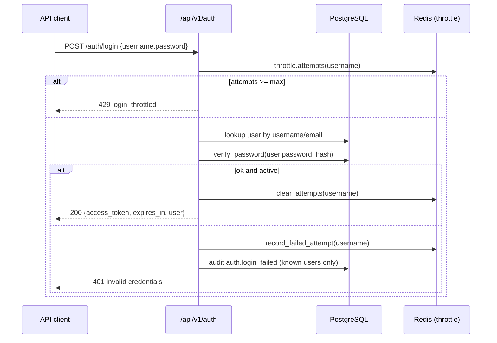
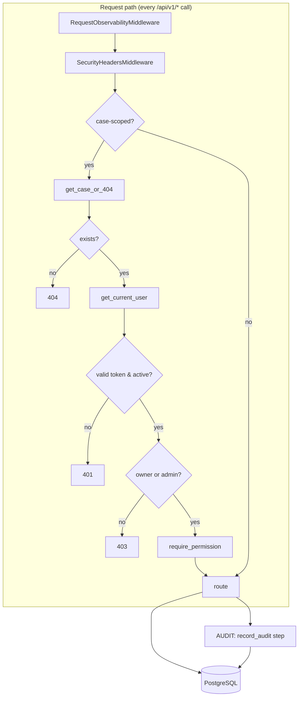

# Phase 4: Productization and security

- **Status:** Implemented
- **Date:** Phase 4
- **Scope:** authentication and authorization (RBAC), case ownership with
  IDOR prevention, findings lifecycle hardening, evidence provenance, an
  append-only audit trail, analytics run attribution, login throttling,
  pagination/observability, a single Alembic migration, an expanded test
  suite, a documented frontend contract and an end-to-end workflow test.
- **Out of scope:** user-assignment/sharing UI, multi-tenant data, refresh
  tokens / OIDC, account password-change flows, LLM features, frontend
  implementation (this phase produces only the API contract documentation).

## Design principles

1. **No fake identity.** Tokens are signed with stdlib HMAC-SHA256 over a
   compact JSON payload (uid, iat, exp, jti). No third-party JWT dependency,
   no plaintext secrets, constant-time signature comparison.
2. **Least privilege by construction.** Access is decided in two independent
   gates: *authentication* (`get_current_user`, 401) and *authorization* —
   role-based permissions (403) plus *case-level ownership* (owner-or-admin,
   403). A handler can only reach the data it is allowed to touch.
3. **Humans decide.** The engine still only ever produces `NEW` findings;
   `REVIEWED`/`DISMISSED`/`CONFIRMED` require a human acting with the matching
   permission. Closed findings are immutable except for an explicit ADMIN.
4. **Everything is attributed.** Audit events capture the actor (when known),
   resource, case and machine-readable metadata; analytics runs persist their
   `actor_id`. The audit log is append-only and never mutated by the API.
5. **Derived, honest provenance.** Provenance is resolved from rows that
   actually exist — `evidence_file -> source_records -> relationships ->
   entities` and findings joined through the source records they cite. No
   fabricated confidence or invented links.

## Authentication

Bearer tokens are created by `app/core/auth.py` and verified with
`hmac.compare_digest`:

```
base64url(json{uid,iat,exp,jti}) . hex(hmac_sha256(secret, payload))
```

- `create_access_token(user_id, secret, expires_minutes)` — wraps a fresh
  `jti` nonce so repeated signings differ.
- `decode_access_token(...) -> UUID | None` **never raises**; it rejects bad
  signatures, expired tokens, malformed payloads and non-UUID `uid` claims,
  all as `None`. Checks the signature and claims before trusting the uid.
- Expiry is `exp` (minutes-to-seconds). `SECRET_KEY`, `ACCESS_TOKEN_EXPIRE_MINUTES`
  live in `app/core/config.py`.
- Passwords: seeded accounts use development defaults overridable via
  `SEED_ADMIN_PASSWORD` / `SEED_INVESTIGATOR_PASSWORD`; only `verify_password`
  bcrypt checks ever run. No password is stored or logged.



## RBAC model

Roles and the role↔permission mapping are pure, enumerated state in
`app/core/rbac.py` and are seeded by the Phase 4 migration (deterministic
`uuid5` ids so they are stable across environments):

| Role | Capability |
| --- | --- |
| `ADMIN` | everything, including `users.manage` and audit access |
| `INVESTIGATOR` | everything except `users.manage` |
| `ANALYST` | read cases/evidence, run analytics, read + review findings |
| `VIEWER` | read cases/evidence/findings only |

Permissions (`case.read/create/update/archive`, `evidence.read/upload`,
`ingestion.run`, `analytics.run`, `findings.read/review/confirm/dismiss`,
`users.manage`, `audit.read`) gate every state-changing route through
`require_permission(...)` → 403; `has_permission(roles, permission)` is a pure
function. `register` is `ADMIN`-only (`users.manage`); seed scripts insert the
`admin` / `investigator` accounts (the migration seeds only roles).

## Case access and IDOR prevention

`get_case_or_404(case_id, request, session)` combines the two checks used by
every case-scoped route:

1. Missing case → **404** (resolves before authentication by design).
2. Authenticated but neither owner nor admin → **403** (IDOR guard;
   existence is assumed discoverable, so the response is uniform 403).
3. No/invalid credentials → **401** for an existing case.

`Case.owner_id` is a nullable FK to `users` (`SET NULL` on delete); legacy
null-owner rows are readable by `ADMIN` only. Case listing is filtered to the
caller's owned cases. There is deliberately no sharing/assignment table: the
model is owner-or-admin.

## Findings lifecycle

| Transition | Non-admin | Permission required |
| --- | --- | --- |
| NEW → REVIEWED | ✓ | `findings.review` |
| NEW → DISMISSED / CONFIRMED | ✓ | `findings.dismiss` / `findings.confirm` |
| REVIEWED → DISMISSED / CONFIRMED | ✓ | `findings.dismiss` / `findings.confirm` |
| Same status | ✓ (idempotent no-op, no audit row) | any matching role |
| DISMISSED/CONFIRMED → any | ✗ (only `ADMIN`) | explicit admin override |

Reviews record `reviewed_by`, `reviewed_at`, `review_comment`; every *actual*
change writes `finding.status_changed` with `{from, to, reason}` to the audit
log. The engine never auto-assigns a confirmation.

## Evidence and provenance

`GET /cases/{id}/evidence/{eid}` returns the stored metadata (sha256, size,
status, record_count, metadata). Provenance resolves the chain:

```
evidence_file -> source_records -> RelationshipEvidence -> relationships
   relationships -> source/target entities
   findings    -> Finding.evidence_ids (source-record ids) joined through
                  this file's records
```

Phase 4 fixed a provenance gap: `Finding.evidence_ids` stores source-record
ids, so findings are now matched with `evidence_ids ?| <record-ids>`; the file
id was previously compared directly and always returned `finding_count = 0`.

## Audit trail

`app/api/routes/audit.py` exposes `GET /api/v1/audit-logs` (requires
`audit.read`). Filters: `case_id`, `actor_id`, `action`, `resource_type`;
pagination defaults `limit=50, offset=0` (cap 200). Rows are append-only:
`AuditLog` has no update/delete path. Captured events include
`case.created/updated/archived`, `evidence.uploaded`, `ingestion.job_ran`,
`analytics.run_completed`, `finding.status_changed`,
`auth.login_succeeded/login_failed/user_created`. Anonymous logins on unknown
usernames are intentionally *not* recorded so account existence is not leaked.

## Analytics attribution

`run_analytics(case_id, actor_id=user.id)` persists the actor on
`analytics_runs.actor_id` (FK `SET NULL` on user deletion), and a
`analytics.run_completed` audit row carries the run id, status and stage.

## Login throttling

Redis key `auth:login:attempts:<lower-username>` with TTL
`LOGIN_LOCKOUT_SECONDS` (default 300). `LOGIN_MAX_ATTEMPTS` (default 5) at `0`
disables throttling (guarded in the route and in `throttle.attempts`).
Throttling is **fail-open** — a Redis outage never locks anyone out (each
throttle helper catches exceptions and returns a pass). Lockouts answer 429
even for correct passwords until the TTL expires (by design).

## Observability

`RequestObservabilityMiddleware` accepts `X-Request-Id`/`X-Correlation-Id`
else generates one; stores it in `scope["state"]["correlation_id"]` (visible
to handlers as `request.state.correlation_id`) and echoes `x-request-id` on
every response, including errors. Each request is logged with method, path,
status, `duration_ms`, actor id (set by `get_current_user`) and the id.
Security headers (`nosniff`, `DENY` framing, referral policy) are applied by
`SecurityHeadersMiddleware`.

## Pagination

All list endpoints return `{items, total, limit, offset}` with sanitized
`limit`/`offset`:
`cases`, `evidence`, `ingest-jobs`, `findings`, `entities`, `relationships`,
`analytics/runs`, `audit-logs`.

## Migration

One migration, `cc19f4d2b003_phase_4_productization_auth_rbac`, adds the
`roles`, `user_roles`, `audit_logs`, `users`, and new columns
(`cases.owner_id`, `analytics_runs.actor_id`, `evidence_files.data_source_id`,
findings `reviewed_by/reviewed_at/review_comment`), seeds the four roles, and
is verified by `alembic check` ("No new upgrade operations detected").

## API modules

| Module | Responsibility |
| --- | --- |
| `app/core/auth.py`, `rbac.py` | token signing/verification, role↔permission map |
| `app/api/dependencies.py` | `get_current_user`, `require_permission`, `require_role`, `get_case_or_404` |
| `app/api/routes/auth.py` | login (throttle + audit), ADMIN-only register, `/me` |
| `app/api/routes/cases.py` | CRUD + archive with ownership |
| `app/api/routes/audit.py` | append-only audit query |
| `app/api/routes/findings.py` | status lifecycle |
| `app/api/routes/evidence.py` | upload/ingest/provenance |
| `app/services/audit.py`, `throttle.py`, `findings_service.py`, `provenance.py`, `users.py` | domain logic |
| `app/middleware.py` | security headers + request observability |

## Testing and quality gates

- Unit: token primitives, RBAC mapping, findings transitions (with a stubbed
  session), throttling fail-open/disabled semantics.
- API: auth register/login matrix, case CRUD + owner/IDOR 403/404/401 matrix,
  role permission denials, findings workflow + audit rows, audit filters/
  pagination, evidence detail + provenance counts, observability headers.
- E2E: `tests/e2e/test_investigator_workflow.py` drives the seeded
  `admin`/`investigator` accounts through register → login → case → evidence →
  ingest → analytics → findings review/confirm → audit trail.
- Gates (as of Phase 4): 245 tests pass; `ruff check app scripts tests` and
  `ruff format --check` clean; `mypy app` clean; `alembic check` clean.



## Deferred items (intentionally out of scope)

- OIDC / refresh-token rotation, password change / reset, MFA.
- Case sharing/assignment UI and non-owner case ACLs.
- Audit log retention/export tooling (the data is queryable today).
- Frontend implementation; this phase fixes the API contract only.

## Phase 4 final verification

- Live smoke tests: admin/investigator login, create/get case, stranger 403
  (IDOR), anonymous 401, throttle 429, audit filter by case, evidence detail,
  provenance counts (`finding_count` now > 0), analytics run attribution,
  findings list membership.
- Full suite: 245 passed; gates green; migration at head; E2E green; final
  report in `docs/architecture/phase-4-final-report.md`.